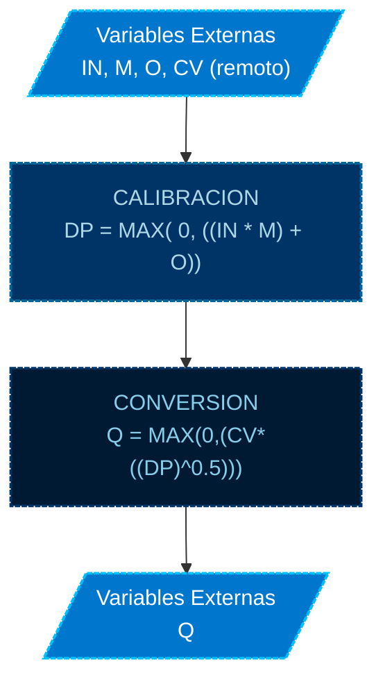

# PROGRAMA

*   **NOMBRE**: MOD: LECTURA Y CALCULO DE CAUDALES
*   **ID PROGRAMA**: PRG1
*   **DI CONTROLADOR**: 10021
*   **AUTOR**: Carlos Jiménez Hirashi *@cjhirashi*, Adaptación: Asistente de IA
*   **VERSION**: 1.5.0

## DESCRIPCION

Este módulo lee los sensores de presión diferencial de cada caja VAV, calibra la lectura aplicando un multiplicador y un offset, y convierte la presión diferencial calibrada a caudal (CFM) utilizando el coeficiente de velocidad (CV) de cada VAV.

El sistema cuenta con 15 cajas VAV distribuidas en 7 Plenums:

*   **PLENUM 1** (P1)

    1.  ***VAV MEDIANA*** (VM)
    2.  ***VAV GRANDE*** (VG)
    3.  ***VAV CHICA*** (VC)

*   **PLENUM 2** (P2)

    4.  ***VAV MEDIANA*** (VM)
    5.  ***VAV GRANDE*** (VG)

*   **PLENUM 3** (P3)

    6.  ***VAV GRANDE*** (VG)

*   **PLENUM 4** (P4)

    7.  ***VAV MEDIANA*** (VM)
    8.  ***VAV GRANDE*** (VG)
    9.  ***VAV CHICA*** (VC)

*   **PLENUM 5** (P5)

    10. ***VAV CHICA*** (P5_VC)
    11. ***VAV GRANDE*** (VG)

*   **PLENUM 6** (P6)

    12. ***VAV GRANDE*** (VG)
    13. ***VAV MEDIANA*** (VM)

*   **PLENUM 7R** (P7)

    14. ***VAV CHICA*** (VC)
    15. ***VAV GRANDE*** (VG)

## VARIABLES DE CONTROL

**NOTA**: Todas las variables de control que contengan un prefijo `P[#]_V[T]_`, indican que son variables relacionadas al control de cada VAV, `P[#]` hace referencia al número de Plenum que pertenece, el factor `[#]` representa el número del Plenum que corresponde, `V[T]` hace referencia al tamaño de caja, el factor `[T]` representa el tamaño de caja y su valor puede ser `G` GRANDE, `M` MEDIANA o `C` CHICA, con estos parámetros podremos saber a qué caja VAV y qué Plenum corresponde cada punto.

### VARIABLES INTERNAS

#### CONSTANTES

*   Ninguna.

#### VARIABLES

*   Ninguna.

### VARIABLES EXTERNAS

*   **Entradas:**
    *   `P[#]_V[T]_IN` (AI): Lectura del sensor de presión diferencial de cada VAV.
    *   `P[#]_V[T]_M` (AV): Factor multiplicador para la calibración de cada VAV.
    *   `P[#]_V[T]_O` (AV): Factor offset para la calibración de cada VAV.
    *   `P[#]_V[T]_CV` (AV): Coeficiente de velocidad de cada VAV (punto remoto).

*   **Salidas:**
    *   `P[#]_V[T]_DP` (AV): Lectura calibrada del sensor de presión diferencial de cada VAV.
    *   `P[#]_V[T]_Q` (AV): Caudal calculado para cada VAV (CFM).
    *   `P1_Q`, `P2_Q`, `P4_Q`, `P5_Q`, `P6_Q`, `PR7_Q` (AV): Caudales totales de los plenums.

## LOGICA DE OPERACION

Este módulo realiza las siguientes acciones para cada VAV:

1.  **Lectura del Sensor:** Lee la señal analógica del sensor de presión diferencial (`P[#]_V[T]_IN`).
2.  **Calibración:** Aplica la calibración a la lectura del sensor:

```basic
P[#]_V[T]_DP = MAX(0, ((P[#]_V[T]_IN * P[#]_V[T]_M) + P[#]_V[T]_O))
```

3.  **Cálculo de Caudal:** Calcula el caudal (CFM) utilizando la fórmula:

```basic
P[#]_V[T]_Q = MAX(0, (P[#]_V[T]_CV * ((P[#]_V[T]_DP)^0.5)))
```

4. **Calculo de caudal total:** Calcula el caudal total por cada plenum.

*Ejemplo (para la VAV Mediana del Plenum 1):*

```basic
REM **PLENUM 1 - VAV MEDIANA

    REM ***CALIBRACION DE SENSOR DE ENTRADA
        P1_VM_DP = MAX(0, ((P1_VM_IN * P1_VM_M) + P1_VM_O))

    REM ***CONVERSION
        P1_VM_Q = MAX(0, (P1_VM_CV * ((P1_VM_DP)^0.5)))
```

*Ejemplo (Cálculo de caudal total del Plenum 1):*

```basic
    P1_Q = P1_VM_Q + P1_VG_Q + P1_VC_Q
```

*Ejemplo (Lectura de Coeficientes de Velocidad - se ejecuta cada minuto):*

```basic
IF INTERVAL(00:01:00) THEN
    P1_VM_CV = 10022.AV112  : REM Coeficiente de Velocidad de VAV
    ...
ENDIF
```

## DIAGRAMA DE FLUJO DEL MODULO DE CONTROL

**CODIGO DE COLORES**


### MODULO - LECTURA Y CALCULO DE CAUDALES




