# MOD: LECTURA Y CALCULO DE CAUDALES

* **ID PROGRAMA**: PRG1
* **DI CONTROLADOR**: 10021
* **AUTOR**: Carlos Jiménez Hirashi @cjhirashi, Adaptación: Asistente de IA
* **VERSION**: 1.5.1

## DESCRIPCION

Este módulo lee los sensores de presión diferencial de cada caja VAV, calibra la lectura aplicando un multiplicador y un offset, y convierte la presión diferencial calibrada a caudal (CFM) utilizando el coeficiente de velocidad (CV) de cada VAV. Finalmente, calcula el caudal total para cada plenum sumando los caudales de sus VAVs correspondientes.

El sistema cuenta con 15 cajas VAV distribuidas en 7 Plenums:

*   **PLENUM 1** (P1): VAV Mediana (VM), VAV Grande (VG), VAV Chica (VC)
*   **PLENUM 2** (P2): VAV Mediana (VM), VAV Grande (VG)
*   **PLENUM 3** (P3): VAV Grande (VG)
*   **PLENUM 4** (P4): VAV Mediana (VM), VAV Grande (VG), VAV Chica (VC)
*   **PLENUM 5** (P5): VAV Chica (VC), VAV Grande (VG)
*   **PLENUM 6** (P6): VAV Grande (VG), VAV Mediana (VM)
*   **PLENUM 7R** (P7): VAV Chica (VC), VAV Grande (VG)

## LOGICA DE OPERACION

El programa ejecuta continuamente las siguientes operaciones para cada una de las 15 cajas VAV:

1.  **Calibración del Sensor de Presión Diferencial:**
    *   Lee la entrada analógica (`P[#]_V[T]_IN`) que representa la presión diferencial medida por el sensor en "WC".
    *   Aplica un factor multiplicador (`P[#]_V[T]_M`) y un offset (`P[#]_V[T]_O`) para obtener la presión diferencial calibrada (`P[#]_V[T]_DP`).
    *   Se asegura que el valor calibrado no sea negativo usando la función `MAX`.

    *Ejemplo (P1_VM):*
    ```basic
    P1_VM_DP = MAX(0, ((P1_VM_IN * P1_VM_M) + P1_VM_O))
    ```

2.  **Cálculo de Caudal (CFM):**
    *   Utiliza la presión diferencial calibrada (`P[#]_V[T]_DP`) y el coeficiente de velocidad (`P[#]_V[T]_CV`) específico de la VAV para calcular el caudal (`P[#]_V[T]_Q`) en CFM.
    *   La fórmula aplicada es `Caudal = CV * sqrt(Presión Diferencial)`.
    *   Se incluye una condición para evitar errores de raíz cuadrada de cero o negativos, asignando 0 CFM si `_DP` no es positivo.

    *Ejemplo (P1_VM):*
    ```basic
    IF P1_VM_DP > 0 THEN P1_VM_Q = P1_VM_CV * (P1_VM_DP ^ 0.5) ELSE P1_VM_Q = 0
    ```

3.  **Lectura Periódica de Coeficientes de Velocidad (CV):**
    *   Cada minuto (`IF INTERVAL(00:01:00)`), el programa lee los valores de los Coeficientes de Velocidad (`_CV`) desde las variables análogas (`AV112` a `AV126`) ubicadas en el controlador remoto con **DI 10022**.
    *   Estos valores remotos se asignan a las variables locales (`P[#]_V[T]_CV`) para ser utilizados en el cálculo de caudal.

    *Ejemplo (Lectura remota):*
    ```basic
     IF INTERVAL(00:01:00) THEN
         P1_VM_CV = 10022.AV112  : REM PLENUM 1 - VAV MEDIANA - COEFICIENTE DE VELOCIDAD ()
         P1_VG_CV = 10022.AV113  : REM PLENUM 1 - VAV GRANDE - COEFICIENTE DE VELOCIDAD ()
         ...
     ENDIF
    ```

4.  **Cálculo de Caudal Total por Plenum:**
    *   Suma los caudales (`_Q`) calculados de todas las VAVs que pertenecen a un mismo plenum para obtener el caudal total del plenum (`P#_Q`).
    *   Para el Plenum 3, que solo tiene una VAV, el caudal total es igual al caudal de esa única VAV (`P3_VG_Q`).

    *Ejemplo (Plenum 1 y Plenum 4):*
    ```basic
    P1_Q = P1_VM_Q + P1_VG_Q + P1_VC_Q
    P4_Q = P4_VM_Q + P4_VG_Q + P4_VC_Q
    ```

**Uso de Puntos de Control y UI:**

*   **Monitoreo (UI):**
    *   `P[#]_V[T]_IN`: Lectura cruda del sensor DP (útil para diagnóstico).
    *   `P[#]_V[T]_DP`: Presión diferencial calibrada (importante para verificar calibración).
    *   `P[#]_V[T]_Q`: Caudal calculado para cada VAV.
    *   `P[#]_Q`: Caudal total de cada plenum.
    *   `P[#]_V[T]_CV`: Coeficiente de velocidad actual (leído remotamente).
*   **Ajuste/Calibración (UI - requiere interacción del operador/técnico):**
    *   `P[#]_V[T]_M`: Factor multiplicador para calibración.
    *   `P[#]_V[T]_O`: Factor offset para calibración.
    *   *Nota:* Aunque los `_CV` se leen remotamente, los puntos originales en el controlador 10022 (`10022.AV112` a `AV126`) serían los puntos a ajustar si se requiere una recalibración del coeficiente de velocidad.

## DIAGRAMAS DE CONTROL

**CODIGO DE COLORES**


### MODULO - LECTURA Y CALCULO DE CAUDALES (Por cada VAV)

```mermaid
flowchart TB
    subgraph " "
    direction LR
    VAREXTIN[/"`Inputs:<br>P[#]_V[T]_IN (AI)<br>P[#]_V[T]_M (AV)<br>P[#]_V[T]_O (AV)<br>P[#]_V[T]_CV (Local Var)`"/] --> CAL["`CALIBRACION<br>P[#]_V[T]_DP =<br>MAX( 0, ((IN * M) + O))`"]
    CAL --> CONVERSION["`CONVERSION<br>IF DP > 0 THEN<br> Q = CV * (DP ^ 0.5)<br>ELSE Q = 0`"]
    CONVERSION --> VAREXTOUT[/"Outputs:<br>P[#]_V[T]_DP (AV)<br>P[#]_V[T]_Q (AV)"/]
    end

    subgraph "Lectura Remota (Cada 1 min)"
    direction LR
     REMOTE_CV[/"`10022.AV[112-126]`"/] --> LOCAL_CV["`Asignación<br>P[#]_V[T]_CV =<br>10022.AV[...]`"]
    end

    subgraph "Cálculo Caudal Total Plenum [X]"
     direction LR
     VAV1_Q[/"`P[X]_V[A]_Q`"/] --> SUMA
     VAV2_Q[/"`P[X]_V[B]_Q`"/] --> SUMA{{"`Σ`"}}
     VAVN_Q[/"`...`"/] --> SUMA
     SUMA --> PLENUM_Q[/"P[X]_Q"/]
    end


    classDef variables fill:#0077CC, stroke:#00BFFF, stroke-width:2px, color:#FFFFFF, stroke-dasharray: 4 1
    class VAREXTIN,VAREXTOUT,REMOTE_CV,LOCAL_CV,VAV1_Q,VAV2_Q,VAVN_Q,PLENUM_Q variables
    classDef calibracion fill:#003366, stroke:#006699, stroke-width:2px, color:#ADD8E6, stroke-dasharray: 4 1
    class CAL calibracion
    classDef conversion fill:#001A33, stroke:#003366, stroke-width:2px, color:#87CEEB, stroke-dasharray: 4 1
    class CONVERSION conversion
    classDef suma fill:#2E8B57, stroke:#3CB371, stroke-width:2px, color:#FFFFFF
    class SUMA suma

```


*Nota: El diagrama "MODULO - LECTURA Y CALCULO DE CAUDALES" se repite para cada una de las 15 VAVs. El diagrama "Cálculo Caudal Total Plenum" se aplica a los Plenums P1, P2, P4, P5, P6 y PR7.*

---
## LISTA DE PUNTOS DEL PROGRAMA

## VARIABLES INTERNAS

### CONSTANTES

*   *No se requieren constantes para este programa.*

### VARIABLES

*   *No se requieren variables internas para este programa.*

## VARIABLES EXTERNAS

### PLENUM 1 - VAV MEDIANA (P1_VM)
1.  `P1_VM_IN` **AI3** *PLENUM 1 - VAV MEDIANA - ENTRADA (CAUDALES)* ( `"WC"` )
    LECTURA - LOCAL - DI-10021
2.  `P1_VM_M` **AV2** *PLENUM 1 - VAV MEDIANA - MULTIPLICADOR* ( )
    LECTURA - LOCAL - DI-10021
3.  `P1_VM_O` **AV3** *PLENUM 1 - VAV MEDIANA - OFFSET* ( )
    LECTURA - LOCAL - DI-10021
4.  `P1_VM_CV` **10022.AV112** *PLENUM 1 - VAV MEDIANA - COEFICIENTE DE VELOCIDAD* ( )
    LECTURA - REMOTO - DI-10022
5.  `P1_VM_DP` **AV1** *PLENUM 1 - VAV MEDIANA - PRESION DIF* ( `"WC"` )
    ESCRITURA - LOCAL - DI-10021
6.  `P1_VM_Q` **AV4** *PLENUM 1 - VAV MEDIANA - CAUDAL FACTOR* ( `cfm` )
    ESCRITURA - LOCAL - DI-10021

### PLENUM 1 - VAV GRANDE (P1_VG)
1.  `P1_VG_IN` **AI4** *PLENUM 1 - VAV GRANDE - ENTRADA (CAUDALES)* ( `"WC"` )
    LECTURA - LOCAL - DI-10021
2.  `P1_VG_M` **AV6** *PLENUM 1 - VAV MEDIANA - MULTIPLICADOR* ( )
    LECTURA - LOCAL - DI-10021
3.  `P1_VG_O` **AV7** *PLENUM 1 - VAV MEDIANA - OFFSET* ( )
    LECTURA - LOCAL - DI-10021
4.  `P1_VG_CV` **10022.AV113** *PLENUM 1 - VAV GRANDE - COEFICIENTE DE VELOCIDAD* ( )
    LECTURA - REMOTO - DI-10022
5.  `P1_VG_DP` **AV5** *PLENUM 1 - VAV MEDIANA - PRESION DIF* ( `"WC"` )
    ESCRITURA - LOCAL - DI-10021
6.  `P1_VG_Q` **AV8** *PLENUM 1 - VAV MEDIANA - CAUDAL FACTOR* ( `cfm` )
    ESCRITURA - LOCAL - DI-10021

### PLENUM 1 - VAV CHICA (P1_VC)
1.  `P1_VC_IN` **AI16** *PLENUM 1 - VAV CHICA - ENTRADA (CAUDALES)* ( `"WC"` )
    LECTURA - LOCAL - DI-10021
2.  `P1_VC_M` **AV60** *PLENUM 1 - VAV CHICA - MULTIPLICADOR* ( )
    LECTURA - LOCAL - DI-10021
3.  `P1_VC_O` **AV61** *PLENUM 1 - VAV CHICA - OFFSET* ( )
    LECTURA - LOCAL - DI-10021
4.  `P1_VC_CV` **10022.AV114** *PLENUM 1 - VAV CHICA - COEFICIENTE DE VELOCIDAD* ( )
    LECTURA - REMOTO - DI-10022
5.  `P1_VC_DP` **AV59** *PLENUM 1 - VAV CHICA - PRESION DIF* ( `"WC"` )
    ESCRITURA - LOCAL - DI-10021
6.  `P1_VC_Q` **AV62** *PLENUM 1 - VAV CHICA - CAUDAL FACTOR* ( `cfm` )
    ESCRITURA - LOCAL - DI-10021

### PLENUM 2 - VAV MEDIANA (P2_VM)
1.  `P2_VM_IN` **AI5** *PLENUM 2 - VAV MEDIANA - ENTRADA (CAUDALES)* ( `"WC"` )
    LECTURA - LOCAL - DI-10021
2.  `P2_VM_M` **AV11** *PLENUM 2 - VAV MEDIANA - MULTIPLICADOR* ( )
    LECTURA - LOCAL - DI-10021
3.  `P2_VM_O` **AV12** *PLENUM 2 - VAV MEDIANA - OFFSET* ( )
    LECTURA - LOCAL - DI-10021
4.  `P2_VM_CV` **10022.AV115** *PLENUM 2 - VAV MEDIANA - COEFICIENTE DE VELOCIDAD* ( )
    LECTURA - REMOTO - DI-10022
5.  `P2_VM_DP` **AV10** *PLENUM 2 - VAV MEDIANA - PRESION DIF* ( `"WC"` )
    ESCRITURA - LOCAL - DI-10021
6.  `P2_VM_Q` **AV13** *PLENUM 2 - VAV MEDIANA - CAUDAL FACTOR* ( `cfm` )
    ESCRITURA - LOCAL - DI-10021

### PLENUM 2 - VAV GRANDE (P2_VG)
1.  `P2_VG_IN` **AI6** *PLENUM 2 - VAV GRANDE - ENTRADA (CAUDALES)* ( `"WC"` )
    LECTURA - LOCAL - DI-10021
2.  `P2_VG_M` **AV15** *PLENUM 2 - VAV GRANDE - MULTIPLICADOR* ( )
    LECTURA - LOCAL - DI-10021
3.  `P2_VG_O` **AV16** *PLENUM 2 - VAV GRANDE - OFFSET* ( )
    LECTURA - LOCAL - DI-10021
4.  `P2_VG_CV` **10022.AV116** *PLENUM 2 - VAV GRANDE - COEFICIENTE DE VELOCIDAD* ( )
    LECTURA - REMOTO - DI-10022
5.  `P2_VG_DP` **AV14** *PLENUM 2 - VAV GRANDE - PRESION DIF* ( `"WC"` )
    ESCRITURA - LOCAL - DI-10021
6.  `P2_VG_Q` **AV17** *PLENUM 2 - VAV GRANDE - CAUDAL FACTOR* ( `cfm` )
    ESCRITURA - LOCAL - DI-10021

### PLENUM 3 - VAV GRANDE (P3_VG)
1.  `P3_VG_IN` **AI17** *PLENUM 3 - VAV GRANDE - ENTRADA (CAUDALES)* ( `"WC"` )
    LECTURA - LOCAL - DI-10021
2.  `P3_VG_M` **AV64** *PLENUM 3 - VAV GRANDE - MULTIPLICADOR* ( )
    LECTURA - LOCAL - DI-10021
3.  `P3_VG_O` **AV65** *PLENUM 3 - VAV GRANDE - OFFSET* ( )
    LECTURA - LOCAL - DI-10021
4.  `P3_VG_CV` **10022.AV117** *PLENUM 3 - VAV GRANDE - COEFICIENTE DE VELOCIDAD* ( )
    LECTURA - REMOTO - DI-10022
5.  `P3_VG_DP` **AV63** *PLENUM 3 - VAV GRANDE - PRESION DIF* ( `"WC"` )
    ESCRITURA - LOCAL - DI-10021
6.  `P3_VG_Q` **AV66** *PLENUM 3 - VAV GRANDE - CAUDAL FACTOR* ( `cfm` )
    ESCRITURA - LOCAL - DI-10021

### PLENUM 4 - VAV MEDIANA (P4_VM)
1.  `P4_VM_IN` **AI7** *PLENUM 4 - VAV MEDIANA - ENTRADA (CAUDALES)* ( `"WC"` )
    LECTURA - LOCAL - DI-10021
2.  `P4_VM_M` **AV20** *PLENUM 4 - VAV MEDIANA - MULTIPLICADOR* ( )
    LECTURA - LOCAL - DI-10021
3.  `P4_VM_O` **AV21** *PLENUM 4 - VAV MEDIANA - OFFSET* ( )
    LECTURA - LOCAL - DI-10021
4.  `P4_VM_CV` **10022.AV118** *PLENUM 4 - VAV MEDIANA - COEFICIENTE DE VELOCIDAD* ( )
    LECTURA - REMOTO - DI-10022
5.  `P4_VM_DP` **AV19** *PLENUM 4 - VAV MEDIANA - PRESION DIF* ( `"WC"` )
    ESCRITURA - LOCAL - DI-10021
6.  `P4_VM_Q` **AV22** *PLENUM 4 - VAV MEDIANA - CAUDAL FACTOR* ( `cfm` )
    ESCRITURA - LOCAL - DI-10021

### PLENUM 4 - VAV GRANDE (P4_VG)
1.  `P4_VG_IN` **AI8** *PLENUM 4 - VAV GRANDE - ENTRADA (CAUDALES)* ( `"WC"` )
    LECTURA - LOCAL - DI-10021
2.  `P4_VG_M` **AV24** *PLENUM 4 - VAV GRANDE - MULTIPLICADOR* ( )
    LECTURA - LOCAL - DI-10021
3.  `P4_VG_O` **AV25** *PLENUM 4 - VAV GRANDE - OFFSET* ( )
    LECTURA - LOCAL - DI-10021
4.  `P4_VG_CV` **10022.AV119** *PLENUM 4 - VAV GRANDE - COEFICIENTE DE VELOCIDAD* ( )
    LECTURA - REMOTO - DI-10022
5.  `P4_VG_DP` **AV23** *PLENUM 4 - VAV GRANDE - PRESION DIF* ( `"WC"` )
    ESCRITURA - LOCAL - DI-10021
6.  `P4_VG_Q` **AV26** *PLENUM 4 - VAV GRANDE - CAUDAL FACTOR* ( `cfm` )
    ESCRITURA - LOCAL - DI-10021

### PLENUM 4 - VAV CHICA (P4_VC)
1.  `P4_VC_IN` **AI9** *PLENUM 4 - VAV CHICA - ENTRADA (CAUDALES)* ( `"WC"` )
    LECTURA - LOCAL - DI-10021
2.  `P4_VC_M` **AV28** *PLENUM 4 - VAV MEDIANA - MULTIPLICADOR* ( )
    LECTURA - LOCAL - DI-10021
3.  `P4_VC_O` **AV29** *PLENUM 4 - VAV MEDIANA - OFFSET* ( )
    LECTURA - LOCAL - DI-10021
4.  `P4_VC_CV` **10022.AV120** *PLENUM 4 - VAV CHICA - COEFICIENTE DE VELOCIDAD* ( )
    LECTURA - REMOTO - DI-10022
5.  `P4_VC_DP` **AV27** *PLENUM 4 - VAV MEDIANA - PRESION DIF* ( `"WC"` )
    ESCRITURA - LOCAL - DI-10021
6.  `P4_VC_Q` **AV30** *PLENUM 4 - VAV MEDIANA - CAUDAL FACTOR* ( `cfm` )
    ESCRITURA - LOCAL - DI-10021

### PLENUM 5 - VAV CHICA (P5_VC)
1.  `P5_VC_IN` **AI10** *PLENUM 5 - VAV CHICA - ENTRADA (CAUDALES)* ( `"WC"` )
    LECTURA - LOCAL - DI-10021
2.  `P5_VC_M` **AV33** *PLENUM 5 - VAV CHICA - MULTIPLICADOR* ( )
    LECTURA - LOCAL - DI-10021
3.  `P5_VC_O` **AV34** *PLENUM 5 - VAV CHICA - OFFSET* ( )
    LECTURA - LOCAL - DI-10021
4.  `P5_VC_CV` **10022.AV121** *PLENUM 5 - VAV CHICA - COEFICIENTE DE VELOCIDAD* ( )
    LECTURA - REMOTO - DI-10022
5.  `P5_VC_DP` **AV32** *PLENUM 5 - VAV CHICA - PRESION DIF* ( `"WC"` )
    ESCRITURA - LOCAL - DI-10021
6.  `P5_VC_Q` **AV35** *PLENUM 5 - VAV CHICA - CAUDAL FACTOR* ( `cfm` )
    ESCRITURA - LOCAL - DI-10021

### PLENUM 5 - VAV GRANDE (P5_VG)
1.  `P5_VG_IN` **AI11** *PLENUM 5 - VAV GRANDE - ENTRADA (CAUDALES)* ( `"WC"` )
    LECTURA - LOCAL - DI-10021
2.  `P5_VG_M` **AV37** *PLENUM 5 - VAV GRANDE - MULTIPLICADOR* ( )
    LECTURA - LOCAL - DI-10021
3.  `P5_VG_O` **AV38** *PLENUM 5 - VAV GRANDE - OFFSET* ( )
    LECTURA - LOCAL - DI-10021
4.  `P5_VG_CV` **10022.AV122** *PLENUM 5 - VAV GRANDE - COEFICIENTE DE VELOCIDAD* ( )
    LECTURA - REMOTO - DI-10022
5.  `P5_VG_DP` **AV36** *PLENUM 5 - VAV GRANDE - PRESION DIF* ( `"WC"` )
    ESCRITURA - LOCAL - DI-10021
6.  `P5_VG_Q` **AV39** *PLENUM 5 - VAV GRANDE - CAUDAL FACTOR* ( `cfm` )
    ESCRITURA - LOCAL - DI-10021

### PLENUM 6 - VAV GRANDE (P6_VG)
1.  `P6_VG_IN` **AI12** *PLENUM 6 - VAV GRANDE - ENTRADA (CAUDALES)* ( `"WC"` )
    LECTURA - LOCAL - DI-10021
2.  `P6_VG_M` **AV42** *PLENUM 6 - VAV GRANDE - MULTIPLICADOR* ( )
    LECTURA - LOCAL - DI-10021
3.  `P6_VG_O` **AV43** *PLENUM 6 - VAV GRANDE - OFFSET* ( )
    LECTURA - LOCAL - DI-10021
4.  `P6_VG_CV` **10022.AV123** *PLENUM 6 - VAV GRANDE - COEFICIENTE DE VELOCIDAD* ( )
    LECTURA - REMOTO - DI-10022
5.  `P6_VG_DP` **AV41** *PLENUM 6 - VAV GRANDE - PRESION DIF* ( `"WC"` )
    ESCRITURA - LOCAL - DI-10021
6.  `P6_VG_Q` **AV44** *PLENUM 6 - VAV GRANDE - CAUDAL FACTOR* ( `cfm` )
    ESCRITURA - LOCAL - DI-10021

### PLENUM 6 - VAV MEDIANA (P6_VM)
1.  `P6_VM_IN` **AI13** *PLENUM 6 - VAV MEDIANA - ENTRADA (CAUDALES)* ( `"WC"` )
    LECTURA - LOCAL - DI-10021
2.  `P6_VM_M` **AV46** *PLENUM 6 - VAV MEDIANA - MULTIPLICADOR* ( )
    LECTURA - LOCAL - DI-10021
3.  `P6_VM_O` **AV47** *PLENUM 6 - VAV MEDIANA - OFFSET* ( )
    LECTURA - LOCAL - DI-10021
4.  `P6_VM_CV` **10022.AV124** *PLENUM 6 - VAV MEDIANA - COEFICIENTE DE VELOCIDAD* ( )
    LECTURA - REMOTO - DI-10022
5.  `P6_VM_DP` **AV45** *PLENUM 6 - VAV MEDIANA - PRESION DIF* ( `"WC"` )
    ESCRITURA - LOCAL - DI-10021
6.  `P6_VM_Q` **AV48** *PLENUM 6 - VAV MEDIANA - CAUDAL FACTOR* ( `cfm` )
    ESCRITURA - LOCAL - DI-10021

### PLENUM 7R - VAV CHICA (PR7_VC)
1.  `PR7_VC_IN` **AI14** *PLENUM R7 - VAV CHICA - ENTRADA (CAUDALES)* ( `"WC"` )
    LECTURA - LOCAL - DI-10021
2.  `PR7_VC_M` **AV51** *PLENUM R7 - VAV CHICA - MULTIPLICADOR* ( )
    LECTURA - LOCAL - DI-10021
3.  `PR7_VC_O` **AV52** *PLENUM R7 - VAV CHICA - OFFSET* ( )
    LECTURA - LOCAL - DI-10021
4.  `PR7_VC_CV` **10022.AV125** *PLENUM R7 - VAV CHICA - COEFICIENTE DE VELOCIDAD* ( )
    LECTURA - REMOTO - DI-10022
5.  `PR7_VC_DP` **AV50** *PLENUM R7 - VAV CHICA - PRESION DIF* ( `"WC"` )
    ESCRITURA - LOCAL - DI-10021
6.  `PR7_VC_Q` **AV53** *PLENUM R7 - VAV CHICA - CAUDAL FACTOR* ( `cfm` )
    ESCRITURA - LOCAL - DI-10021

### PLENUM 7R - VAV GRANDE (PR7_VG)
1.  `PR7_VG_IN` **AI15** *PLENUM R7 - VAV GRANDE - ENTRADA (CAUDALES)* ( `"WC"` )
    LECTURA - LOCAL - DI-10021
2.  `PR7_VG_M` **AV55** *PLENUM R7 - VAV GRANDE - MULTIPLICADOR* ( )
    LECTURA - LOCAL - DI-10021
3.  `PR7_VG_O` **AV56** *PLENUM R7 - VAV GRANDE - OFFSET* ( )
    LECTURA - LOCAL - DI-10021
4.  `PR7_VG_CV` **10022.AV126** *PLENUM R7 - VAV GRANDE - COEFICIENTE DE VELOCIDAD* ( )
    LECTURA - REMOTO - DI-10022
5.  `PR7_VG_DP` **AV54** *PLENUM R7 - VAV GRANDE - PRESION DIF* ( `"WC"` )
    ESCRITURA - LOCAL - DI-10021
6.  `PR7_VG_Q` **AV57** *PLENUM R7 - VAV GRANDE - CAUDAL FACTOR* ( `cfm` )
    ESCRITURA - LOCAL - DI-10021

### CAUDALES TOTALES POR PLENUM
1.  `P1_Q` **AV9** *PLENUM 1 - CAUDAL TOTAL* ( `cfm` )
    ESCRITURA - LOCAL - DI-10021
2.  `P2_Q` **AV18** *PLENUM 2 - CAUDAL TOTAL* ( `cfm` )
    ESCRITURA - LOCAL - DI-10021
3.  `P4_Q` **AV31** *PLENUM 4 - CAUDAL TOTAL* ( `cfm` )
    ESCRITURA - LOCAL - DI-10021
4.  `P5_Q` **AV40** *PLENUM 5 - CAUDAL TOTAL* ( `cfm` )
    ESCRITURA - LOCAL - DI-10021
5.  `P6_Q` **AV49** *PLENUM 6 - CAUDAL TOTAL* ( `cfm` )
    ESCRITURA - LOCAL - DI-10021
6.  `PR7_Q` **AV58** *PLENUM R7 - CAUDAL TOTAL* ( `cfm` )
    ESCRITURA - LOCAL - DI-10021

