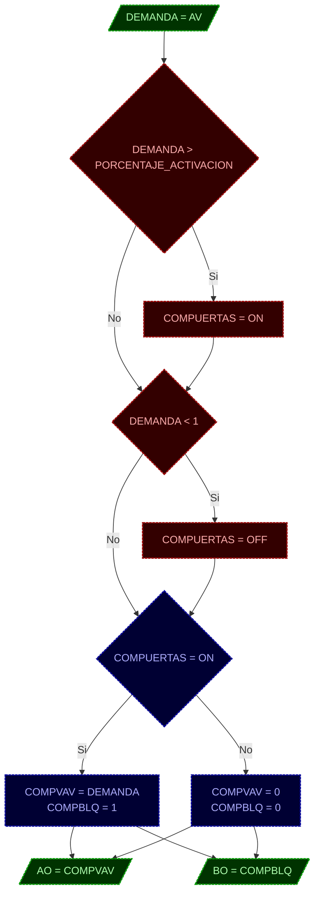

# PROGRAMA
* **NOMBRE**: MOD: CONTROL DE COMPUERTAS VAVS
* **ID PROGRAMA**: PRG2
* **DI CONTROLADOR**: 10021
* **AUTOR**: Carlos Jiménez Hirashi *@cjhirashi*
* **VERSION**: 1.5.0

## DESCRIPCION

Este módulo gestiona el control de apertura de las compuertas (Compuerta VAV y Compuerta de bloqueo) de cada caja VAV del ***Cuarto de pruebas***, esto basándose en el valor de demanda de apertura de compuerta que es asignado a cada caja VAV (esta demanda se genera en otro módulo de control). 

El sistema cuenta con 15 cajas VAV distribuidas en 7 Plenums:

* **PLENUM 1** (P1)

    1. ***VAV MEDIANA*** (VM)
    2. ***VAV GRANDE*** (VG)
    3. ***VAV CHICA*** (VC)

* **PLENUM 2** (P2)

    4. ***VAV MEDIANA*** (VM)
    5. ***VAV GRANDE*** (VG)

* **PLENUM 3** (P3)

    6. ***VAV GRANDE*** (VG)

* **PLENUM 4** (P4)

    7. ***VAV MEDIANA*** (VM)
    8. ***VAV GRANDE*** (VG)
    9. ***VAV CHICA*** (VC)

* **PLENUM 5** (P5)

    10. ***VAV CHICA*** (P5_VC)
    11. ***VAV GRANDE*** (VG)

* **PLENUM 6** (P6)

    12. ***VAV GRANDE*** (VG)
    13. ***VAV MEDIANA*** (VM)

* **PLENUM 7R** (P7)

    14. ***VAV CHICA*** (VC)
    15. ***VAV GRANDE*** (VG)

## VARIABLES DE CONTROL

**NOTA**: Totas las variables de control que contengan un prefijo `P[#]_V[T]_`, indican que son variables relacionadas al control de cada VAV, `P[#]` hace referencia al número de Plenum que pertenece, el factor `[#]` representa el número del Plenum que corresponde, `V[T]` hace referencia al tamaño de caja, el factor `[T]` representa el tamaño de caja y su valor puede ser `G` GRANDE, `M` MEDIANA o `C` CHICA, con estos parámetros podremos saber a qué caja VAV y qué Plenum corresponde cada punto.

### VARIABLES INTERNAS

#### CONSTANTES

* `PORCENTAJE_ACTIVACION` Este valor define el porcentaje de apertura que la demanda de la caja VAV tiene que superar para que se active el sistema. Este punto maneja un valor que representa un porcentaje de apertura (*%*) y su valor inicial es 5.

#### VARIABLES

* `P[#]_V[T]_COMPUERTAS` Este punto contiene el estado de operación del control de compuertas de cada caja VAV. Este punto maneja un valor digital, `1` *ACTIVO* y `0` *INACTIVO*.

### VARIABLES EXTERNAS

* `P[#]_V[T]_DEMANDA` Este punto contiene la demanda de apertura para la apertura para la compuerta de la VAV a la que está relacionada. Este punto maneja un valor que representa un porcentaje de apertura (*%*) y puede contener un valor entre 0-100. Este punto se utiliza en la Interfaz de Usuario como solo lectura. El programa LEE esta variable desde la lista de puntos del sistema.

* `P[#]_V[T]_COMPVAV` Este punto es la salida de control que opera la compuerta VAV de la caja VAV como tal. Este punto maneja un valor que representa un porcentaje de apertura (*%*) y puede contener un valor entre 0-100. Este punto se utiliza en la Interfaz de Usuario como solo lectura. El programa ESCRIBE esta variable de la lista de puntos del sistema.

* `P[#]_V[T]_COMPBLQ` Este punto es la salida de control que opera la compuerta de bloqueo de la caja VAV a la que está relacionada. Este punto maneja un valor digital, `1` *ABIERTA* y `0` *CERRADA*. Este punto se utiliza en la Interfaz de Usuario como solo lectura. El programa ESCRIBE esta variable de la lista de puntos del sistema.

## LOGICA DE OPERACION

Declaración de variables de control de la caja VAV:

```basic
    REM PLENUM [#] - VAV [TAMAÑO]
    LOCALS P[#]_V[T]_COMPUERTAS, P[#]_V[T]_DEMANDA, 
    LOCALS P[#]_V[T]_COMPVAV, P[#]_V[T]_COMPBLQ

		P1_VM_DM = AV[#]	: REM Demanda de VAV
		AO[#] = P1_VM_A		: REM Compuerta VAV
		BO[#] = P1_VM_AB	: REM Compuerta de Bloqueo
```

Este es un módulo de control formado por 2 bloques de operación para el control de las compuertas de aire de la caja VAV (Compuerta VAV `P[#]_V[T]_COMPVAV` y compuerta de bloqueo de aire `P[#]_V[T]_COMPBLQ`).

* ***BLOQUE 1***: Activación del sistema.

    La caja VAV tiene asignado un punto de control que indica la demanda de apertura de la compuerta VAV `P[#]_V[T]_DEMANDA`, este valor es establecido desde otro módulo de control. La activación del control de compuertas se determina por el valor de la demanda, cuando este valor es mayor al punto establecido en la constante `PORCENTAJE_ACTIVACION`, `P[#]_V[T]_DEMANDA > PORCENTAJE_ACTIVACION` se activa el sistema de control `P[#]_V[T]_COMPUERTAS = 1`, si el valor de la demanda es menor a 1 `P[#]_V[T]_DEMANDA < 1` se desactiva el sistema de control `P[#]_V[T]_COMPUERTAS = 0`.

    *Ejemplo*:

    ```basic
    REM *PLENUM [#]

        REM MODULO: VAV [TAMAÑO] 

            REM BLOQUE: Activación del sistema.
                IF P[#]_V[T]_DEMANDA > PORCENTAJE_ACTIVACION THEN P[#]_V[T]_COMPUERTAS = 1
                IF P[#]_V[T]_DEMANDA < 1 THEN P[#]_V[T]_COMPUERTAS = 0
    ```

* ***BLOQUE 2***: Conexión de demanda para apertura de compuertas.

    Cuando el sistema se encuentra activo `P[#]_V[T]_COMPUERTAS = 1` se asigna al contro de compuerta VAV directamente el valor de la demanda `P[#]_V[T]_COMPVAV = P[#]_V[T]_DEMANDA` y al control de la compuerta de bloque se le da el valor de apertura `P[#]_V[T]_COMPBLQ = 1`. Cuando el sistema se encuentra inactivo `P[#]_V[T]_COMPUERTAS = 0` se asigna al control de compuerta VAV el valor de cierre `P[#]_V[T]_COMPVAV = 0` y al control de la compuerta de bloquo, igual valor de cierre `P[#]_V[T]_COMPBLQ = 0`.

    *Ejemplo*:

    ```basic
    REM BLOQUE: Conexión de demanda para apertura de compuertas.
        IF P[#]_V[T]_COMPUERTAS = 1 THEN 
            P[#]_V[T]_COMPVAV = P[#]_V[T]_DEMANDA
            P[#]_V[T]_COMPBLQ = 1 
        ELSE 
            P[#]_V[T]_COMPVAV = 0
            P[#]_V[T]_COMPBLQ = 0
        ENDIF
    ```

En el siguiente ejemplo se muestra el módulo de control completo para cada VAV integrando los dos bloques de control:

```basic
    REM *PLENUM [#]

        REM MODULO: VAV [TAMAÑO] 

            REM BLOQUE: Activación del sistema.
                IF P[#]_V[T]_DEMANDA > PORCENTAJE_ACTIVACION THEN P[#]_V[T]_COMPUERTAS = 1
                IF P[#]_V[T]_DEMANDA < 1 THEN P[#]_V[T]_COMPUERTAS = 0

            REM BLOQUE: Conexión de demanda para apertura de compuertas.
                IF P[#]_V[T]_COMPUERTAS = 1 THEN 
                    P[#]_V[T]_COMPVAV = P[#]_V[T]_DEMANDA
                    P[#]_V[T]_COMPBLQ = 1 
                ELSE 
                    P[#]_V[T]_COMPVAV = 0
                    P[#]_V[T]_COMPBLQ = 0
                ENDIF
```


## DIAGRAMA DE FLUJO DEL MODULO DE CONTROL

### CODIGO DE COLORES


### MODULO - CONTROL DE COMPUERTAS VAVS


