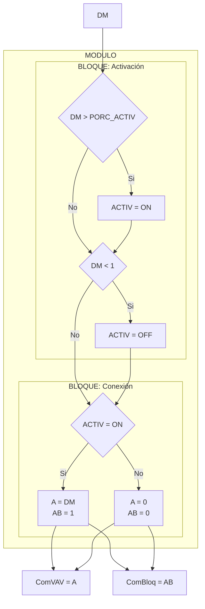

# PROGRAMA
* **NOMBRE**: MOD: CONTROL DE COMPUERTAS VAVS
* **ID PROGRAMA**: PRG2
* **DI CONTROLADOR**: 10021
* **AUTOR**: Carlos Jiménez Hirashi *@cjhirashi*
* **VERSION**: 1.5.0

## DESCRIPCION

Este módulo gestiona el control de apertura de las compuertas (Compuerta VAV y Compuerta de bloqueo) de cada caja VAV del ***Cuarto de pruebas***, esto basándose en el valor de demanda de apertura de compuerta que es asignado a cada caja VAV (esta demanda se genera en otro módulo de control). 

El sistema cuenta con 15 cajas VAV distribuidas en 7 Plenums:

* **PLENUM 1** (P1)

    1. ***VAV MEDIANA*** (VM)
    2. ***VAV GRANDE*** (VG)
    3. ***VAV CHICA*** (VC)

* **PLENUM 2** (P2)

    4. ***VAV MEDIANA*** (VM)
    5. ***VAV GRANDE*** (VG)

* **PLENUM 3** (P3)

    6. ***VAV GRANDE*** (VG)

* **PLENUM 4** (P4)

    7. ***VAV MEDIANA*** (VM)
    8. ***VAV GRANDE*** (VG)
    9. ***VAV CHICA*** (VC)

* **PLENUM 5** (P5)

    10. ***VAV CHICA*** (P5_VC)
    11. ***VAV GRANDE*** (VG)

* **PLENUM 6** (P6)

    12. ***VAV GRANDE*** (VG)
    13. ***VAV MEDIANA*** (VM)

* **PLENUM 7R** (P7)

    14. ***VAV CHICA*** (VC)
    15. ***VAV GRANDE*** (VG)

## VARIABLES DE CONTROL

**NOTA**: Totas las variables de control que contengan un prefijo `P[#]_V[T]_`, indican que son variables relacionadas al control de cada VAV, `P[#]` hace referencia al número de Plenum que pertenece, el factor `[#]` representa el número del Plenum que corresponde, `V[T]` hace referencia al tamaño de caja, el factor `[T]` representa el tamaño de caja y su valor puede ser `G` GRANDE, `M` MEDIANA o `C` CHICA, con estos parámetros podremos saber a qué caja VAV y qué Plenum corresponde cada punto.

### VARIABLES INTERNAS

#### CONSTANTES

* `PORCENTAJE_ACTIVACION` Este valor define el porcentaje de apertura que la demanda de la caja VAV tiene que superar para que se active el sistema. Este punto maneja un valor que representa un porcentaje de apertura (*%*) y su valor inicial es 5.

#### VARIABLES

* `P[#]_V[T]_COMPUERTAS` Este punto contiene el estado de operación del control de compuertas de cada caja VAV. Este punto maneja un valor digital, `1` *ACTIVO* y `0` *INACTIVO*.

### VARIABLES EXTERNAS

* `P[#]_V[T]_DEMANDA` Este punto contiene la demanda de apertura para la apertura para la compuerta de la VAV a la que está relacionada. Este punto maneja un valor que representa un porcentaje de apertura (*%*) y puede contener un valor entre 0-100. Este punto se utiliza en la Interfaz de Usuario como solo lectura. El programa LEE esta variable desde la lista de puntos del sistema.

* `P[#]_V[T]_COMPVAV` Este punto es la salida de control que opera la compuerta VAV de la caja VAV como tal. Este punto maneja un valor que representa un porcentaje de apertura (*%*) y puede contener un valor entre 0-100. Este punto se utiliza en la Interfaz de Usuario como solo lectura. El programa ESCRIBE esta variable de la lista de puntos del sistema.

* `P[#]_V[T]_COMPBLQ` Este punto es la salida de control que opera la compuerta de bloqueo de la caja VAV a la que está relacionada. Este punto maneja un valor digital, `1` *ABIERTA* y `0` *CERRADA*. Este punto se utiliza en la Interfaz de Usuario como solo lectura. El programa ESCRIBE esta variable de la lista de puntos del sistema.

## LOGICA DE OPERACION

Quiero que crees un programa que active y desactive el control de las compuertas de la VAV (compuerta VAV [`A`] y compuerta de bloqueo [`AB`]). El punto que determinará la activación del sistema es la Demanda de operación de la Compuerta [`DM`]. Para activar el sistema, el valor de demanda [`DM`] sea mayor al valor de la constante [`PORC_ACTIV`] y este tiene un valor de 5, para desactivar el sistema, el valor de demanda [`DM`] tiene que ser menor que 1. Cuando el sistema se activa, se conecta el valor de demanda [`DM`] al control de la compuerta [`A`] y la compuerta de bloqueo [`AB`] se manda abrir. En caso de que el sistema está inactivo, se envían los valores de las compuertas [`A`] y [`AB`] a 0.

## DIAGRAMA DE FLUJO DEL MODULO



Son 15 VAV en las que se aplicará el mismo proceso, estas están distribuidas en 7 Plenums:


1. Primero establecer las Variables de Control del código en la sección de variables de control, vas a seguir esta estructura para cada VAV:

Ejemplo.
```basic
    REM PLENUM 1 - VAV MEDIANA
    LOCALS P1_VM_ACTIV, P1_VM_DM, P1_VM_A, P1_VM_AB
		REM P1_VM_ACTIV		Estado de activación del control de compuertas (VAV y Bloqueo)
		P1_VM_DM = AV85		: REM Control de demanda de apertura de la Compuerta VAV
		AO1 = P1_VM_A		: REM Control de apertura de Compuerta VAV
		BO1= P1_VM_AB		: REM Control de apertura de Compuerta Bloqueo
```

2. Establece en la misma sección de variables de control la Constante del sistema

Ejemplo.
```basic
    REM CONSTANTES: AJUSTES DE OPERACION
	LOCALS PORC_ACTIV
		PORC_ACTIV = 5		: REM Porcentaje de activación del control de compuertas
```

3. En la sección de lógica de control desarrolla la lógica de control para cada VAV

Ejemplo.
```basic
	REM *PLENUM 1

		REM **VAV MEDIANA 

			REM ***ACTIVACION DE CAJA
				IF P1_VM_DM > PORC_ACTIV THEN P1_VM_ACTIV = 1
				IF P1_VM_DM < 1 THEN P1_VM_ACTIV = 0

			REM ***CONEXION A CONTROL DE COMPUERTAS
				IF P1_VM_ACTIV THEN 
					P1_VM_A = P1_VM_DM
					P1_VM_AB = 1 
				 ELSE 
				 	P1_VM_A = 0
					P1_VM_AB = 0
                ENDIF
```