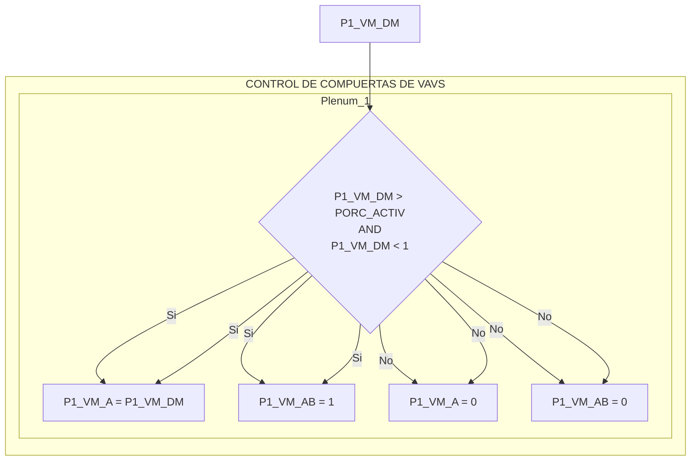

## PRG2 - CONTROL DE COMPUERTAS DE VAVS

Este programa controla la activación y desactivación de las compuertas de 15 VAVs (Variable Air Volume) distribuidas en 7 Plenums, basándose en la demanda de operación de cada VAV. Cuando la demanda de una VAV supera un porcentaje de activación (PORC_ACTIV = 5%), se activa el control de su compuerta, abriendo tanto la compuerta principal (A) como la compuerta de bloqueo (AB). Cuando la demanda cae por debajo de 1%, el control se desactiva, cerrando ambas compuertas.

---
### INFORMACION DEL SISTEMA
* **AUTOR**: Carlos Jimenez Hirashi @cjhirashi
* **DI**: 10021
* **VERSION**: 1.5.0
* **FECHA**: 23/AGO/2024

---
### LISTA DE PUNTOS DEL PROGRAMA

| Tipo de Punto | Nombre      | Valor | Descripción                                                     | Unidades     | Escritura | Sistema | DI    |
| :------------ | :---------- | :---- | :-------------------------------------------------------------- | :----------- | :-------- | :------ | :---- |
| CONSTANTE      | PORC_ACTIV  | 5      | Porcentaje de activación del control de compuertas               | %           |           |        |       |
| VAR. EXTERNA  | P1_VM_DM    | AV85   | PLENUM 1 - VAV MEDIANA - DEMANDA                                 | %           | LECTURA   | LOCAL  | 10021 |
| VAR. EXTERNA  | P1_VG_DM    | AV86   | PLENUM 1 - VAV GRANDE - DEMANDA                                  | %           | LECTURA   | LOCAL  | 10021 |
| VAR. EXTERNA  | P1_VC_DM    | AV67   | PLENUM 1 - VAV CHICA - DEMANDA                                   | %           | LECTURA   | LOCAL  | 10021 |
| VAR. EXTERNA  | P1_VM_A     | AO1    | PLENUM 1 - VAV MEDIANA - COMPUERTA VAV                           | %           | ESCRITURA | LOCAL  | 10021 |
| VAR. EXTERNA  | P1_VG_A     | AO2    | PLENUM 1 - VAV GRANDE - COMPUERTA VAV                            | %           | ESCRITURA | LOCAL  | 10021 |
| VAR. EXTERNA  | P1_VC_A     | AO21   | PLENUM 1 - VAV CHICA - COMPUERTA VAV                             | %           | ESCRITURA | LOCAL  | 10021 |
| VAR. EXTERNA  | P1_VM_AB    | BO14   | PLENUM 1 - VAV MEDIANA - COMPUERTA BLOQUEO                      | CERRADA/ABIERTA | ESCRITURA | LOCAL  | 10021 |
| VAR. EXTERNA  | P1_VG_AB    | BO15   | PLENUM 1 - VAV GRANDE - COMPUERTA BLOQUEO                       | CERRADA/ABIERTA | ESCRITURA | LOCAL  | 10021 |
| VAR. EXTERNA  | P1_VC_AB    | BO22   | PLENUM 1 - VAV CHICA - COMPUERTA BLOQUEO                        | CERRADA/ABIERTA | ESCRITURA | LOCAL  | 10021 |
| VAR. EXTERNA  | P2_VM_DM    | AV87   | PLENUM 2 - VAV MEDIANA - DEMANDA                                 | %           | LECTURA   | LOCAL  | 10021 |
| VAR. EXTERNA  | P2_VG_DM    | AV88   | PLENUM 2 - VAV GRANDE - DEMANDA                                  | %           | LECTURA   | LOCAL  | 10021 |
| VAR. EXTERNA  | P2_VM_A     | AO3    | PLENUM 2 - VAV MEDIANA - COMPUERTA VAV                           | %           | ESCRITURA | LOCAL  | 10021 |
| VAR. EXTERNA  | P2_VG_A     | AO4    | PLENUM 2 - VAV GRANDE - COMPUERTA VAV                            | %           | ESCRITURA | LOCAL  | 10021 |
| VAR. EXTERNA  | P2_VM_AB    | BO16   | PLENUM 2 - VAV MEDIANA - COMPUERTA BLOQUEO                      | CERRADA/ABIERTA | ESCRITURA | LOCAL  | 10021 |
| VAR. EXTERNA  | P2_VG_AB    | BO1   | PLENUM 2 - VAV GRANDE - COMPUERTA BLOQUEO                       | CERRADA/ABIERTA | ESCRITURA | LOCAL  | 10022 |
| VAR. EXTERNA  | P3_VG_DM    | AV68   | PLENUM 3 - VAV GRANDE - DEMANDA                                  | %           | LECTURA   | LOCAL  | 10021 |
| VAR. EXTERNA  | P3_VG_A     | AO23   | PLENUM 3 - VAV GRANDE - COMPUERTA VAV                            | %           | ESCRITURA | LOCAL  | 10021 |
| VAR. EXTERNA  | P3_VG_AB    | BO24   | PLENUM 3 - VAV GRANDE - COMPUERTA BLOQUEO                       | CERRADA/ABIERTA | ESCRITURA | LOCAL  | 10021 |
| VAR. EXTERNA | P4_VM_DM   |	AV89	 |PLENUM 4 - VAV MEDIANA - DEMANDA	| % |	LECTURA |	LOCAL |	10021|
| VAR. EXTERNA | P4_VG_DM   |	AV90	 |PLENUM 4 - VAV GRANDE - DEMANDA	| % |	LECTURA |	LOCAL |	10021|
| VAR. EXTERNA | P4_VC_DM   |	AV91	 |PLENUM 4 - VAV CHICA - DEMANDA	| % |	LECTURA |	LOCAL |	10021|
| VAR. EXTERNA | P4_VM_A   |	AO5	    |PLENUM 4 - VAV MEDIANA - COMPUERTA VAV |	% |	ESCRITURA |	LOCAL |	10021|
| VAR. EXTERNA | P4_VG_A   |	AO6	    |PLENUM 4 - VAV GRANDE - COMPUERTA VAV	| % |	ESCRITURA |	LOCAL |	10021|
| VAR. EXTERNA | P4_VC_A   |	AO7	    |PLENUM 4 - VAV CHICA - COMPUERTA VAV	| % |	ESCRITURA |	LOCAL |	10021|
| VAR. EXTERNA | P4_VM_AB   |	BO2	    |PLENUM 4 - VAV MEDIANA - COMPUERTA BLOQUEO | CERRADA/ABIERTA |	ESCRITURA |	LOCAL |	10022|
| VAR. EXTERNA | P4_VG_AB   |	BO3	    |PLENUM 4 - VAV GRANDE - COMPUERTA BLOQUEO	| CERRADA/ABIERTA |	ESCRITURA |	LOCAL |	10022|
| VAR. EXTERNA | P4_VC_AB   |	BO4	    |PLENUM 4 - VAV CHICA - COMPUERTA BLOQUEO	| CERRADA/ABIERTA |	ESCRITURA |	LOCAL |	10022|
| VAR. EXTERNA | P5_VC_DM   |	AV92   |PLENUM 5 - VAV CHICA - DEMANDA	| % |	LECTURA |	LOCAL |	10021|
| VAR. EXTERNA | P5_VG_DM   |	AV93   |PLENUM 5 - VAV GRANDE - DEMANDA	| % |	LECTURA |	LOCAL |	10021|
| VAR. EXTERNA | P5_VC_A   |	AO8	   |PLENUM 5 - VAV CHICA - COMPUERTA VAV	| % |	ESCRITURA |	LOCAL |	10021|
| VAR. EXTERNA | P5_VG_A   |	AO9	   |PLENUM 5 - VAV GRANDE - COMPUERTA VAV	| % |	ESCRITURA |	LOCAL |	10021|
| VAR. EXTERNA | P5_VC_AB   |	BO5	   |PLENUM 5 - VAV CHICA - COMPUERTA BLOQUEO	| CERRADA/ABIERTA |	ESCRITURA |	LOCAL |	10022|
| VAR. EXTERNA | P5_VG_AB   |	BO6	   |PLENUM 5 - VAV GRANDE - COMPUERTA BLOQUEO | CERRADA/ABIERTA |	ESCRITURA |	LOCAL |	10022|
| VAR. EXTERNA | P6_VG_DM   |	AV94	|PLENUM 6 - VAV GRANDE - DEMANDA	|% |	LECTURA	|LOCAL|	10021|
| VAR. EXTERNA | P6_VM_DM   |	AV95	|PLENUM 6 - VAV MEDIANA - DEMANDA	|%|	LECTURA	|LOCAL	|10021|
| VAR. EXTERNA | P6_VG_A   |	AO10	|PLENUM 6 - VAV GRANDE - COMPUERTA VAV	|%|	ESCRITURA	|LOCAL	|10021|
| VAR. EXTERNA | P6_VM_A   |	AO11	|PLENUM 6 - VAV MEDIANA - COMPUERTA VAV	|%|	ESCRITURA	|LOCAL	|10021|
| VAR. EXTERNA | P6_VG_AB   |	BO7	  |PLENUM 6 - VAV GRANDE - COMPUERTA BLOQUEO	|CERRADA/ABIERTA|	ESCRITURA	|LOCAL	|10022|
| VAR. EXTERNA | P6_VM_AB   |	BO8	  |PLENUM 6 - VAV MEDIANA - COMPUERTA BLOQUEO	|CERRADA/ABIERTA	|ESCRITURA |	LOCAL |	10022|
| VAR. EXTERNA | PR7_VC_DM   |	AV96 |	PLENUM R7 - VAV CHICA - DEMANDA	|%	|LECTURA	|LOCAL	|10021|
| VAR. EXTERNA | PR7_VG_DM   |	AV97 |	PLENUM R7 - VAV GRANDE - DEMANDA |	%	|LECTURA |	LOCAL |	10021|
| VAR. EXTERNA | PR7_VC_A   |	AO12	|PLENUM R7 - VAV CHICA - COMPUERTA VAV	|%	|ESCRITURA |	LOCAL |	10021|
| VAR. EXTERNA | PR7_VG_A   |	AO13	|PLENUM R7 - VAV GRANDE - COMPUERTA VAV	|%	|ESCRITURA	|LOCAL	|10021|
| VAR. EXTERNA | PR7_VC_AB   |	BO17	|PLENUM R7 - VAV CHICA - COMPUERTA BLOQUEO |	CERRADA/ABIERTA |	ESCRITURA |	LOCAL |	10021|
| VAR. EXTERNA | PR7_VG_AB   |	BO18	|PLENUM R7 - VAV GRANDE - COMPUERTA BLOQUEO	| CERRADA/ABIERTA |	ESCRITURA |	LOCAL |	10021|
| VAR. INTERNA | P1_VM_ACTIV |    | Estado de activación del control de compuertas (VAV y Bloqueo) del Plenum 1 - VAV Mediana |   |   |   |    |
| VAR. INTERNA | P1_VG_ACTIV |    | Estado de activación del control de compuertas (VAV y Bloqueo) del Plenum 1 - VAV Grande  |   |   |   |    |
| VAR. INTERNA | P1_VC_ACTIV |   | Estado de activación del control de compuertas (VAV y Bloqueo) del Plenum 1 - VAV Chica |   |   |   |    |
| VAR. INTERNA | P2_VM_ACTIV |    | Estado de activación del control de compuertas (VAV y Bloqueo) del Plenum 2 - VAV Mediana |   |   |   |    |
| VAR. INTERNA | P2_VG_ACTIV |   | Estado de activación del control de compuertas (VAV y Bloqueo) del Plenum 2 - VAV Grande  |   |   |   |   |
| VAR. INTERNA | P3_VG_ACTIV |    | Estado de activación del control de compuertas (VAV y Bloqueo) del Plenum 3 - VAV Grande |   |   |   |    |
| VAR. INTERNA | P4_VM_ACTIV |   | Estado de activación del control de compuertas (VAV y Bloqueo) del Plenum 4 - VAV Mediana  |   |   |   |    |
| VAR. INTERNA | P4_VG_ACTIV |    | Estado de activación del control de compuertas (VAV y Bloqueo) del Plenum 4 - VAV Grande |   |   |   |    |
| VAR. INTERNA | P4_VC_ACTIV |    | Estado de activación del control de compuertas (VAV y Bloqueo) del Plenum 4 - VAV Chica  |   |   |   |   |
| VAR. INTERNA | P5_VC_ACTIV |   | Estado de activación del control de compuertas (VAV y Bloqueo) del Plenum 5 - VAV Chica  |   |   |   |   |
| VAR. INTERNA | P5_VG_ACTIV |   | Estado de activación del control de compuertas (VAV y Bloqueo) del Plenum 5 - VAV Grande  |   |   |   |   |
| VAR. INTERNA | P6_VG_ACTIV |   | Estado de activación del control de compuertas (VAV y Bloqueo) del Plenum 6 - VAV Grande   |   |   |   |   |
| VAR. INTERNA | P6_VM_ACTIV |    | Estado de activación del control de compuertas (VAV y Bloqueo) del Plenum 6 - VAV Mediana |   |   |   |    |
| VAR. INTERNA | PR7_VC_ACTIV|	|Estado de activación del control de compuertas (VAV y Bloqueo) del Plenum R7 - VAV Chica |	  |		|	|	|
| VAR. INTERNA | PR7_VG_ACTIV	|	|Estado de activación del control de compuertas (VAV y Bloqueo) del Plenum R7 - VAV Grande	|  |		|		| |

---
### LOGICA DE OPERACION

El programa  `PRG2 - CONTROL DE COMPUERTAS DE VAVS` está  diseñado  para  gestionar  la  operación  de  las  compuertas  de  15  VAVs  (Variable  Air Volume) ubicadas en 7 Plenums distintos. La activación y desactivación de cada VAV depende del valor de su  correspondiente  demanda  (`P#_V#_DM`).  El  programa  ejecuta  un  ciclo  continuo  que evalúa cada VAV de forma independiente.

**Estructura de Control (por cada VAV):**

El programa implementa la siguiente lógica de control para cada una de las 15 VAVs:

1.  **Bloque de Activación:**

    *   Se  lee  el  valor  de  la  variable  externa  `P#_V#_DM`  (Demanda  de  la  VAV).  Esta variable  representa  el  porcentaje  de  apertura  demandado  para  la  VAV  y  es establecida por otro programa (no forma parte de este código).
    *   Se  compara  el  valor  de  `P#_V#_DM`  con  la  constante  `PORC_ACTIV`  (valor  fijo:  5).
        *   Si `P#_V#_DM > PORC_ACTIV`, se activa la variable interna `P#_V#_ACTIV`.  Esta variable indica que la VAV debe entrar en modo de operación (compuertas abiertas).
        *   Si `P1_VM_DM < 1`, se desactiva la misma variable `P#_V#_ACTIV`.
        *   Este bloque funciona como un "pestillo" o "latch": una vez que la demanda supera el umbral, la VAV se activa y permanece activa mientras no baje de 1.

2.  **Bloque de Conexión a Compuertas:**

    *   **Si `P#_V#_ACTIV` es 1 (VERDADERO):**
        *   Se  asigna  el  valor  de  `P#_V#_DM`  a  la  variable  externa  `P#_V#_A`.  Esto establece la apertura de la compuerta principal de la VAV al mismo valor que la demanda.
        *   Se  asigna  el  valor  1  a  la  variable  externa  `P#_V#_AB`.  Esto  abre  la  compuerta de bloqueo de la VAV (1: ABIERTA).
    *   **Si `P#_V#_ACTIV` es 0 (FALSO):**
        *    Se asigna el valor 0 a la variable externa `P#_V#_A`.
        *    Se asigna el valor 0 a la variable externa `P#_V#_AB`.  Esto cierra ambas compuertas.

**Ejemplo de Código (Plenum 1, VAV Mediana):**
```basic
    REM ***VAV MEDIANA
        REM ***ACTIVACION DE CAJA
            IF P1_VM_DM > PORC_ACTIV THEN P1_VM_ACTIV = 1
            IF P1_VM_DM < 1 THEN P1_VM_ACTIV = 0
        REM ***CONEXION A CONTROL DE COMPUERTAS
            IF P1_VM_ACTIV THEN
                P1_VM_A = P1_VM_DM
                P1_VM_AB = 1
             ELSE
                P1_VM_A = 0
                P1_VM_AB = 0
            ENDIF
```

**Variables involucradas y su visualización en UI**

Todas la variables externas utilizadas seran integradas a una interfaz de usuario (UI) y seran unicamente de visualización.

*   `P#_V#_DM`: Demanda de cada VAV.
*   `P#_V#_A`: Posición de la compuerta principal de cada VAV.
*  `P#_V#_AB`: Estado de la compuerta de bloqueo de cada VAV (1: ABIERTA, 0: CERRADA).

---
### DIAGRAMAS DE CONTROL

