## PRG2 - CONTROL DE COMPUERTAS DE VAVS

Este programa controla la activación y desactivación de las compuertas de 15 VAVs (Variable Air Volume) distribuidas en 7 Plenums, basándose en la demanda de operación de cada VAV.  Cuando la demanda de una VAV supera un porcentaje de activación (PORC_ACTIV = 5%), se activa el control de su compuerta, abriendo tanto la compuerta principal (A) como la compuerta de bloqueo (AB). Cuando la demanda cae por debajo de 1%, el control se desactiva, cerrando ambas compuertas.

---
### INFORMACION DEL SISTEMA
* **AUTOR**: Carlos Jimenez Hirashi @cjhirashi
* **DI**: 10021
* **VERSION**: 1.5.0
* **FECHA**: 23/AGO/2024

---
### LISTA DE PUNTOS DEL PROGRAMA

| Tipo de Punto | Nombre      | Valor | Descripción                                                     | Unidades     | Escritura | Sistema | DI    |
| :------------ | :---------- | :---- | :-------------------------------------------------------------- | :----------- | :-------- | :------ | :---- |
| CONSTANTE      | PORC_ACTIV  | 5      | Porcentaje de activación del control de compuertas               | %           |           |        |       |
| VAR. EXTERNA  | P1_VM_DM    | AV85   | PLENUM 1 - VAV MEDIANA - DEMANDA                                 | %           | LECTURA   | LOCAL  | 10021 |
| VAR. EXTERNA  | P1_VG_DM    | AV86   | PLENUM 1 - VAV GRANDE - DEMANDA                                  | %           | LECTURA   | LOCAL  | 10021 |
| VAR. EXTERNA  | P1_VC_DM    | AV67   | PLENUM 1 - VAV CHICA - DEMANDA                                   | %           | LECTURA   | LOCAL  | 10021 |
| VAR. EXTERNA  | P1_VM_A     | AO1    | PLENUM 1 - VAV MEDIANA - COMPUERTA VAV                           | %           | ESCRITURA | LOCAL  | 10021 |
| VAR. EXTERNA  | P1_VG_A     | AO2    | PLENUM 1 - VAV GRANDE - COMPUERTA VAV                            | %           | ESCRITURA | LOCAL  | 10021 |
| VAR. EXTERNA  | P1_VC_A     | AO21   | PLENUM 1 - VAV CHICA - COMPUERTA VAV                             | %           | ESCRITURA | LOCAL  | 10021 |
| VAR. EXTERNA  | P1_VM_AB    | BO14   | PLENUM 1 - VAV MEDIANA - COMPUERTA BLOQUEO                      | CERRADA/ABIERTA | ESCRITURA | LOCAL  | 10021 |
| VAR. EXTERNA  | P1_VG_AB    | BO15   | PLENUM 1 - VAV GRANDE - COMPUERTA BLOQUEO                       | CERRADA/ABIERTA | ESCRITURA | LOCAL  | 10021 |
| VAR. EXTERNA  | P1_VC_AB    | BO22   | PLENUM 1 - VAV CHICA - COMPUERTA BLOQUEO                        | CERRADA/ABIERTA | ESCRITURA | LOCAL  | 10021 |
| VAR. EXTERNA  | P2_VM_DM    | AV87   | PLENUM 2 - VAV MEDIANA - DEMANDA                                 | %           | LECTURA   | LOCAL  | 10021 |
| VAR. EXTERNA  | P2_VG_DM    | AV88   | PLENUM 2 - VAV GRANDE - DEMANDA                                  | %           | LECTURA   | LOCAL  | 10021 |
| VAR. EXTERNA  | P2_VM_A     | AO3    | PLENUM 2 - VAV MEDIANA - COMPUERTA VAV                           | %           | ESCRITURA | LOCAL  | 10021 |
| VAR. EXTERNA  | P2_VG_A     | AO4    | PLENUM 2 - VAV GRANDE - COMPUERTA VAV                            | %           | ESCRITURA | LOCAL  | 10021 |
| VAR. EXTERNA  | P2_VM_AB    | BO16   | PLENUM 2 - VAV MEDIANA - COMPUERTA BLOQUEO                      | CERRADA/ABIERTA | ESCRITURA | LOCAL  | 10021 |
| VAR. EXTERNA  | P2_VG_AB    | BO1   | PLENUM 2 - VAV GRANDE - COMPUERTA BLOQUEO                       | CERRADA/ABIERTA | ESCRITURA | LOCAL  | 10022 |
| VAR. EXTERNA  | P3_VG_DM    | AV68   | PLENUM 3 - VAV GRANDE - DEMANDA                                  | %           | LECTURA   | LOCAL  | 10021 |
| VAR. EXTERNA  | P3_VG_A     | AO23   | PLENUM 3 - VAV GRANDE - COMPUERTA VAV                            | %           | ESCRITURA | LOCAL  | 10021 |
| VAR. EXTERNA  | P3_VG_AB    | BO24   | PLENUM 3 - VAV GRANDE - COMPUERTA BLOQUEO                       | CERRADA/ABIERTA | ESCRITURA | LOCAL  | 10021 |
| VAR. EXTERNA | P4_VM_DM   |	AV89	 |PLENUM 4 - VAV MEDIANA - DEMANDA	| % |	LECTURA |	LOCAL |	10021|
| VAR. EXTERNA | P4_VG_DM   |	AV90	 |PLENUM 4 - VAV GRANDE - DEMANDA	| % |	LECTURA |	LOCAL |	10021|
| VAR. EXTERNA | P4_VC_DM   |	AV91	 |PLENUM 4 - VAV CHICA - DEMANDA	| % |	LECTURA |	LOCAL |	10021|
| VAR. EXTERNA | P4_VM_A   |	AO5	    |PLENUM 4 - VAV MEDIANA - COMPUERTA VAV |	% |	ESCRITURA |	LOCAL |	10021|
| VAR. EXTERNA | P4_VG_A   |	AO6	    |PLENUM 4 - VAV GRANDE - COMPUERTA VAV	| % |	ESCRITURA |	LOCAL |	10021|
| VAR. EXTERNA | P4_VC_A   |	AO7	    |PLENUM 4 - VAV CHICA - COMPUERTA VAV	| % |	ESCRITURA |	LOCAL |	10021|
| VAR. EXTERNA | P4_VM_AB   |	BO2	    |PLENUM 4 - VAV MEDIANA - COMPUERTA BLOQUEO | CERRADA/ABIERTA |	ESCRITURA |	LOCAL |	10022|
| VAR. EXTERNA | P4_VG_AB   |	BO3	    |PLENUM 4 - VAV GRANDE - COMPUERTA BLOQUEO	| CERRADA/ABIERTA |	ESCRITURA |	LOCAL |	10022|
| VAR. EXTERNA | P4_VC_AB   |	BO4	    |PLENUM 4 - VAV CHICA - COMPUERTA BLOQUEO	| CERRADA/ABIERTA |	ESCRITURA |	LOCAL |	10022|
| VAR. EXTERNA | P5_VC_DM   |	AV92   |PLENUM 5 - VAV CHICA - DEMANDA	| % |	LECTURA |	LOCAL |	10021|
| VAR. EXTERNA | P5_VG_DM   |	AV93   |PLENUM 5 - VAV GRANDE - DEMANDA	| % |	LECTURA |	LOCAL |	10021|
| VAR. EXTERNA | P5_VC_A   |	AO8	   |PLENUM 5 - VAV CHICA - COMPUERTA VAV	| % |	ESCRITURA |	LOCAL |	10021|
| VAR. EXTERNA | P5_VG_A   |	AO9	   |PLENUM 5 - VAV GRANDE - COMPUERTA VAV	| % |	ESCRITURA |	LOCAL |	10021|
| VAR. EXTERNA | P5_VC_AB   |	BO5	   |PLENUM 5 - VAV CHICA - COMPUERTA BLOQUEO	| CERRADA/ABIERTA |	ESCRITURA |	LOCAL |	10022|
| VAR. EXTERNA | P5_VG_AB   |	BO6	   |PLENUM 5 - VAV GRANDE - COMPUERTA BLOQUEO | CERRADA/ABIERTA |	ESCRITURA |	LOCAL |	10022|
| VAR. EXTERNA | P6_VG_DM   |	AV94	|PLENUM 6 - VAV GRANDE - DEMANDA	|% |	LECTURA	|LOCAL|	10021|
| VAR. EXTERNA | P6_VM_DM   |	AV95	|PLENUM 6 - VAV MEDIANA - DEMANDA	|%|	LECTURA	|LOCAL	|10021|
| VAR. EXTERNA | P6_VG_A   |	AO10	|PLENUM 6 - VAV GRANDE - COMPUERTA VAV	|%|	ESCRITURA	|LOCAL	|10021|
| VAR. EXTERNA | P6_VM_A   |	AO11	|PLENUM 6 - VAV MEDIANA - COMPUERTA VAV	|%|	ESCRITURA	|LOCAL	|10021|
| VAR. EXTERNA | P6_VG_AB   |	BO7	  |PLENUM 6 - VAV GRANDE - COMPUERTA BLOQUEO	|CERRADA/ABIERTA|	ESCRITURA	|LOCAL	|10022|
| VAR. EXTERNA | P6_VM_AB   |	BO8	  |PLENUM 6 - VAV MEDIANA - COMPUERTA BLOQUEO	|CERRADA/ABIERTA	|ESCRITURA |	LOCAL |	10022|
| VAR. EXTERNA | PR7_VC_DM   |	AV96 |	PLENUM R7 - VAV CHICA - DEMANDA	|%	|LECTURA	|LOCAL	|10021|
| VAR. EXTERNA | PR7_VG_DM   |	AV97 |	PLENUM R7 - VAV GRANDE - DEMANDA |	%	|LECTURA |	LOCAL |	10021|
| VAR. EXTERNA | PR7_VC_A   |	AO12	|PLENUM R7 - VAV CHICA - COMPUERTA VAV	|%	|ESCRITURA |	LOCAL |	10021|
| VAR. EXTERNA | PR7_VG_A   |	AO13	|PLENUM R7 - VAV GRANDE - COMPUERTA VAV	|%	|ESCRITURA	|LOCAL	|10021|
| VAR. EXTERNA | PR7_VC_AB   |	BO17	|PLENUM R7 - VAV CHICA - COMPUERTA BLOQUEO |	CERRADA/ABIERTA |	ESCRITURA |	LOCAL |	10021|
| VAR. EXTERNA | PR7_VG_AB   |	BO18	|PLENUM R7 - VAV GRANDE - COMPUERTA BLOQUEO	| CERRADA/ABIERTA |	ESCRITURA |	LOCAL |	10021|
| VAR. INTERNA | P1_VM_ACTIV |    | Estado de activación del control de compuertas (VAV y Bloqueo) del Plenum 1 - VAV Mediana |   |   |   |    |
| VAR. INTERNA | P1_VG_ACTIV |    | Estado de activación del control de compuertas (VAV y Bloqueo) del Plenum 1 - VAV Grande  |   |   |   |    |
| VAR. INTERNA | P1_VC_ACTIV |   | Estado de activación del control de compuertas (VAV y Bloqueo) del Plenum 1 - VAV Chica |   |   |   |    |
| VAR. INTERNA | P2_VM_ACTIV |    | Estado de activación del control de compuertas (VAV y Bloqueo) del Plenum 2 - VAV Mediana |   |   |   |    |
| VAR. INTERNA | P2_VG_ACTIV |   | Estado de activación del control de compuertas (VAV y Bloqueo) del Plenum 2 - VAV Grande  |   |   |   |   |
| VAR. INTERNA | P3_VG_ACTIV |    | Estado de activación del control de compuertas (VAV y Bloqueo) del Plenum 3 - VAV Grande |   |   |   |    |
| VAR. INTERNA | P4_VM_ACTIV |   | Estado de activación del control de compuertas (VAV y Bloqueo) del Plenum 4 - VAV Mediana  |   |   |   |    |
| VAR. INTERNA | P4_VG_ACTIV |    | Estado de activación del control de compuertas (VAV y Bloqueo) del Plenum 4 - VAV Grande |   |   |   |    |
| VAR. INTERNA | P4_VC_ACTIV |    | Estado de activación del control de compuertas (VAV y Bloqueo) del Plenum 4 - VAV Chica  |   |   |   |   |
| VAR. INTERNA | P5_VC_ACTIV |   | Estado de activación del control de compuertas (VAV y Bloqueo) del Plenum 5 - VAV Chica  |   |   |   |   |
| VAR. INTERNA | P5_VG_ACTIV |   | Estado de activación del control de compuertas (VAV y Bloqueo) del Plenum 5 - VAV Grande  |   |   |   |   |
| VAR. INTERNA | P6_VG_ACTIV |   | Estado de activación del control de compuertas (VAV y Bloqueo) del Plenum 6 - VAV Grande   |   |   |   |   |
| VAR. INTERNA | P6_VM_ACTIV |    | Estado de activación del control de compuertas (VAV y Bloqueo) del Plenum 6 - VAV Mediana |   |   |   |    |
| VAR. INTERNA | PR7_VC_ACTIV|	|Estado de activación del control de compuertas (VAV y Bloqueo) del Plenum R7 - VAV Chica |	  |		|	|	|
| VAR. INTERNA | PR7_VG_ACTIV	|	|Estado de activación del control de compuertas (VAV y Bloqueo) del Plenum R7 - VAV Grande	|  |		|		| |

---
### LOGICA DE OPERACION

El módulo de control completo del programa está compuesto por bloques de programación que se ejecutan secuencialmente.  Cada bloque corresponde a una VAV específica y realiza las siguientes operaciones:

1.  **Lectura de la Demanda (DM):** El programa lee el valor de la demanda de la VAV (`P#_V#_DM`).  Esta es una variable externa que indica el porcentaje de apertura solicitado para la compuerta.

2.  **Activación/Desactivación:**
    *   Si la demanda (`DM`) es mayor que la constante `PORC_ACTIV` (5%), se activa una variable interna  (`P#_V#_ACTIV`).
    *   Si la demanda (`DM`) es menor que 1%, la variable interna `P#_V#_ACTIV` se desactiva.

3.  **Control de Compuertas:**
    *   **Si `P#_V#_ACTIV` está activa (valor 1):**
        *   La compuerta principal de la VAV (`P#_V#_A`) se establece al valor de la demanda (`DM`), permitiendo el flujo de aire proporcional a la demanda.
        *   La compuerta de bloqueo de la VAV (`P#_V#_AB`) se establece a 1 (ABIERTA), permitiendo el flujo de aire.
    *   **Si `P#_V#_ACTIV` está inactiva (valor 0):**
        *   La compuerta principal de la VAV (`P#_V#_A`) se establece a 0, cerrando el flujo de aire.
        *   La compuerta de bloqueo de la VAV (`P#_V#_AB`) se establece a 0 (CERRADA), bloqueando el flujo de aire.

**Variables externas en la UI:**

Todas las variables externas de este programa serán integradas a la UI *solo para visualización*. El usuario no podrá modificar estas variables directamente desde la UI. Las variables a visualizar son:

*   `P#_V#_DM`: Demanda de cada VAV.
*   `P#_V#_A`: Posición de la compuerta principal de cada VAV.
*  `P#_V#_AB`: Estado de la compuerta de bloqueo de cada VAV (1: ABIERTA, 0: CERRADA).

**Ejemplo de código (Plenum 1, VAV Mediana):**

```basic
REM ***VAV MEDIANA
    REM ***ACTIVACION DE CAJA
        IF P1_VM_DM > PORC_ACTIV THEN P1_VM_ACTIV = 1
        IF P1_VM_DM < 1 THEN P1_VM_ACTIV = 0
    REM ***CONEXION A CONTROL DE COMPUERTAS
        IF P1_VM_ACTIV THEN
            P1_VM_A = P1_VM_DM
            P1_VM_AB = 1
         ELSE
            P1_VM_A = 0
            P1_VM_AB = 0
        ENDIF
```

### DIAGRAMAS DE CONTROL

```mermaid
graph TD
    subgraph Programa_Principal
        subgraph Plenum_1
            P1_VM_DM --> P1_VM_Decision{P1_VM_DM > PORC_ACTIV<br>AND<br>P1_VM_DM < 1};
            P1_VM_Decision -- Si --> P1_VM_SetA[P1_VM_A = P1_VM_DM];
            P1_VM_Decision -- Si --> P1_VM_SetAB[P1_VM_AB = 1];
            P1_VM_Decision -- No --> P1_VM_SetA0[P1_VM_A = 0];
            P1_VM_Decision -- No --> P1_VM_SetAB0[P1_VM_AB = 0];
            P1_VG_DM --> P1_VG_Decision{P1_VG_DM > PORC_ACTIV<br>AND<br>P1_VG_DM < 1};
            P1_VG_Decision -- Si --> P1_VG_SetA[P1_VG_A = P1_VG_DM];
			P1_VG_Decision -- Si --> P1_VG_SetAB[P1_VG_AB = 1];
            P1_VG_Decision -- No --> P1_VG_SetA0[P1_VG_A = 0];
			P1_VG_Decision -- No --> P1_VG_SetAB0[P1_VG_AB = 0];
             P1_VC_DM --> P1_VC_Decision{P1_VC_DM > PORC_ACTIV<br>AND<br>P1_VC_DM < 1};
            P1_VC_Decision -- Si --> P1_VC_SetA[P1_VC_A = P1_VC_DM];
			P1_VC_Decision -- Si --> P1_VC_SetAB[P1_VC_AB = 1];
            P1_VC_Decision -- No --> P1_VC_SetA0[P1_VC_A = 0];
			P1_VC_Decision -- No --> P1_VC_SetAB0[P1_VC_AB = 0];
        end

    subgraph Plenum_2
      P2_VM_DM --> P2_VM_Decision{P2_VM_DM > PORC_ACTIV<br>AND<br>P2_VM_DM < 1};
      P2_VM_Decision -- Si --> P2_VM_SetA[P2_VM_A = P2_VM_DM];
      P2_VM_Decision -- Si --> P2_VM_SetAB[P2_VM_AB = 1];
      P2_VM_Decision -- No --> P2_VM_SetA0[P2_VM_A = 0];
      P2_VM_Decision -- No --> P2_VM_SetAB0[P2_VM_AB = 0];
      P2_VG_DM --> P2_VG_Decision{P2_VG_DM > PORC_ACTIV<br>AND<br>P2_VG_DM < 1};
      P2_VG_Decision -- Si --> P2_VG_SetA[P2_VG_A = P2_VG_DM];
      P2_VG_Decision -- Si --> P2_VG_SetAB[P2_VG_AB = 1];
      P2_VG_Decision -- No --> P2_VG_SetA0[P2_VG_A = 0];
      P2_VG_Decision -- No --> P2_VG_SetAB0[P2_VG_AB = 0];
    end

     subgraph Plenum_3
      P3_VG_DM --> P3_VG_Decision{P3_VG_DM > PORC_ACTIV<br>AND<br>P3_VG_DM < 1};
      P3_VG_Decision -- Si --> P3_VG_SetA[P3_VG_A = P3_VG_DM];
      P3_VG_Decision -- Si --> P3_VG_SetAB[P3_VG_AB = 1];
      P3_VG_Decision -- No --> P3_VG_SetA0[P3_VG_A = 0];
      P3_VG_Decision -- No --> P3_VG_SetAB0[P3_VG_AB = 0];
    end

	subgraph Plenum_4
      P4_VM_DM --> P4_VM_Decision{P4_VM_DM > PORC_ACTIV<br>AND<br>P4_VM_DM < 1};
      P4_VM_Decision -- Si --> P4_VM_SetA[P4_VM_A = P4_VM_DM];
      P4_VM_Decision -- Si --> P4_VM_SetAB[P4_VM_AB = 1];
      P4_VM_Decision -- No --> P4_VM_SetA0[P4_VM_A = 0];
      P4_VM_Decision -- No --> P4_VM_SetAB0[P4_VM_AB = 0];
      P4_VG_DM --> P4_VG_Decision{P4_VG_DM > PORC_ACTIV<br>AND<br>P4_VG_DM < 1};
      P4_VG_Decision -- Si --> P4_VG_SetA[P4_VG_A = P4_VG_DM];
      P4_VG_Decision -- Si --> P4_VG_SetAB[P4_VG_AB = 1];
      P4_VG_Decision -- No --> P4_VG_SetA0[P4_VG_A = 0];
      P4_VG_Decision -- No --> P4_VG_SetAB0[P4_VG_AB = 0];
      P4_VC_DM --> P4_VC_Decision{P4_VC_DM > PORC_ACTIV<br>AND<br>P4_VC_DM < 1};
      P4_VC_Decision -- Si --> P4_VC_SetA[P4_VC_A = P4_VC_DM];
      P4_VC_Decision -- Si --> P4_VC_SetAB[P4_VC_AB = 1];
      P4_VC_Decision -- No --> P4_VC_SetA0[P4_VC_A = 0];
      P4_VC_Decision -- No --> P4_VC_SetAB0[P4_VC_AB = 0];
    end

	subgraph Plenum_5
      P5_VC_DM --> P5_VC_Decision{P5_VC_DM > PORC_ACTIV<br>AND<br>P5_VC_DM < 1};
      P5_VC_Decision -- Si --> P5_VC_SetA[P5_VC_A = P5_VC_DM];
      P5_VC_Decision -- Si --> P5_VC_SetAB[P5_VC_AB = 1];
      P5_VC_Decision -- No --> P5_VC_SetA0[P5_VC_A = 0];
      P5_VC_Decision -- No --> P5_VC_SetAB0[P5_VC_AB = 0];
       P5_VG_DM --> P5_VG_Decision{P5_VG_DM > PORC_ACTIV<br>AND<br>P5_VG_DM < 1};
      P5_VG_Decision -- Si --> P5_VG_SetA[P5_VG_A = P5_VG_DM];
      P5_VG_Decision -- Si --> P5_VG_SetAB[P5_VG_AB = 1];
      P5_VG_Decision -- No --> P5_VG_SetA0[P5_VG_A = 0];
      P5_VG_Decision -- No --> P5_VG_SetAB0[P5_VG_AB = 0];
    end

	subgraph Plenum_6
      P6_VG_DM --> P6_VG_Decision{P6_VG_DM > PORC_ACTIV<br>AND<br>P6_VG_DM < 1};
      P6_VG_Decision -- Si --> P6_VG_SetA[P6_VG_A = P6_VG_DM];
      P6_VG_Decision -- Si --> P6_VG_SetAB[P6_VG_AB = 1];
      P6_VG_Decision -- No --> P6_VG_SetA0[P6_VG_A = 0];
      P6_VG_Decision -- No --> P6_VG_SetAB0[P6_VG_AB = 0];
      P6_VM_DM --> P6_VM_Decision{P6_VM_DM > PORC_ACTIV<br>AND<br>P6_VM_DM < 1};
      P6_VM_Decision -- Si --> P6_VM_SetA[P6_VM_A = P6_VM_DM];
      P6_VM_Decision -- Si --> P6_VM_SetAB[P6_VM_AB = 1];
      P6_VM_Decision -- No --> P6_VM_SetA0[P6_VM_A = 0];
      P6_VM_Decision -- No --> P6_VM_SetAB0[P6_VM_AB = 0];
    end

	subgraph Plenum_7R
      PR7_VC_DM --> PR7_VC_Decision{PR7_VC_DM > PORC_ACTIV<br>AND<br>PR7_VC_DM < 1};
      PR7_VC_Decision -- Si --> PR7_VC_SetA[PR7_VC_A = PR7_VC_DM];
      PR7_VC_Decision -- Si --> PR7_VC_SetAB[PR7_VC_AB = 1];
      PR7_VC_Decision -- No --> PR7_VC_SetA0[PR7_VC_A = 0];
      PR7_VC_Decision -- No --> PR7_VC_SetAB0[PR7_VC_AB = 0];
      PR7_VG_DM --> PR7_VG_Decision{PR7_VG_DM > PORC_ACTIV<br>AND<br>PR7_VG_DM < 1};
      PR7_VG_Decision -- Si --> PR7_VG_SetA[PR7_VG_A = PR7_VG_DM];
      PR7_VG_Decision -- Si --> PR7_VG_SetAB[PR7_VG_AB = 1];
      PR7_VG_Decision -- No --> PR7_VG_SetA0[PR7_VG_A = 0];
      PR7_VG_Decision -- No --> PR7_VG_SetAB0[PR7_VG_AB = 0];
    end
   end
```

