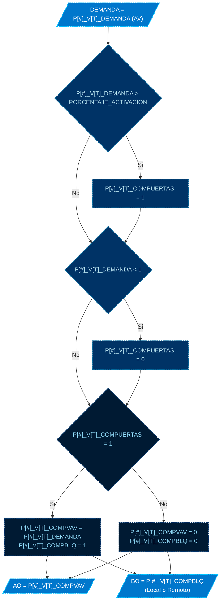

# MOD: CONTROL DE COMPUERTAS VAVS

* **ID PROGRAMA**: PRG2
* **DI CONTROLADOR**: 10021
* **AUTOR**: Carlos Jiménez Hirashi @cjhirashi, Adaptación: Asistente de IA
* **VERSION**: 1.5.0

## DESCRIPCION

Este módulo gestiona el control de apertura de las compuertas (Compuerta VAV y Compuerta de bloqueo) de cada una de las 15 cajas VAV del sistema del Cuarto de Pruebas. La operación se basa en el valor de demanda de apertura (`P[#]_V[T]_DEMANDA`) que es asignado a cada caja VAV desde otro módulo de control. Cuando la demanda supera un umbral predefinido, el módulo activa el control y envía la señal de apertura correspondiente a la compuerta VAV y abre la compuerta de bloqueo. Si la demanda cae por debajo del umbral mínimo, cierra ambas compuertas.

El sistema controla las siguientes VAVs:

*   **PLENUM 1** (P1): VAV Mediana (VM), VAV Grande (VG), VAV Chica (VC)
*   **PLENUM 2** (P2): VAV Mediana (VM), VAV Grande (VG)
*   **PLENUM 3** (P3): VAV Grande (VG)
*   **PLENUM 4** (P4): VAV Mediana (VM), VAV Grande (VG), VAV Chica (VC)
*   **PLENUM 5** (P5): VAV Chica (VC), VAV Grande (VG)
*   **PLENUM 6** (P6): VAV Grande (VG), VAV Mediana (VM)
*   **PLENUM 7R** (P7): VAV Chica (VC), VAV Grande (VG)

## LOGICA DE OPERACION

Este módulo de control se compone de dos bloques lógicos principales que se replican para cada una de las 15 VAVs:

1.  **Bloque 1: Activación del Sistema**
    *   Se monitorea la variable de demanda (`P[#]_V[T]_DEMANDA`) de cada VAV.
    *   Se compara esta demanda con el umbral definido en la constante `PORCENTAJE_ACTIVACION` (valor = 5%).
    *   Si `P[#]_V[T]_DEMANDA > PORCENTAJE_ACTIVACION`, se activa el estado de control interno para esa VAV (`P[#]_V[T]_COMPUERTAS = 1`).
    *   Si `P[#]_V[T]_DEMANDA < 1`, se desactiva el estado de control (`P[#]_V[T]_COMPUERTAS = 0`). Esto asegura que una demanda muy baja o cero apague el control.

    *Ejemplo (Bloque 1 - P1_VM):*
    ```basic
    REM ***BLOQUE: Activación del sistema.
        IF P1_VM_DEMANDA > PORCENTAJE_ACTIVACION THEN P1_VM_COMPUERTAS = 1
        IF P1_VM_DEMANDA < 1 THEN P1_VM_COMPUERTAS = 0
    ```

2.  **Bloque 2: Conexión de Demanda para Apertura de Compuertas**
    *   Se evalúa el estado de control interno (`P[#]_V[T]_COMPUERTAS`) determinado en el Bloque 1.
    *   **Si está ACTIVO (`= 1`):**
        *   La salida de la Compuerta VAV (`P[#]_V[T]_COMPVAV`) se iguala directamente a la demanda (`= P[#]_V[T]_DEMANDA`).
        *   La salida de la Compuerta de Bloqueo (`P[#]_V[T]_COMPBLQ`) se comanda a ABRIR (`= 1`).
    *   **Si está INACTIVO (`= 0`):**
        *   La salida de la Compuerta VAV (`P[#]_V[T]_COMPVAV`) se comanda a CERRAR (`= 0`).
        *   La salida de la Compuerta de Bloqueo (`P[#]_V[T]_COMPBLQ`) se comanda a CERRAR (`= 0`).

    *Ejemplo (Bloque 2 - P1_VM):*
    ```basic
    REM ***BLOQUE: Conexión de demanda para apertura de compuertas.
        IF P1_VM_COMPUERTAS = 1 THEN
            P1_VM_COMPVAV = P1_VM_DEMANDA
            P1_VM_COMPBLQ = 1
        ELSE
            P1_VM_COMPVAV = 0
            P1_VM_COMPBLQ = 0
        ENDIF
    ```

**Manejo de Compuertas de Bloqueo Locales y Remotas:**
Este programa controla salidas de Compuerta de Bloqueo (`_COMPBLQ`) que residen tanto en el controlador local (DI 10021) como en un controlador remoto (DI 10022).
*   Las salidas BO14, BO15, BO22, BO16, BO24, BO17, BO18 son locales al DI 10021.
*   Las salidas 10022.BO1 a 10022.BO8 son remotas y se escriben directamente especificando el DI del controlador remoto en la asignación.

*Ejemplo (Escritura Local - P1_VM):*
```basic
BO14 = P1_VM_COMPBLQ   : REM ... - ESCRITURA LOCAL
```
*Ejemplo (Escritura Remota - P2_VG):*
```basic
10022.BO1 = P2_VG_COMPBLQ : REM ... - ESCRITURA REMOTO
```

**Uso de Puntos de Control y UI:**

*   **Monitoreo (UI):**
    *   `P[#]_V[T]_DEMANDA` (AV): Permite visualizar la demanda de entrada para cada VAV.
    *   `P[#]_V[T]_COMPVAV` (AO): Muestra el porcentaje de apertura comandado a la compuerta VAV.
    *   `P[#]_V[T]_COMPBLQ` (BO Local / BO Remoto): Muestra el estado comandado (Abierta/Cerrada) de la compuerta de bloqueo.


## DIAGRAMAS DE CONTROL

### CODIGO DE COLORES


### MODULO - CONTROL DE COMPUERTAS VAVS (Lógica replicada para cada VAV)

*Nota: El diagrama anterior representa la lógica que se aplica individualmente a cada una de las 15 VAVs controladas por este programa.*

---
## LISTA DE PUNTOS DEL PROGRAMA

## VARIABLES INTERNAS

### CONSTANTES

#### AJUSTES DE OPERACION
1.  `PORCENTAJE_ACTIVACION` **5** *Umbral de demanda para activar control de compuertas* ( `%` )

### VARIABLES

#### ESTADO DE CONTROL VAVs
1.  `P1_VM_COMPUERTAS` *Estado del control de compuertas VAV Mediana Plenum 1* ( `ACTIVO/INACTIVO` )
2.  `P1_VG_COMPUERTAS` *Estado del control de compuertas VAV Grande Plenum 1* ( `ACTIVO/INACTIVO` )
3.  `P1_VC_COMPUERTAS` *Estado del control de compuertas VAV Chica Plenum 1* ( `ACTIVO/INACTIVO` )
4.  `P2_VM_COMPUERTAS` *Estado del control de compuertas VAV Mediana Plenum 2* ( `ACTIVO/INACTIVO` )
5.  `P2_VG_COMPUERTAS` *Estado del control de compuertas VAV Grande Plenum 2* ( `ACTIVO/INACTIVO` )
6.  `P3_VG_COMPUERTAS` *Estado del control de compuertas VAV Grande Plenum 3* ( `ACTIVO/INACTIVO` )
7.  `P4_VM_COMPUERTAS` *Estado del control de compuertas VAV Mediana Plenum 4* ( `ACTIVO/INACTIVO` )
8.  `P4_VG_COMPUERTAS` *Estado del control de compuertas VAV Grande Plenum 4* ( `ACTIVO/INACTIVO` )
9.  `P4_VC_COMPUERTAS` *Estado del control de compuertas VAV Chica Plenum 4* ( `ACTIVO/INACTIVO` )
10. `P5_VC_COMPUERTAS` *Estado del control de compuertas VAV Chica Plenum 5* ( `ACTIVO/INACTIVO` )
11. `P5_VG_COMPUERTAS` *Estado del control de compuertas VAV Grande Plenum 5* ( `ACTIVO/INACTIVO` )
12. `P6_VG_COMPUERTAS` *Estado del control de compuertas VAV Grande Plenum 6* ( `ACTIVO/INACTIVO` )
13. `P6_VM_COMPUERTAS` *Estado del control de compuertas VAV Mediana Plenum 6* ( `ACTIVO/INACTIVO` )
14. `PR7_VC_COMPUERTAS` *Estado del control de compuertas VAV Chica Plenum 7R* ( `ACTIVO/INACTIVO` )
15. `PR7_VG_COMPUERTAS` *Estado del control de compuertas VAV Grande Plenum 7R* ( `ACTIVO/INACTIVO` )

## VARIABLES EXTERNAS

### PLENUM 1 - VAV MEDIANA (P1_VM)
1.  `P1_VM_DEMANDA` **AV85** *PLENUM 1 - VAV MEDIANA - DEMANDA* ( `%` )
    LECTURA - LOCAL - DI-10021
2.  `P1_VM_COMPVAV` **AO1** *PLENUM 1 - VAV MEDIANA - COMPUERTA VAV* ( `%` )
    ESCRITURA - LOCAL - DI-10021
3.  `P1_VM_COMPBLQ` **BO14** *PLENUM 1, VAV 01 - MEDIANA, COMPUERTA BLOQUEO* ( `ABIERTA/CERRADA` )
    ESCRITURA - LOCAL - DI-10021

### PLENUM 1 - VAV GRANDE (P1_VG)
1.  `P1_VG_DEMANDA` **AV86** *PLENUM 1 - VAV GRANDE - DEMANDA* ( `%` )
    LECTURA - LOCAL - DI-10021
2.  `P1_VG_COMPVAV` **AO2** *PLENUM 1, VAV 02 - GRANDE, COMPUERTA VAV* ( `%` )
    ESCRITURA - LOCAL - DI-10021
3.  `P1_VG_COMPBLQ` **BO15** *PLENUM 1, VAV 02 - GRANDE, COMPUERTA BLOQUEO* ( `ABIERTA/CERRADA` )
    ESCRITURA - LOCAL - DI-10021

### PLENUM 1 - VAV CHICA (P1_VC)
1.  `P1_VC_DEMANDA` **AV67** *PLENUM 1 - VAV CHICA - DEMANDA* ( `%` )
    LECTURA - LOCAL - DI-10021
2.  `P1_VC_COMPVAV` **AO21** *PLENUM 1, VAV 03 - CHICA, COMPUERTA VAV* ( `%` )
    ESCRITURA - LOCAL - DI-10021
3.  `P1_VC_COMPBLQ` **BO22** *PLENUM 1, VAV 03 - CHICA, COMPUERTA BLOQUEO* ( `ABIERTA/CERRADA` )
    ESCRITURA - LOCAL - DI-10021

### PLENUM 2 - VAV MEDIANA (P2_VM)
1.  `P2_VM_DEMANDA` **AV87** *PLENUM 2 - VAV MEDIANA - DEMANDA* ( `%` )
    LECTURA - LOCAL - DI-10021
2.  `P2_VM_COMPVAV` **AO3** *PLENUM 2, VAV 01 - MEDIANA, COMPUERTA VAV* ( `%` )
    ESCRITURA - LOCAL - DI-10021
3.  `P2_VM_COMPBLQ` **BO16** *PLENUM 2, VAV 01 - MEDIANA, COMPUERTA BLOQUEO* ( `ABIERTA/CERRADA` )
    ESCRITURA - LOCAL - DI-10021

### PLENUM 2 - VAV GRANDE (P2_VG)
1.  `P2_VG_DEMANDA` **AV88** *PLENUM 2 - VAV GRANDE - DEMANDA* ( `%` )
    LECTURA - LOCAL - DI-10021
2.  `P2_VG_COMPVAV` **AO4** *PLENUM 2, VAV 02 - GRANDE, COMPUERTA VAV* ( `%` )
    ESCRITURA - LOCAL - DI-10021
3.  `P2_VG_COMPBLQ` **10022.BO1** *PLENUM 2, VAV 02 - GRANDE, COMPUERTA BLOQUEO* ( `ABIERTA/CERRADA` )
    ESCRITURA - REMOTO - DI-10022

### PLENUM 3 - VAV GRANDE (P3_VG)
1.  `P3_VG_DEMANDA` **AV68** *PLENUM 3 - GRANDE - DEMANDA* ( `%` )
    LECTURA - LOCAL - DI-10021
2.  `P3_VG_COMPVAV` **AO23** *PLENUM 3, VAV 01 - GRANDE, COMPUERTA VAV* ( `%` )
    ESCRITURA - LOCAL - DI-10021
3.  `P3_VG_COMPBLQ` **BO24** *PLENUM 3, VAV 01 - GRANDE, COMPUERTA BLOQUEO* ( `ABIERTA/CERRADA` )
    ESCRITURA - LOCAL - DI-10021

### PLENUM 4 - VAV MEDIANA (P4_VM)
1.  `P4_VM_DEMANDA` **AV89** *PLENUM 4 - VAV MEDIANA - DEMANDA* ( `%` )
    LECTURA - LOCAL - DI-10021
2.  `P4_VM_COMPVAV` **AO5** *PLENUM 4, VAV 01 - MEDIANA, COMPUERTA VAV* ( `%` )
    ESCRITURA - LOCAL - DI-10021
3.  `P4_VM_COMPBLQ` **10022.BO2** *PLENUM 4, VAV 01 - MEDIANA, COMPUERTA BLOQUEO* ( `ABIERTA/CERRADA` )
    ESCRITURA - REMOTO - DI-10022

### PLENUM 4 - VAV GRANDE (P4_VG)
1.  `P4_VG_DEMANDA` **AV90** *PLENUM 4 - VAV GRANDE - DEMANDA* ( `%` )
    LECTURA - LOCAL - DI-10021
2.  `P4_VG_COMPVAV` **AO6** *PLENUM 4, VAV 02 - GRANDE, COMPUERTA VAV* ( `%` )
    ESCRITURA - LOCAL - DI-10021
3.  `P4_VG_COMPBLQ` **10022.BO3** *PLENUM 4, VAV 02 - GRANDE, COMPUERTA BLOQUEO* ( `ABIERTA/CERRADA` )
    ESCRITURA - REMOTO - DI-10022

### PLENUM 4 - VAV CHICA (P4_VC)
1.  `P4_VC_DEMANDA` **AV91** *PLENUM 4 - VAV CHICA - DEMANDA* ( `%` )
    LECTURA - LOCAL - DI-10021
2.  `P4_VC_COMPVAV` **AO7** *PLENUM 4, VAV 03 - CHICA, COMPUERTA VAV* ( `%` )
    ESCRITURA - LOCAL - DI-10021
3.  `P4_VC_COMPBLQ` **10022.BO4** *PLENUM 4, VAV 03 - CHICA, COMPUERTA BLOQUEO* ( `ABIERTA/CERRADA` )
    ESCRITURA - REMOTO - DI-10022

### PLENUM 5 - VAV CHICA (P5_VC)
1.  `P5_VC_DEMANDA` **AV92** *PLENUM 5 - VAV CHICA - DEMANDA* ( `%` )
    LECTURA - LOCAL - DI-10021
2.  `P5_VC_COMPVAV` **AO8** *PLENUM 5, VAV 01 - CHICA, COMPUERTA VAV* ( `%` )
    ESCRITURA - LOCAL - DI-10021
3.  `P5_VC_COMPBLQ` **10022.BO5** *PLENUM 5, VAV 01 - CHICA, COMPUERTA BLOQUEO* ( `ABIERTA/CERRADA` )
    ESCRITURA - REMOTO - DI-10022

### PLENUM 5 - VAV GRANDE (P5_VG)
1.  `P5_VG_DEMANDA` **AV93** *PLENUM 5 - VAV GRANDE - DEMANDA* ( `%` )
    LECTURA - LOCAL - DI-10021
2.  `P5_VG_COMPVAV` **AO9** *PLENUM 5, VAV 02 - GRANDE, COMPUERTA VAV* ( `%` )
    ESCRITURA - LOCAL - DI-10021
3.  `P5_VG_COMPBLQ` **10022.BO6** *PLENUM 5, VAV 02 - GRANDE, COMPUERTA BLOQUEO* ( `ABIERTA/CERRADA` )
    ESCRITURA - REMOTO - DI-10022

### PLENUM 6 - VAV GRANDE (P6_VG)
1.  `P6_VG_DEMANDA` **AV94** *PLENUM 6 - VAV GRANDE - DEMANDA* ( `%` )
    LECTURA - LOCAL - DI-10021
2.  `P6_VG_COMPVAV` **AO10** *PLENUM 6, VAV 01 - GRANDE, COMPUERTA VAV* ( `%` )
    ESCRITURA - LOCAL - DI-10021
3.  `P6_VG_COMPBLQ` **10022.BO7** *PLENUM 6, VAV 01 - GRANDE, COMPUERTA BLOQUEO* ( `ABIERTA/CERRADA` )
    ESCRITURA - REMOTO - DI-10022

### PLENUM 6 - VAV MEDIANA (P6_VM)
1.  `P6_VM_DEMANDA` **AV95** *PLENUM 6 - VAV MEDIANA - DEMANDA* ( `%` )
    LECTURA - LOCAL - DI-10021
2.  `P6_VM_COMPVAV` **AO11** *PLENUM 6, VAV 02 - MEDIANA, COMPUERTA VAV* ( `%` )
    ESCRITURA - LOCAL - DI-10021
3.  `P6_VM_COMPBLQ` **10022.BO8** *PLENUM 6, VAV 02 - MEDIANA, COMPUERTA BLOQUEO* ( `ABIERTA/CERRADA` )
    ESCRITURA - REMOTO - DI-10022

### PLENUM 7R - VAV CHICA (PR7_VC)
1.  `PR7_VC_DEMANDA` **AV96** *PLENUM R7 - VAV CHICA - DEMANDA* ( `%` )
    LECTURA - LOCAL - DI-10021
2.  `PR7_VC_COMPVAV` **AO12** *PLENUM R7, VAV 01 - CHICA, COMPUERTA VAV* ( `%` )
    ESCRITURA - LOCAL - DI-10021
3.  `PR7_VC_COMPBLQ` **BO17** *PLENUM R7, VAV 01 - CHICA, COMPUERTA BLOQUEO* ( `ABIERTA/CERRADA` )
    ESCRITURA - LOCAL - DI-10021

### PLENUM 7R - VAV GRANDE (PR7_VG)
1.  `PR7_VG_DEMANDA` **AV97** *PLENUM R7 - VAV GRANDE - DEMANDA* ( `%` )
    LECTURA - LOCAL - DI-10021
2.  `PR7_VG_COMPVAV` **AO13** *PLENUM R7, VAV 02 - GRANDE, COMPUERTA VAV* ( `%` )
    ESCRITURA - LOCAL - DI-10021
3.  `PR7_VG_COMPBLQ` **BO18** *PLENUM R7, VAV 02 - GRANDE, COMPUERTA BLOQUEO* ( `ABIERTA/CERRADA` )
    ESCRITURA - LOCAL - DI-10021
