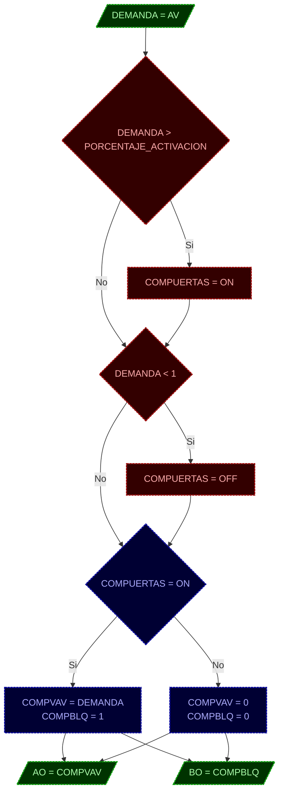

# MOD: CONTROL DE COMPUERTAS VAVS

*   **ID PROGRAMA**: PRG2
*   **DI CONTROLADOR**: 10021
*   **AUTOR**: Carlos Jiménez Hirashi @cjhirashi
*   **VERSION**: 1.5.0

## DESCRIPCION

Este módulo gestiona el control de apertura de las compuertas (Compuerta VAV y Compuerta de bloqueo) de cada caja VAV del Cuarto de pruebas, basándose en el valor de demanda de apertura de compuerta que se asigna a cada caja VAV (esta demanda se genera en otro módulo de control).

El sistema cuenta con 15 cajas VAV distribuidas en 7 Plenums:

*   **PLENUM 1** (P1)
    1.  ***VAV MEDIANA*** (VM)
    2.  ***VAV GRANDE*** (VG)
    3.  ***VAV CHICA*** (VC)
*   **PLENUM 2** (P2)
    4.  ***VAV MEDIANA*** (VM)
    5.  ***VAV GRANDE*** (VG)
*   **PLENUM 3** (P3)
    6.  ***VAV GRANDE*** (VG)
*   **PLENUM 4** (P4)
    7.  ***VAV MEDIANA*** (VM)
    8.  ***VAV GRANDE*** (VG)
    9.  ***VAV CHICA*** (VC)
*   **PLENUM 5** (P5)
    10. ***VAV CHICA*** (P5_VC)
    11. ***VAV GRANDE*** (VG)
*   **PLENUM 6** (P6)
    12. ***VAV GRANDE*** (VG)
    13. ***VAV MEDIANA*** (VM)
*   **PLENUM 7R** (P7)
    14. ***VAV CHICA*** (VC)
    15. ***VAV GRANDE*** (VG)

## LOGICA DE OPERACION

Este módulo de control se encarga de activar y controlar las compuertas VAV (de volumen variable) y las compuertas de bloqueo asociadas a cada una de las 15 cajas VAV en los 7 plenums del sistema.  La activación se basa en una señal de demanda que indica el porcentaje de apertura deseado para cada compuerta VAV.

El módulo de control opera de la siguiente manera:

1.  **Activación/Desactivación:** Para cada caja VAV, se compara la señal de demanda (`P[#]_V[T]_DEMANDA`) con un umbral de activación constante (`PORCENTAJE_ACTIVACION`).
    *   Si la demanda es mayor que el umbral, se activa el control de la compuerta (`P[#]_V[T]_COMPUERTAS = 1`).
    *   Si la demanda cae por debajo de 1, se desactiva el control (`P[#]_V[T]_COMPUERTAS = 0`).

2.  **Control de Compuertas:**
    *   Cuando el control está activo (`P[#]_V[T]_COMPUERTAS = 1`):
        *   La compuerta VAV (`P[#]_V[T]_COMPVAV`) se ajusta directamente al valor de la demanda (`P[#]_V[T]_DEMANDA`).
        *   La compuerta de bloqueo (`P[#]_V[T]_COMPBLQ`) se abre (se le asigna el valor `1`).
    *   Cuando el control está inactivo (`P[#]_V[T]_COMPUERTAS = 0`):
        *   La compuerta VAV se cierra (se le asigna el valor `0`).
        *   La compuerta de bloqueo se cierra (se le asigna el valor `0`).

Este proceso se repite para *cada una* de las 15 cajas VAV, utilizando el prefijo `P[#]_V[T]_` para identificar de forma única los puntos de control de cada VAV.  Donde `#` representa el número de Plenum (1 a 7, o 7R) y `T` representa el tamaño de la VAV (G: Grande, M: Mediana, C: Chica).  Por ejemplo, `P1_VG_DEMANDA` es la demanda de la VAV grande del Plenum 1.

**Interfaz de Usuario (UI):**

Las siguientes variables son de *solo lectura* en la interfaz de usuario, mostrando el estado actual del sistema:

*   `P[#]_V[T]_DEMANDA`:  Muestra el porcentaje de demanda actual para cada VAV.
*   `P[#]_V[T]_COMPVAV`: Muestra la posición actual (porcentaje de apertura) de cada compuerta VAV.
*   `P[#]_V[T]_COMPBLQ`: Muestra el estado actual (abierta/cerrada) de cada compuerta de bloqueo.

No se requiere interacción del operador con este módulo a través de la UI, ya que la demanda se genera en otro módulo y el control es totalmente automático.

## DIAGRAMAS DE CONTROL

### CODIGO DE COLORES

### MODULO - CONTROL DE COMPUERTAS VAVS

*Nota*: El diagrama representa el flujo de control para una *única* VAV.  Este mismo flujo se replica para cada una de las 15 VAVs.
---

## LISTA DE PUNTOS DEL PROGRAMA

# LISTA DE PUNTOS DEL PROGRAMA

## VARIABLES INTERNAS

### CONSTANTES

#### AJUSTES DE OPERACION
1.  `PORCENTAJE_ACTIVACION` **5**  *Porcentaje de activación del control de compuertas* ( *%* )

### VARIABLES

#### ESTADO DE LAS VAVS
1.  `P1_VM_COMPUERTAS` *Estado de operación del control de compuertas de la VAV* ( *ACTIVA/INACTIVA* )
2.  `P1_VG_COMPUERTAS` *Estado de operación del control de compuertas de la VAV* ( *ACTIVA/INACTIVA* )
3.  `P1_VC_COMPUERTAS` *Estado de operación del control de compuertas de la VAV* ( *ACTIVA/INACTIVA* )
4.  `P2_VM_COMPUERTAS` *Estado de operación del control de compuertas de la VAV* ( *ACTIVA/INACTIVA* )
5.  `P2_VG_COMPUERTAS` *Estado de operación del control de compuertas de la VAV* ( *ACTIVA/INACTIVA* )
6.  `P3_VG_COMPUERTAS` *Estado de operación del control de compuertas de la VAV* ( *ACTIVA/INACTIVA* )
7.  `P4_VM_COMPUERTAS` *Estado de operación del control de compuertas de la VAV* ( *ACTIVA/INACTIVA* )
8.  `P4_VG_COMPUERTAS` *Estado de operación del control de compuertas de la VAV* ( *ACTIVA/INACTIVA* )
9.  `P4_VC_COMPUERTAS` *Estado de operación del control de compuertas de la VAV* ( *ACTIVA/INACTIVA* )
10. `P5_VC_COMPUERTAS` *Estado de operación del control de compuertas de la VAV* ( *ACTIVA/INACTIVA* )
11. `P5_VG_COMPUERTAS` *Estado de operación del control de compuertas de la VAV* ( *ACTIVA/INACTIVA* )
12. `P6_VG_COMPUERTAS` *Estado de operación del control de compuertas de la VAV* ( *ACTIVA/INACTIVA* )
13. `P6_VM_COMPUERTAS` *Estado de operación del control de compuertas de la VAV* ( *ACTIVA/INACTIVA* )
14. `PR7_VC_COMPUERTAS` *Estado de operación del control de compuertas de la VAV* ( *ACTIVA/INACTIVA* )
15. `PR7_VG_COMPUERTAS` *Estado de operación del control de compuertas de la VAV* ( *ACTIVA/INACTIVA* )

## VARIABLES EXTERNAS

### PLENUM 1
1.  `P1_VM_DEMANDA` **AV85**  *PLENUM 1 - VAV MEDIANA - DEMANDA* ( *%* )
    LECTURA - LOCAL - DI-10021
2.  `P1_VG_DEMANDA` **AV86**  *PLENUM 1 - VAV GRANDE - DEMANDA* ( *%* )
    LECTURA - LOCAL - DI-10021
3. `P1_VC_DEMANDA` **AV67** *PLENUM 1, VAV03 - CHICA, DEMANDA* ( *%* )
    LECTURA - LOCAL - DI-10021
4.  `P1_VM_COMPVAV` **AO1**  *PLENUM 1, VAV 01 - MEDIANA, COMPUERTA VAV* ( *%* )
    ESCRITURA - LOCAL - DI-10021
5.  `P1_VG_COMPVAV` **AO2**  *PLENUM 1, VAV 02 - GRANDE, COMPUERTA VAV* ( *%* )
    ESCRITURA - LOCAL - DI-10021
6. `P1_VC_COMPVAV` **AO21** *PLENUM 1, VAV 03 - CHICA, COMPUERTA VAV* ( *%* )
    ESCRITURA - LOCAL - DI-10021
7.  `P1_VM_COMPBLQ` **BO14**  *PLENUM 1, VAV 01 - MEDIANA, COMPUERTA BLOQUEO* ( *ABIERTA/CERRADA* )
    ESCRITURA - LOCAL - DI-10021
8.  `P1_VG_COMPBLQ` **BO15**  *PLENUM 1, VAV 02 - GRANDE, COMPUERTA BLOQUEO* ( *ABIERTA/CERRADA* )
    ESCRITURA - LOCAL - DI-10021
9. `P1_VC_COMPBLQ` **BO22** *PLENUM 1, VAV 03 - CHICA, COMPUERTA BLOQUEO* ( *ABIERTA/CERRADA* )
    ESCRITURA - LOCAL - DI-10021

### PLENUM 2
1.  `P2_VM_DEMANDA` **AV87**  *PLENUM 2 - VAV MEDIANA - DEMANDA* ( *%* )
    LECTURA - LOCAL - DI-10021
2.  `P2_VG_DEMANDA` **AV88**  *PLENUM 2 - VAV GRANDE - DEMANDA* ( *%* )
    LECTURA - LOCAL - DI-10021
3.  `P2_VM_COMPVAV` **AO3**  *PLENUM 2, VAV 01 - MEDIANA, COMPUERTA VAV* ( *%* )
    ESCRITURA - LOCAL - DI-10021
4.  `P2_VG_COMPVAV` **AO4**  *PLENUM 2, VAV 02 - GRANDE, COMPUERTA VAV* ( *%* )
    ESCRITURA - LOCAL - DI-10021
5.  `P2_VM_COMPBLQ` **BO16**  *PLENUM 2, VAV 01 - MEDIANA, COMPUERTA BLOQUEO* ( *ABIERTA/CERRADA* )
    ESCRITURA - LOCAL - DI-10021
6.  `P2_VG_COMPBLQ`**BO1** *PLENUM 2, VAV 02 - GRANDE, COMPUERTA BLOQUEO* ( *ABIERTA/CERRADA* )
    ESCRITURA - REMOTO - DI-10022

### PLENUM 3
1.  `P3_VG_DEMANDA` **AV68**  *PLENUM 3, VAV01 - GRANDE, DEMANDA* ( *%* )
    LECTURA - LOCAL - DI-10021
2.  `P3_VG_COMPVAV` **AO23**  *PLENUM 3, VAV 01 - GRANDE, COMPUERTA VAV* ( *%* )
    ESCRITURA - LOCAL - DI-10021
3.  `P3_VG_COMPBLQ` **BO24**  *PLENUM 3, VAV 01 - GRANDE, COMPUERTA BLOQUEO* ( *ABIERTA/CERRADA* )
    ESCRITURA - LOCAL - DI-10021

### PLENUM 4
1. `P4_VM_DEMANDA` **AV89** *PLENUM 4 - VAV MEDIANA - DEMANDA* ( *%* )
   LECTURA - LOCAL - DI-10021
2. `P4_VG_DEMANDA` **AV90** *PLENUM 4 - VAV GRANDE - DEMANDA* ( *%* )
    LECTURA - LOCAL - DI-10021
3. `P4_VC_DEMANDA` **AV91** *PLENUM 4 - VAV CHICA - DEMANDA* ( *%* )
    LECTURA - LOCAL - DI-10021
4. `P4_VM_COMPVAV` **AO5** *PLENUM 4, VAV 01 - MEDIANA, COMPUERTA VAV* ( *%* )
    ESCRITURA - LOCAL - DI-10021
5. `P4_VG_COMPVAV` **AO6** *PLENUM 4, VAV 02 - GRANDE, COMPUERTA VAV* ( *%* )
    ESCRITURA - LOCAL - DI-10021
6. `P4_VC_COMPVAV` **AO7** *PLENUM 4, VAV 03 - CHICA, COMPUERTA VAV* ( *%* )
    ESCRITURA - LOCAL - DI-10021
7. `P4_VM_COMPBLQ` **BO2**  *PLENUM 4, VAV 01 - MEDIANA, COMPUERTA BLOQUEO* ( *ABIERTA/CERRADA* )
    ESCRITURA - REMOTO - DI-10022
8. `P4_VG_COMPBLQ` **BO3**  *PLENUM 4, VAV 02 - GRANDE, COMPUERTA BLOQUEO* ( *ABIERTA/CERRADA* )
    ESCRITURA - REMOTO - DI-10022
9.  `P4_VC_COMPBLQ` **BO4**  *PLENUM 4, VAV 03 - CHICA, COMPUERTA BLOQUEO* ( *ABIERTA/CERRADA* )
    ESCRITURA - REMOTO - DI-10022

### PLENUM 5
1.  `P5_VC_DEMANDA` **AV92**  *PLENUM 5 - VAV CHICA - DEMANDA* ( *%* )
    LECTURA - LOCAL - DI-10021
2.  `P5_VG_DEMANDA` **AV93**  *PLENUM 5 - VAV GRANDE - DEMANDA* ( *%* )
    LECTURA - LOCAL - DI-10021
3.  `P5_VC_COMPVAV` **AO8**  *PLENUM 5, VAV 01 - CHICA, COMPUERTA VAV* ( *%* )
    ESCRITURA - LOCAL - DI-10021
4.  `P5_VG_COMPVAV` **AO9**  *PLENUM 5, VAV 02 - GRANDE, COMPUERTA VAV* ( *%* )
    ESCRITURA - LOCAL - DI-10021
5.  `P5_VG_COMPBLQ` **BO6** *PLENUM 5, VAV 02 - GRANDE, COMPUERTA BLOQUEO* ( *ABIERTA/CERRADA* )
    ESCRITURA - REMOTO - DI-10022
6.  `P5_VC_COMPBLQ` **BO5** *PLENUM 5, VAV 01 - CHICA, COMPUERTA BLOQUEO* ( *ABIERTA/CERRADA* )
    ESCRITURA - REMOTO - DI-10022

### PLENUM 6
1.  `P6_VG_DEMANDA` **AV94**  *PLENUM 6, VAV01 - GRANDE, DEMANDA* ( *%* )
    LECTURA - LOCAL - DI-10021
2.  `P6_VM_DEMANDA` **AV95**  *PLENUM 6, VAV02 - MEDIANA, DEMANDA* ( *%* )
    LECTURA - LOCAL - DI-10021
3.  `P6_VG_COMPVAV` **AO10**  *PLENUM 6, VAV 01 - GRANDE, COMPUERTA VAV* ( *%* )
    ESCRITURA - LOCAL - DI-10021
4.  `P6_VM_COMPVAV` **AO11**  *PLENUM 6, VAV 02 - MEDIANA, COMPUERTA VAV* ( *%* )
    ESCRITURA - LOCAL - DI-10021
5.  `P6_VM_COMPBLQ` **BO8** *PLENUM 6, VAV 02 - MEDIANA, COMPUERTA BLOQUEO* ( *ABIERTA/CERRADA*)
    ESCRITURA - REMOTO - DI-10022
6. `P6_VG_COMPBLQ` **BO7**  *PLENUM 6, VAV 01 - GRANDE, COMPUERTA BLOQUEO* ( *ABIERTA/CERRADA* )
    ESCRITURA - REMOTO - DI-10022

### PLENUM R7
1.  `PR7_VC_DEMANDA` **AV96**  *PLENUM R7, VAV01 - CHICA, DEMANDA* ( *%* )
    LECTURA - LOCAL - DI-10021
2.  `PR7_VG_DEMANDA` **AV97**  *PLENUM R7, VAV02 - GRANDE, DEMANDA* ( *%* )
    LECTURA - LOCAL - DI-10021
3.  `PR7_VC_COMPVAV` **AO12**  *PLENUM R7, VAV 01 - CHICA, COMPUERTA VAV* ( *%* )
    ESCRITURA - LOCAL - DI-10021
4.  `PR7_VG_COMPVAV` **AO13**  *PLENUM R7, VAV 02 - GRANDE, COMPUERTA VAV* ( *%* )
    ESCRITURA - LOCAL - DI-10021
5.  `PR7_VC_COMPBLQ` **BO17**  *PLENUM R7, VAV 01 - CHICA, COMPUERTA BLOQUEO* ( *ABIERTA/CERRADA* )
    ESCRITURA - LOCAL - DI-10021
6.  `PR7_VG_COMPBLQ` **BO18**  *PLENUM R7, VAV 02 - GRANDE, COMPUERTA BLOQUEO* ( *ABIERTA/CERRADA* )
    ESCRITURA - LOCAL - DI-10021