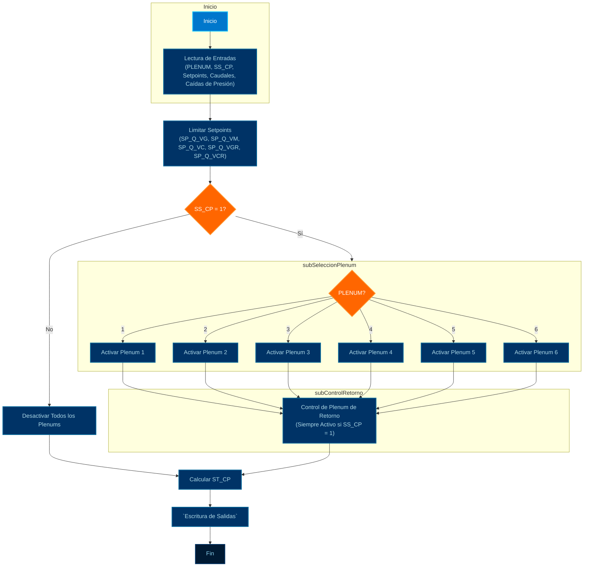

# PROGRAMA

*   **NOMBRE**: MOD: CONTROL DE PLENUMS
*   **ID PROGRAMA**: PRG3
*   **DI CONTROLADOR**: 10021
*   **AUTOR**: Carlos Jiménez Hirashi *@cjhirashi*, Adaptación: Asistente de IA
*   **VERSION**: 1.5.0

## DESCRIPCION

Este módulo gestiona la selección del plenum activo, la activación/desactivación de las VAVs en función del plenum seleccionado, la limitación de los setpoints de caudal y la asignación de variables para el control de las VAVs y el monitoreo del sistema.

Los rangos de medición de caudales por caja son los siguientes:

### PLENUM 1

* **VAV GRANDE**

	* **MAX** = 3000	
	* **MIN** = 1100	

* **VAV MEDIANA**

	* **MAX** = 850	
	* **MIN** = 350

* **VAV CHICA**

	* **MAX** = 200	
	* **MIN** = 75

### PLENUM 2

* **VAV GRANDE**

	* **MAX** = 2000	
	* **MIN** = 850	

* **VAV MEDIANA**

    * **MAX** = 650	
	* **MIN** = 275

### PLENUM 3

* **VAV GRANDE**

	* **MAX** = 1350
	* **MIN** = 575	

### PLENUM 4

* **VAV GRANDE**

	* **MAX** = 3000	
	* **MIN** = 1100	

* **VAV MEDIANA**
	* **MAX** = 850	
	* **MIN** = 350	

* **VAV CHICA**

	* **MAX** = 200	
	* **MIN** = 75
	
### PLENUM 5

* **VAV GRANDE**

	* **MAX** = 4000	
	* **MIN** = 1500	

* **VAV CHICA**

	* **MAX** = 300	
	* **MIN** = 125	

### PLENUM 6
		
* **VAV GRANDE**

	* **MAX** = 3000	
	* **MIN** = 1100	

* **VAV MEDIANA**

	* **MAX** = 850	
	* **MIN** = 350	

### PLENUM 7

* **VAV GRANDE**

	* **MAX** = 3000	
	* **MIN** = 1100	

* **VAV CHICA**

	* **MAX** = 200	
	* **MIN** = 75


## VARIABLES DE CONTROL

**NOTA**: Todas las variables de control que contengan un prefijo `P[#]_V[T]_`, indican que son variables relacionadas al control de cada VAV, `P[#]` hace referencia al número de Plenum que pertenece, el factor `[#]` representa el número del Plenum que corresponde, `V[T]` hace referencia al tamaño de caja, el factor `[T]` representa el tamaño de caja y su valor puede ser `G` GRANDE, `M` MEDIANA o `C` CHICA, con estos parámetros podremos saber a qué caja VAV y qué Plenum pertenece.

### VARIABLES INTERNAS

#### CONSTANTES

*   **Rangos de Operación de Caudal (QMAX, QMIN):** Para cada VAV (ej: `P1_VG_QMAX`, `P1_VG_QMIN`, etc.). *

### VARIABLES EXTERNAS

*   **Entradas:**
    *   `PLENUM` (MSV): Selector del plenum activo (0 = Ninguno, 1-6 = Plenum 1-6). (LEE)
    *   `SS_CP` Señal de activación del sistema. (LEE)

    *   `V[T]_Q-SP` Setpoint de caudal para VAV [TAMAÑO] activa. (LEE)
    *   `P[#]_V[T]_Q` Caudales VAV. (LEE)

    *   `P1_DP_1` Caida de presión 1 PLENUM 1. (LEE)
    *   `P1_DP_2` Caida de presión 2 PLENUM 1. (LEE)
    *   `P2_DP` Caida de presión PLENUM 2. (LEE)
    *   `P4_DP` Caida de presión PLENUM 4. (LEE)
    *   `P5_DP` Caida de presión PLENUM 5. (LEE)
    *   `P6_DP` Caida de presión PLENUM 6. (LEE)

*   **Salidas:**
    *   `ST_CP`Estado de operación general. (ESCRIBE)
    *   `ST_P1` - `ST_P6` Estado de operación de cada plenum (1-6). (ESCRIBE)

    *   `V[T]_DEMANDA` Demanda de VAV [TAMAÑO] activa. (ESCRIBE)

    *   `V[T]_Q` Caudal de VAV Grande Activa (ESCRIBE)
    *   `Q_T` Caudal Total Activo (ESCRIBE)
    *   `P[#]_V[T]_COMPVAV` Control de compuerta VAV (ESCRIBE)

    *   `DP_1` Caida de presión 1 de plenum activo (ESCRIBE)
    *   `DP_2` Caida de presión 2 de plenum activo (ESCRIBE)
    *   `VG_MIN` Caudal Mínimo de VAV Grande activa (ESCRIBE)
    *   `VG_MAX` Caudal Máximo de VAV Grande activa (ESCRIBE)
    *   `VM_MIN` Caudal Mínimo de VAV Mediana activa (ESCRIBE)
    *   `VM_MAX` Caudal Máximo de VAV Mediana activa (ESCRIBE)
    *   `VC_MIN` Caudal Mínimo de VAV Chica activa (ESCRIBE)
    *   `VC_MAX` Caudal Máximo de VAV Chica activa (ESCRIBE)

## LOGICA DE OPERACION

Este módulo realiza las siguientes acciones:

1.  **Lectura de Entradas:** Lee el estado de las variables de entrada (PLENUM, SS_CP, setpoints, caudales, caídas de presión).

2.  **Limitación de Setpoints:** Limita los setpoints de caudal de las VAVs dentro de los rangos de operación definidos por las constantes QMAX y QMIN.

3.  **Selección de Plenum Activo:**
    *   Si el sistema está activo (`SS_CP = 1`) y se ha seleccionado un plenum válido (`PLENUM` entre 1 y 6):
        *   Se activa el plenum correspondiente.
        *   Se asignan las variables de caudal, demanda y control de compuertas correspondientes al plenum activo.
        *   Se establecen los límites de caudal (MAX, MIN) para las VAVs del plenum activo.
        *   Se desactivan los otros plenums.

4.  **Control de Plenum de Retorno (Plenum 7):**
    *   Si el sistema está activo (`SS_CP = 1`):
        *   Se asignan las demandas a las variables de control de las compuertas de las VAVs de retorno.

5.  **Sistema Inactivo:**
    *   Si el sistema está inactivo (`SS_CP = 0`):
        *   Se establecen las variables de control de las compuertas a 0 (cerrando todas las VAVs).
        *   Se establecen los estados de operación de los plenums a 0.

6.  **Estado de Operación General:**
    *   Se calcula el estado de operación general (`ST_CP`) como el máximo de los estados de los plenums.

7.  **Escritura de Salidas:** Se escriben los valores calculados en las variables de salida.

**Pseudocódigo (Simplificado):**

```basic
// Leer entradas
PLENUM = MSV1
SS_CP = BV1
... (leer todos los setpoints y caudales) ...

// Limitar setpoints
SP_Q_VG = MIN(MAX(SP_Q_VG, MIN_VG), MAX_VG)
SP_Q_VM = MIN(MAX(SP_Q_VM, MIN_VM), MAX_VM)
SP_Q_VC = MIN(MAX(SP_Q_VC, MIN_VC), MAX_VC)
SP_Q_VGR = MIN(MAX(SP_Q_VGR, P7_VG_QMIN), P7_VG_QMAX)
SP_Q_VCR = MIN(MAX(SP_Q_VCR, P7_VC_QMIN), P7_VC_QMAX)

// Limitar selector de plenum
PLENUM = MAX(1, MIN(PLENUM, 6))

// Lógica de selección de plenum y activación/desactivación de VAVs
IF SS_CP = 1 THEN
    IF PLENUM = 1 THEN
        // Activar Plenum 1
        ...
    ELSE IF PLENUM = 2 THEN
        // Activar Plenum 2
        ...
    ELSE IF PLENUM = 3 THEN
        // Activar Plenum 3
        ...
    ELSE IF PLENUM = 4 THEN
        // Activar Plenum 4
        ...
    ELSE IF PLENUM = 5 THEN
        // Activar Plenum 5
        ...
    ELSE IF PLENUM = 6 THEN
        // Activar Plenum 6
        ...
    ENDIF

    // Control de Plenum de Retorno (siempre activo si SS_CP = 1)
    PR7_VG_A = QR_GR_DM
    PR7_VC_A = QR_CH_DM

ELSE // SS_CP = 0
    // Desactivar todos los plenums
    ...
ENDIF

// Calcular estado de operación general
ST_CP = MAX(ST_P1, ST_P2, ST_P3, ST_P4, ST_P5, ST_P6)

// Escribir salidas
... (escribir todas las variables de salida) ...
```

**Diagrama de Flujo:**


