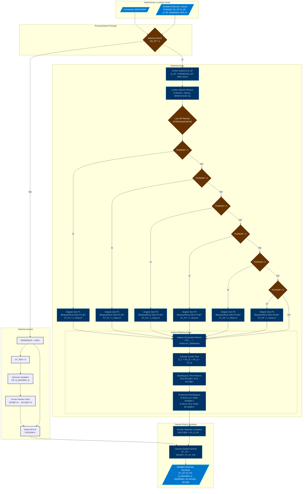

# MOD: CONTROL DE PLENUMS

* **ID PROGRAMA**: PRG3
* **DI CONTROLADOR**: 10021
* **AUTOR**: Carlos Jiménez Hirashi @cjhirashi, Adaptación: Asistente de IA
* **VERSION**: 1.5.1

## DESCRIPCION

Este módulo de control está diseñado para gestionar la operación de múltiples plenums (1 a 6) y un plenum de retorno (R7) dentro de un sistema de ventilación. Su función principal es seleccionar cuál plenum está activo basado en una señal de entrada (`PLENUM`), activar y desactivar las VAVs (Cajas de Volumen Variable) correspondientes, limitar los setpoints de caudal dentro de rangos predefinidos, y asignar las variables correctas para el control y monitoreo del plenum seleccionado.

## LOGICA DE OPERACION

El programa opera en base al estado de activación del sistema (`SS_CP`, BV1):

**Bloque: Sistema Activo (`SS_CP = 1`)**

1.  **Limitación de Setpoints de Caudal:**
    *   Se asegura que los setpoints de caudal para las VAVs activas (`VG_Q_SP`, `VM_Q_SP`, `VC_Q_SP`) y las VAVs de retorno (`VGR_Q_SP`, `VCR_Q_SP`) no excedan los límites máximos (`*_QMAX`) ni sean inferiores a los límites mínimos (`*_QMIN`) definidos como constantes. Los límites activos (`VG_MIN/MAX`, etc.) se definen dinámicamente más adelante según el plenum seleccionado.
    *   ```basic
        VG_Q_SP = MIN(MAX(VG_Q_SP, VG_MIN), VG_MAX)
        VM_Q_SP = MIN(MAX(VM_Q_SP, VM_MIN), VM_MAX)
        ...
        VCR_Q_SP = MIN(MAX(VCR_Q_SP, PR7_VC_QMIN), PR7_VC_QMAX)
        ```

2.  **Limitación del Selector de Plenum:**
    *   Se asegura que el valor de la variable `PLENUM` (MSV1) esté siempre dentro del rango válido (1 a 6).
    *   ```basic
        PLENUM = MAX(1, MIN(PLENUM, 6))
        ```

3.  **Lectura de Presión Diferencial Remota:**
    *   Cada 5 segundos, se lee el sensor de presión diferencial remoto (controlador 10022) correspondiente al plenum seleccionado.
    *   ```basic
        IF INTERVAL(00:00:05) THEN
            IF PLENUM = 1 THEN P1_DP_2 = 10022.AI3
            ...
        ENDIF
        ```

4.  **Selección de Plenum y Asignación de Variables:**
    *   Se utiliza una estructura `IF / ELSE IF` para determinar el plenum activo (1-6).
    *   **Dentro del bloque del plenum activo (Ej: Plenum 1):**
        *   Se asignan las lecturas de DP a las variables activas (`DP_1`, `DP_2`).
        *   Se gestiona el control de prioridad 7 sobre las activaciones genéricas (`BV9`-`BV11`): se libera (`RLQ`) si la VAV existe, o se fuerza a 0 si no existe en ese plenum.
        *   Se asignan los límites `QMAX`/`QMIN` del plenum a las variables activas (`VG_MAX`/`MIN`, etc.).
        *   Se asignan los caudales medidos del plenum (`P1_VG_Q`, etc.) a las variables activas (`VG_Q`, etc.).
        *   Se asignan las demandas genéricas (`VG_DEMANDA`, etc.) a las demandas específicas del plenum (`P1_VG_DEMANDA`, etc.), y las de otros plenums se ponen a 0.
        *   Se actualiza el estado del plenum (`ST_P1=1`, otros a 0).
    *   Esta lógica se replica para los 6 plenums.

5.  **Control Plenum de Retorno (R7):**
    *   Las demandas genéricas de retorno (`VGR_DEMANDA`, `VCR_DEMANDA`) se asignan a las demandas específicas del plenum R7 (`PR7_VG_DEMANDA`, `PR7_VC_DEMANDA`).

6.  **Cálculo Caudal Total:**
    *   Se suman los caudales activos (`VG_Q`, `VM_Q`, `VC_Q`) para obtener el caudal total (`Q_T`).

7.  **Desbloqueo VAVs Retorno:**
    *   Se libera (`RLQ`) el control de prioridad 7 para las VAVs de retorno (`BV12@7`, `BV13@7`), permitiendo su activación por otros programas (como PRG4).
    *   ```basic
        RLQ BV12@7
        RLQ BV13@7
        ```

8.  **Protección Anti-Bloqueo:**
    *   Se verifica si todas las VAVs de suministro (`BV9`-`BV11`) están inactivas (0). Si es así, se fuerza la activación de la VAV grande (`BV9@8 = 1`) con prioridad 8 (nivel operador) para evitar un bloqueo total.
    *   Se realiza una verificación similar para las VAVs de retorno (`BV12`, `BV13`), forzando `BV12@8 = 1` si ambas están en 0.
    *   ```basic
        IF BV9 = 0 AND BV10 = 0 AND BV11 = 0 THEN BV9@8 = 1
        IF BV12 = 0 AND BV13 = 0 THEN BV12@8 = 1
        ```

**Bloque: Sistema Inactivo (`SS_CP = 0`)**

1.  **Desactivación de Demandas:** Todas las demandas específicas de VAVs (P1 a R7) se establecen en 100%.
2.  **Desactivación Estados Plenum:** Todos los estados (`ST_P1` a `ST_P6`) se ponen a 0.
3.  **Reinicio Variables Activas:** Se reinician a 0 las variables de DP activa, límites MAX/MIN activos y caudales activos (`DP_1`, `DP_2`, `VG_MAX`, `VG_MIN`, `VG_Q`, `Q_T`, etc.).
4.  **Forzar Desactivación VAVs (Prioridad 7):** Se escribe explícitamente `0` con prioridad 7 en todas las variables de activación genéricas (`BV9@7` a `BV13@7`).
5.  **Restablecimiento Variables:** Los setpoints de caudal (`VG_Q_SP`, etc.) se resetean a 0 y la variable `PLENUM` se restablece a 1.

**Bloque Final (Siempre se ejecuta):**

1.  **Escritura de Setpoints (Prioridad 8):**
    *   Los valores de los setpoints (que pudieron haber sido limitados en el paso 1 si `SS_CP=1`) se escriben de vuelta a sus objetos AV correspondientes (`AV107` a `AV111`) utilizando la **prioridad 8**. Esto permite que la UI refleje el valor real (limitado) que se está utilizando y permite al operador sobrescribir con la misma prioridad 8 si es necesario.
    *   ```basic
        AV107@8 = VG_Q_SP
        AV108@8 = VM_Q_SP
        ...
        ```
2.  **Cálculo Estado General del Sistema:**
    *   Se determina el estado general (`ST_CP`) como el máximo de los estados individuales de los plenums (`ST_P1` a `ST_P6`).

### Uso de Puntos de Control en UI

*   **Variables que requieren interacción del operador:**
    *   `PLENUM` (MSV1): Selección manual del plenum activo (1-6).
    *   `SS_CP` (BV1): Activación/desactivación general del sistema.
    *   `VG_Q_SP` a `VCR_Q_SP` (AV107-AV111): Setpoints deseados. El operador puede escribir en prioridad 8; el programa lee este valor, lo limita si es necesario, y escribe el valor limitado de vuelta con prioridad 8.
    *   `VG_DEMANDA` a `VCR_DEMANDA` (AV82-AV84, AV80-AV81): Demandas genéricas (entrada para este programa, salida para PRG4).

*   **Variables principalmente para Monitoreo:**
    *   `ST_CP`, `ST_P1` a `ST_P6` (BV2-BV8): Estado actual del sistema y plenums.
    *   `VG_MIN` a `VC_MAX` (AV112-AV117): Límites de caudal aplicados según el plenum activo.
    *   `P1_VM_Q` a `PR7_VG_Q` (Varias AV): Caudales medidos individuales.
    *   `VG_Q`, `VM_Q`, `VC_Q`, `Q_T` (AV98-AV101): Caudales activos y total del plenum seleccionado.
    *   `P1_VM_DEMANDA` a `PR7_VG_DEMANDA` (Varias AV): Demandas específicas enviadas a cada VAV.
    *   `P1_DP_1` a `P6_DP` (AI18, 10022.AI3-AI7): Lecturas directas de sensores DP.
    *   `DP_1`, `DP_2` (AV105, AV106): DP del plenum activo.
    *   `BV9` a `BV13` (`VG_ACT` a `VCR_ACT`): Estado de activación/permiso gestionado por este programa (Prioridad 7). La protección anti-bloqueo puede escribir en `BV9@8` o `BV12@8`.

## DIAGRAMAS DE CONTROL



---
## LISTA DE PUNTOS DEL PROGRAMA

*(La lista de puntos no ha cambiado respecto a la versión anterior de la documentación de PRG3, ya que solo se modificó la lógica de uso)*

### VARIABLES INTERNAS

#### CONSTANTES

##### RANGOS DE CAUDAL PLENUM 1
1. `P1_VG_QMAX` **3000** *PLENUM 1 - VAV GRANDE - Caudal Máximo* ( cfm )
2. `P1_VG_QMIN` **1100** *PLENUM 1 - VAV GRANDE - Caudal Mínimo* ( cfm )
3. `P1_VM_QMAX` **850** *PLENUM 1 - VAV MEDIANA - Caudal Máximo* ( cfm )
4. `P1_VM_QMIN` **350** *PLENUM 1 - VAV MEDIANA - Caudal Mínimo* ( cfm )
5. `P1_VC_QMAX` **200** *PLENUM 1 - VAV CHICA - Caudal Máximo* ( cfm )
6. `P1_VC_QMIN` **75** *PLENUM 1 - VAV CHICA - Caudal Mínimo* ( cfm )

##### RANGOS DE CAUDAL PLENUM 2
7. `P2_VG_QMAX` **2000** *PLENUM 2 - VAV GRANDE - Caudal Máximo* ( cfm )
8. `P2_VG_QMIN` **850** *PLENUM 2 - VAV GRANDE - Caudal Mínimo* ( cfm )
9. `P2_VM_QMAX` **650** *PLENUM 2 - VAV MEDIANA - Caudal Máximo* ( cfm )
10. `P2_VM_QMIN` **275** *PLENUM 2 - VAV MEDIANA - Caudal Mínimo* ( cfm )

##### RANGOS DE CAUDAL PLENUM 3
11. `P3_VG_QMAX` **1350** *PLENUM 3 - VAV GRANDE - Caudal Máximo* ( cfm )
12. `P3_VG_QMIN` **575** *PLENUM 3 - VAV GRANDE - Caudal Mínimo* ( cfm )

##### RANGOS DE CAUDAL PLENUM 4
13. `P4_VG_QMAX` **3000** *PLENUM 4 - VAV GRANDE - Caudal Máximo* ( cfm )
14. `P4_VG_QMIN` **1100** *PLENUM 4 - VAV GRANDE - Caudal Mínimo* ( cfm )
15. `P4_VM_QMAX` **850** *PLENUM 4 - VAV MEDIANA - Caudal Máximo* ( cfm )
16. `P4_VM_QMIN` **350** *PLENUM 4 - VAV MEDIANA - Caudal Mínimo* ( cfm )
17. `P4_VC_QMAX` **200** *PLENUM 4 - VAV CHICA - Caudal Máximo* ( cfm )
18. `P4_VC_QMIN` **75** *PLENUM 4 - VAV CHICA - Caudal Mínimo* ( cfm )

##### RANGOS DE CAUDAL PLENUM 5
19. `P5_VG_QMAX` **4000** *PLENUM 5 - VAV GRANDE - Caudal Máximo* ( cfm )
20. `P5_VG_QMIN` **1500** *PLENUM 5 - VAV GRANDE - Caudal Mínimo* ( cfm )
21. `P5_VC_QMAX` **300** *PLENUM 5 - VAV CHICA - Caudal Máximo* ( cfm )
22. `P5_VC_QMIN` **125** *PLENUM 5 - VAV CHICA - Caudal Mínimo* ( cfm )

##### RANGOS DE CAUDAL PLENUM 6
23. `P6_VG_QMAX` **3000** *PLENUM 6 - VAV GRANDE - Caudal Máximo* ( cfm )
24. `P6_VG_QMIN` **1100** *PLENUM 6 - VAV GRANDE - Caudal Mínimo* ( cfm )
25. `P6_VM_QMAX` **850** *PLENUM 6 - VAV MEDIANA - Caudal Máximo* ( cfm )
26. `P6_VM_QMIN` **350** *PLENUM 6 - VAV MEDIANA - Caudal Mínimo* ( cfm )

##### RANGOS DE CAUDAL PLENUM 7 (RETORNO)
27. `PR7_VG_QMAX` **3000** *PLENUM R7 - VAV GRANDE - Caudal Máximo* ( cfm )
28. `PR7_VG_QMIN` **1100** *PLENUM R7 - VAV GRANDE - Caudal Mínimo* ( cfm )
29. `PR7_VC_QMAX` **200** *PLENUM R7 - VAV CHICA - Caudal Máximo* ( cfm )
30. `PR7_VC_QMIN` **75** *PLENUM R7 - VAV CHICA - Caudal Mínimo* ( cfm )

### VARIABLES EXTERNAS

#### CONTROL SISTEMA Y PLENUM
1. `PLENUM` **MSV1** *PLENUM EN OPERACION* ( 1..6 )
    LECTURA - LOCAL - DI-10021
2. `SS_CP` **BV1** *SISTEMA - ACTIVACION* ( ACTIVA/INACTIVA )
    LECTURA - LOCAL - DI-10021
3. `ST_CP` **BV2** *SISTEMA - ESTADO* ( ACTIVA/INACTIVA )
    ESCRITURA - LOCAL - DI-10021
4. `ST_P1` **BV3** *PLENUM 1 - ESTADO* ( ACTIVA/INACTIVA )
    ESCRITURA - LOCAL - DI-10021
5. `ST_P2` **BV4** *PLENUM 2 - ESTADO* ( ACTIVA/INACTIVA )
    ESCRITURA - LOCAL - DI-10021
6. `ST_P3` **BV5** *PLENUM 3 - ESTADO* ( ACTIVA/INACTIVA )
    ESCRITURA - LOCAL - DI-10021
7. `ST_P4` **BV6** *PLENUM 4 - ESTADO* ( ACTIVA/INACTIVA )
    ESCRITURA - LOCAL - DI-10021
8. `ST_P5` **BV7** *PLENUM 5 - ESTADO* ( ACTIVA/INACTIVA )
    ESCRITURA - LOCAL - DI-10021
9. `ST_P6` **BV8** *PLENUM 6 - ESTADO* ( ACTIVA/INACTIVA )
    ESCRITURA - LOCAL - DI-10021

#### SETPOINTS Y LÍMITES VAV ACTIVA
10. `VG_Q_SP` **AV107** *VAV GRANDE ACTIVA - SETPOINT DE CAUDAL* ( cfm )
    LECTURA/ESCRITURA(@8) - LOCAL - DI-10021
11. `VM_Q_SP` **AV108** *VAV MEDIANA ACTIVA - SETPOINT DE CAUDAL* ( cfm )
    LECTURA/ESCRITURA(@8) - LOCAL - DI-10021
12. `VC_Q_SP` **AV109** *VAV CHICA ACTIVA - SETPOINT DE CAUDAL* ( cfm )
    LECTURA/ESCRITURA(@8) - LOCAL - DI-10021
13. `VGR_Q_SP` **AV110** *VAV GRANDE RETORNO - SETPOINT DE CAUDAL* ( cfm )
    LECTURA/ESCRITURA(@8) - LOCAL - DI-10021
14. `VCR_Q_SP` **AV111** *VAV CHICA RETORNO - SETPOINT DE CAUDAL* ( cfm )
    LECTURA/ESCRITURA(@8) - LOCAL - DI-10021
15. `VG_MIN` **AV112** *VAV GRANDE ACTIVA - CAUDAL MINIMO* ( cfm )
    ESCRITURA - LOCAL - DI-10021
16. `VG_MAX` **AV113** *VAV GRANDE ACTIVA - CAUDAL MAXIMO* ( cfm )
    ESCRITURA - LOCAL - DI-10021
17. `VM_MIN` **AV114** *VAV MEDIANA ACTIVA - CAUDAL MINIMO* ( cfm )
    ESCRITURA - LOCAL - DI-10021
18. `VM_MAX` **AV115** *VAV MEDIANA ACTIVA - CAUDAL MAXIMO* ( cfm )
    ESCRITURA - LOCAL - DI-10021
19. `VC_MIN` **AV116** *VAV CHICA ACTIVA - CAUDAL MINIMO* ( cfm )
    ESCRITURA - LOCAL - DI-10021
20. `VC_MAX` **AV117** *VAV CHICA ACTIVA - CAUDAL MAXIMO* ( cfm )
    ESCRITURA - LOCAL - DI-10021

#### CAUDALES VAV (POR PLENUM Y ACTIVAS)
21. `P1_VM_Q` **AV4** *PLENUM 1 - VAV MEDIANA - CAUDAL FACTOR* ( cfm )
    LECTURA - LOCAL - DI-10021
22. `P1_VG_Q` **AV8** *PLENUM 1 - VAV GRANDE - CAUDAL FACTOR* ( cfm )
    LECTURA - LOCAL - DI-10021
23. `P1_VC_Q` **AV62** *PLENUM 1 - VAV CHICA - CAUDAL FACTOR* ( cfm )
    LECTURA - LOCAL - DI-10021
24. `P2_VM_Q` **AV13** *PLENUM 2 - VAV MEDIANA - CAUDAL FACTOR* ( cfm )
    LECTURA - LOCAL - DI-10021
25. `P2_VG_Q` **AV17** *PLENUM 2 - VAV GRANDE - CAUDAL FACTOR* ( cfm )
    LECTURA - LOCAL - DI-10021
26. `P3_VG_Q` **AV66** *PLENUM 3 - VAV GRANDE - CAUDAL FACTOR* ( cfm )
    LECTURA - LOCAL - DI-10021
27. `P4_VM_Q` **AV22** *PLENUM 4 - VAV MEDIANA - CAUDAL FACTOR* ( cfm )
    LECTURA - LOCAL - DI-10021
28. `P4_VG_Q` **AV26** *PLENUM 4 - VAV GRANDE - CAUDAL FACTOR* ( cfm )
    LECTURA - LOCAL - DI-10021
29. `P4_VC_Q` **AV30** *PLENUM 4 - VAV CHICA - CAUDAL FACTOR* ( cfm )
    LECTURA - LOCAL - DI-10021
30. `P5_VC_Q` **AV35** *PLENUM 5 - VAV CHICA - CAUDAL FACTOR* ( cfm )
    LECTURA - LOCAL - DI-10021
31. `P5_VG_Q` **AV39** *PLENUM 5 - VAV GRANDE - CAUDAL FACTOR* ( cfm )
    LECTURA - LOCAL - DI-10021
32. `P6_VG_Q` **AV44** *PLENUM 6 - VAV GRANDE - CAUDAL FACTOR* ( cfm )
    LECTURA - LOCAL - DI-10021
33. `P6_VM_Q` **AV48** *PLENUM 6 - VAV MEDIANA - CAUDAL FACTOR* ( cfm )
    LECTURA - LOCAL - DI-10021
34. `PR7_VC_Q` **AV53** *PLENUM R7 - VAV CHICA - CAUDAL FACTOR* ( cfm )
    LECTURA - LOCAL - DI-10021
35. `PR7_VG_Q` **AV57** *PLENUM R7 - VAV GRANDE - CAUDAL FACTOR* ( cfm )
    LECTURA - LOCAL - DI-10021
36. `VG_Q` **AV98** *VAV GRANDE ACTIVA - CAUDAL* ( cfm )
    ESCRITURA - LOCAL - DI-10021
37. `VM_Q` **AV99** *VAV MEDIANA ACTIVA - CAUDAL* ( cfm )
    ESCRITURA - LOCAL - DI-10021
38. `VC_Q` **AV100** *VAV CHICA ACTIVA - CAUDAL* ( cfm )
    ESCRITURA - LOCAL - DI-10021
39. `Q_T` **AV101** *VAVS ACTIVAS - CAUDAL TOTAL* ( cfm )
    ESCRITURA - LOCAL - DI-10021

#### DEMANDAS VAV (POR PLENUM Y ACTIVAS)
40. `VG_DEMANDA` **AV82** *VAV GRANDE - DEMANDA* ( % )
    LECTURA - LOCAL - DI-10021
41. `VM_DEMANDA` **AV83** *VAV MEDIANA - DEMANDA* ( % )
    LECTURA - LOCAL - DI-10021
42. `VC_DEMANDA` **AV84** *VAV CHICA - DEMANDA* ( % )
    LECTURA - LOCAL - DI-10021
43. `VGR_DEMANDA` **AV80** *VAV GRANDE RETORNO - DEMANDA* ( % )
    LECTURA - LOCAL - DI-10021
44. `VCR_DEMANDA` **AV81** *VAV CHICA RETORNO - DEMANDA* ( % )
    LECTURA - LOCAL - DI-10021
45. `P1_VM_DEMANDA` **AV85** *PLENUM 1 - VAV MEDIANA - DEMANDA* ( % )
    ESCRITURA - LOCAL - DI-10021
46. `P1_VG_DEMANDA` **AV86** *PLENUM 1 - VAV GRANDE - DEMANDA* ( % )
    ESCRITURA - LOCAL - DI-10021
47. `P1_VC_DEMANDA` **AV67** *PLENUM 1 - VAV CHICA - DEMANDA* ( % )
    ESCRITURA - LOCAL - DI-10021
48. `P2_VM_DEMANDA` **AV87** *PLENUM 2 - VAV MEDIANA - DEMANDA* ( % )
    ESCRITURA - LOCAL - DI-10021
49. `P2_VG_DEMANDA` **AV88** *PLENUM 2 - VAV GRANDE - DEMANDA* ( % )
    ESCRITURA - LOCAL - DI-10021
50. `P3_VG_DEMANDA` **AV68** *PLENUM 3 - GRANDE - DEMANDA* ( % )
    ESCRITURA - LOCAL - DI-10021
51. `P4_VM_DEMANDA` **AV89** *PLENUM 4 - VAV MEDIANA - DEMANDA* ( % )
    ESCRITURA - LOCAL - DI-10021
52. `P4_VG_DEMANDA` **AV90** *PLENUM 4 - VAV GRANDE - DEMANDA* ( % )
    ESCRITURA - LOCAL - DI-10021
53. `P4_VC_DEMANDA` **AV91** *PLENUM 4 - VAV CHICA - DEMANDA* ( % )
    ESCRITURA - LOCAL - DI-10021
54. `P5_VC_DEMANDA` **AV92** *PLENUM 5 - VAV CHICA - DEMANDA* ( % )
    ESCRITURA - LOCAL - DI-10021
55. `P5_VG_DEMANDA` **AV93** *PLENUM 5 - VAV GRANDE - DEMANDA* ( % )
    ESCRITURA - LOCAL - DI-10021
56. `P6_VG_DEMANDA` **AV94** *PLENUM 6 - VAV GRANDE - DEMANDA* ( % )
    ESCRITURA - LOCAL - DI-10021
57. `P6_VM_DEMANDA` **AV95** *PLENUM 6 - VAV MEDIANA - DEMANDA* ( % )
    ESCRITURA - LOCAL - DI-10021
58. `PR7_VC_DEMANDA` **AV96** *PLENUM R7 - VAV CHICA - DEMANDA* ( % )
    ESCRITURA - LOCAL - DI-10021
59. `PR7_VG_DEMANDA` **AV97** *PLENUM R7 - VAV GRANDE - DEMANDA* ( % )
    ESCRITURA - LOCAL - DI-10021

#### CAÍDAS DE PRESIÓN (POR PLENUM Y ACTIVAS)
60. `P1_DP_1` **AI18** *PLENUM 1 - CAIDA DE PRESION 1* ( "WC" )
    LECTURA - LOCAL - DI-10021
61. `P1_DP_2` **10022.AI3** *PLENUM 1, CAIDA DE PRESION 2* ( "WC" )
    LECTURA - REMOTO - DI-10022
62. `P2_DP` **10022.AI4** *PLENUM 2, CAIDA DE PRESION* ( "WC" )
    LECTURA - REMOTO - DI-10022
63. `P4_DP` **10022.AI5** *PLENUM 4, CAIDA DE PRESION* ( "WC" )
    LECTURA - REMOTO - DI-10022
64. `P5_DP` **10022.AI6** *PLENUM 5, CAIDA DE PRESION* ( "WC" )
    LECTURA - REMOTO - DI-10022
65. `P6_DP` **10022.AI7** *PLENUM 6, CAIDA DE PRESION* ( "WC" )
    LECTURA - REMOTO - DI-10022
66. `DP_1` **AV105** *PLENUM ACTIVO - CAIDA DE PRESION SENSOR 1* ( "WC" )
    ESCRITURA - LOCAL - DI-10021
67. `DP_2` **AV106** *PLENUM ACTIVO - CAIDA DE PRESION SENSOR 2* ( "WC" )
    ESCRITURA - LOCAL - DI-10021

#### ESTADO ACTIVACIÓN VAV ACTIVA (CONTROL PRIORIDAD 7 y 8)
68. `VG_ACT` **BV9** *VAV GRANDE - ACTIVACION* ( ACTIVA/INACTIVA )
    ESCRITURA(@7,@8) - LOCAL - DI-10021
69. `VM_ACT` **BV10** *VAV MEDIANA - ACTIVACION* ( ACTIVA/INACTIVA )
    ESCRITURA(@7) - LOCAL - DI-10021
70. `VC_ACT` **BV11** *VAV CHICA - ACTIVACION* ( ACTIVA/INACTIVA )
    ESCRITURA(@7) - LOCAL - DI-10021
71. `VGR_ACT` **BV12** *VAV GRANDE RETORNO - ACTIVACION* ( ACTIVA/INACTIVA )
    ESCRITURA(@7,@8) - LOCAL - DI-10021
72. `VCR_ACT` **BV13** *VAV CHICA RETORNO - ACTIVACION* ( ACTIVA/INACTIVA )
    ESCRITURA(@7) - LOCAL - DI-10021