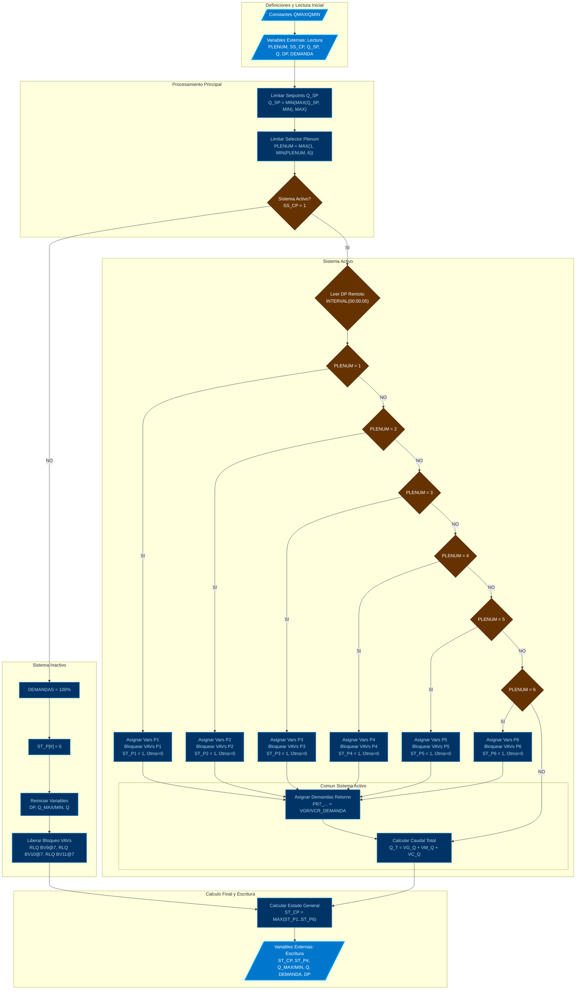

# MOD: CONTROL DE PLENUMS

* **ID PROGRAMA**: PRG3
* **DI CONTROLADOR**: 10021
* **AUTOR**: Carlos Jiménez Hirashi @cjhirashi, Adaptación: Asistente de IA
* **VERSION**: 1.5.0

## DESCRIPCION

Este módulo de control está diseñado para gestionar la operación de múltiples plenums (1 a 6) y un plenum de retorno (R7) dentro de un sistema de ventilación. Su función principal es seleccionar cuál plenum está activo basado en una señal de entrada (`PLENUM`), activar y desactivar las VAVs (Cajas de Volumen Variable) correspondientes, limitar los setpoints de caudal dentro de rangos predefinidos, y asignar las variables correctas para el control y monitoreo del plenum seleccionado.

## LOGICA DE OPERACION

El programa sigue una secuencia lógica para gestionar la selección y operación de los plenums y sus VAVs asociadas:

1.  **Limitación de Setpoints de Caudal:**
    *   Se toman los setpoints de caudal deseados para las VAVs activas (`VG_Q_SP`, `VM_Q_SP`, `VC_Q_SP`) y de retorno (`VGR_Q_SP`, `VCR_Q_SP`) y se ajustan para que permanezcan dentro de los rangos operativos definidos (Mínimo y Máximo). Los límites Mín/Máx para las VAVs activas (`VG_MIN`, `VG_MAX`, etc.) son establecidos dinámicamente según el plenum activo, mientras que los de retorno (`PR7_...`) son fijos.
    *   ```basic
        REM *LIMITACION DE SETPOINTS DE CAUDAL
            VG_Q_SP = MIN(MAX(VG_Q_SP, VG_MIN), VG_MAX)
            VM_Q_SP = MIN(MAX(VM_Q_SP, VM_MIN), VM_MAX)
            VC_Q_SP = MIN(MAX(VC_Q_SP, VC_MIN), VC_MAX)
            VGR_Q_SP = MIN(MAX(VGR_Q_SP, PR7_VG_QMIN), PR7_VG_QMAX)
            VCR_Q_SP = MIN(MAX(VCR_Q_SP, PR7_VC_QMIN), PR7_VC_QMAX)
        ```

2.  **Limitación del Selector de Plenum:**
    *   Se asegura que el valor de la variable `PLENUM` (MSV1), que indica el plenum deseado, esté siempre dentro del rango válido (1 a 6). Si el valor recibido es menor que 1, se fuerza a 1. Si es mayor que 6, se fuerza a 6.
    *   ```basic
        REM *LIMITACION SELECTOR DE PLENUM (Asegura que esté entre 1 y 6)
            PLENUM = MAX(1, MIN(PLENUM, 6))
        ```

3.  **Lógica Principal (Evaluación del Estado del Sistema):**
    *   El comportamiento principal del programa depende del estado de la variable `SS_CP` (BV1).

    *   **Bloque: Sistema Activo (`SS_CP = 1`)**
        *   **Lectura de Presión Diferencial Remota:** Se establece una lectura periódica (cada 5 segundos) de los sensores de presión diferencial ubicados en el controlador remoto (DI=10022). Solo se lee el sensor correspondiente al plenum actualmente seleccionado por la variable `PLENUM`.
        *   ```basic
            IF INTERVAL(00:00:05) THEN
                IF PLENUM = 1 THEN P1_DP_2 = 10022.AI3
                IF PLENUM = 2 THEN P2_DP = 10022.AI4
                ...
            ENDIF
            ```
        *   **Selección de Plenum y Asignación de Variables:** Mediante una estructura `IF / ELSE IF`, se determina cuál de los 6 plenums está activo. Dentro de cada bloque (uno por plenum):
            *   Se asignan las lecturas de presión diferencial (local y/o remota) a las variables de monitoreo activas (`DP_1`, `DP_2`).
            *   Se gestiona el control de las variables de activación genéricas (`BV9`, `BV10`, `BV11`) con **prioridad 7**. Se usa `RLQ` (Relinquish) para liberar el control si la VAV de ese tamaño existe en el plenum, o se escribe un `0` si no existe, previniendo activación accidental por otros programas o por el operador.
            *   Se copian las constantes de caudal Mín/Máx del plenum específico (`P1_VG_QMAX`, etc.) a las variables genéricas (`VG_MAX`, `VG_MIN`, etc.) que serán usadas por otros programas o para visualización.
            *   Se copian los caudales medidos del plenum específico (`P1_VG_Q`, etc.) a las variables genéricas (`VG_Q`, `VM_Q`, `VC_Q`).
            *   Las demandas genéricas leídas (`VG_DEMANDA`, etc.) se asignan a las variables de demanda específicas del plenum activo (`P1_VG_DEMANDA`, etc.). Las demandas de los plenums inactivos se fuerzan a 0.
            *   Se actualizan las variables de estado de cada plenum (`ST_P1` a `ST_P6`), poniendo a 1 la del plenum activo y a 0 las demás.
            *   **Ejemplo (Plenum 1):**
                ```basic
                IF PLENUM = 1 THEN
                    REM ***PLENUM 1 ACTIVO
                        REM ****PRESION DE PLENUM
                        DP_1 = P1_DP_1
                        DP_2 = P1_DP_2
                        REM ****BLOQUEO DE ACTIVACION DE VAV ACTIVA (Prioridad 7)
                        RLQ BV9@7 : RLQ BV10@7 : RLQ BV11@7
                        REM ****LIMITE DE CAUDAL...
                        VG_MAX = P1_VG_QMAX : VG_MIN = P1_VG_QMIN
                        ...
                        REM ****CAUDAL DE AIRE
                        VG_Q = P1_VG_Q : VM_Q = P1_VM_Q : VC_Q = P1_VC_Q
                        REM ****DEMANDA DE AIRE...
                        P1_VG_DEMANDA = VG_DEMANDA : P1_VM_DEMANDA = VM_DEMANDA : P1_VC_DEMANDA = VC_DEMANDA
                        P2_VG_DEMANDA = 0 : P2_VM_DEMANDA = 0 : ...
                        REM ****ESTADO DE PLENUM ACTIVO
                        ST_P1 = 1 : ST_P2 = 0 : ST_P3 = 0 : ST_P4 = 0 : ST_P5 = 0 : ST_P6 = 0
                ELSE IF ...
                ```
        *   **Control del Plenum de Retorno (R7):** Si el sistema está activo, las demandas genéricas de retorno (`VGR_DEMANDA`, `VCR_DEMANDA`) se asignan directamente a las variables de demanda del plenum R7 (`PR7_VG_DEMANDA`, `PR7_VC_DEMANDA`).
        *   **Cálculo del Caudal Total:** Se suman los caudales genéricos activos (`VG_Q`, `VM_Q`, `VC_Q`) para obtener el caudal total del plenum de suministro activo (`Q_T`).

    *   **Bloque: Sistema Inactivo (`SS_CP = 0`)**
        *   Se establecen todas las variables de demanda específicas (P1 a R7) a 100%.
        *   Se desactivan todos los indicadores de estado de plenum (`ST_P1` a `ST_P6 = 0`).
        *   Se reinician a 0 todas las variables genéricas (DP, Límites MAX/MIN, Caudales Q).
        *   Se libera (`RLQ`) el control de prioridad 7 sobre las variables de activación genéricas (`BV9`, `BV10`, `BV11`).
        *   ```basic
            ELSE
                REM **SISTEMA INACTIVO (SS_CP = 0)
                    REM ***DESACTIVAR TODAS LAS DEMANDAS (A 100 según tu indicación)
                    P1_VG_DEMANDA = 100 : P1_VM_DEMANDA = 100 : ... : PR7_VC_DEMANDA = 100
                    REM ***DESACTIVAR ESTADOS DE PLENUM
                    ST_P1 = 0 : ST_P2 = 0 : ST_P3 = 0 : ST_P4 = 0 : ST_P5 = 0 : ST_P6 = 0
                    REM ***REINICIAR VARIABLES ACTIVAS
                    DP_1 = 0 : DP_2 = 0 : VG_MAX = 0 : VG_MIN = 0 : ... : Q_T = 0
                    REM ***LIBERAR CONTROL DE ACTIVACION DE VAV ACTIVA (Prioridad 7)
                    RLQ BV9@7 : RLQ BV10@7 : RLQ BV11@7
            ENDIF
            ```

4.  **Cálculo del Estado General del Sistema:**
    *   Finalmente, se determina el estado general del sistema (`ST_CP`) calculando el máximo valor entre todos los estados de los plenums (`ST_P1` a `ST_P6`). Si al menos uno está activo (valor 1), el estado general será 1.
    *   ```basic
        REM *CALCULO ESTADO DE OPERACIÓN GENERAL
        ST_CP = MAX(ST_P1, ST_P2, ST_P3, ST_P4, ST_P5, ST_P6)
        ```

### Uso de Puntos de Control en UI (Interfaz de Usuario)

*   **Variables que requieren interacción del operador (o provienen de otros programas):**
    *   `PLENUM` (MSV1): El operador selecciona el plenum que desea poner en prueba/operación.
    *   `SS_CP` (BV1): Señal principal para activar o desactivar todo el sistema de prueba de plenums.
    *   `VG_Q_SP`, `VM_Q_SP`, `VC_Q_SP` (AV107-AV109): Setpoints de caudal deseado para las VAVs del tamaño correspondiente en el plenum activo.
    *   `VGR_Q_SP`, `VCR_Q_SP` (AV110-AV111): Setpoints de caudal deseado para las VAVs de retorno.
    *   `VG_DEMANDA`, `VM_DEMANDA`, `VC_DEMANDA` (AV82-AV84): Demandas (% de apertura) para las VAVs del tamaño correspondiente en el plenum activo.
    *   `VGR_DEMANDA`, `VCR_DEMANDA` (AV80-AV81): Demandas (% de apertura) para las VAVs de retorno.

*   **Variables principalmente para Monitoreo (calculadas o leídas):**
    *   `ST_CP`, `ST_P1` a `ST_P6` (BV2-BV8): Estado actual del sistema y de cada plenum.
    *   `VG_MIN` a `VC_MAX` (AV112-AV117): Límites de caudal aplicados actualmente según el plenum activo.
    *   `P1_VM_Q` a `PR7_VG_Q` (Varias AV): Caudal medido real de cada VAV individual.
    *   `VG_Q`, `VM_Q`, `VC_Q`, `Q_T` (AV98-AV101): Caudal actual de las VAVs activas (según tamaño) y caudal total del plenum activo.
    *   `P1_VM_DEMANDA` a `PR7_VG_DEMANDA` (Varias AV): Demanda específica que se está enviando a cada VAV individual.
    *   `P1_DP_1` a `P6_DP` (AI18, 10022.AI3-AI7): Lecturas crudas de los sensores de presión diferencial.
    *   `DP_1`, `DP_2` (AV105-AV106): Presión diferencial medida en el plenum activo.

## DIAGRAMAS DE CONTROL



---
## LISTA DE PUNTOS DEL PROGRAMA

### VARIABLES INTERNAS

#### CONSTANTES

##### RANGOS DE CAUDAL PLENUM 1
1. `P1_VG_QMAX` **3000** *PLENUM 1 - VAV GRANDE - Caudal Máximo* ( cfm )
2. `P1_VG_QMIN` **1100** *PLENUM 1 - VAV GRANDE - Caudal Mínimo* ( cfm )
3. `P1_VM_QMAX` **850** *PLENUM 1 - VAV MEDIANA - Caudal Máximo* ( cfm )
4. `P1_VM_QMIN` **350** *PLENUM 1 - VAV MEDIANA - Caudal Mínimo* ( cfm )
5. `P1_VC_QMAX` **200** *PLENUM 1 - VAV CHICA - Caudal Máximo* ( cfm )
6. `P1_VC_QMIN` **75** *PLENUM 1 - VAV CHICA - Caudal Mínimo* ( cfm )

##### RANGOS DE CAUDAL PLENUM 2
7. `P2_VG_QMAX` **2000** *PLENUM 2 - VAV GRANDE - Caudal Máximo* ( cfm )
8. `P2_VG_QMIN` **850** *PLENUM 2 - VAV GRANDE - Caudal Mínimo* ( cfm )
9. `P2_VM_QMAX` **650** *PLENUM 2 - VAV MEDIANA - Caudal Máximo* ( cfm )
10. `P2_VM_QMIN` **275** *PLENUM 2 - VAV MEDIANA - Caudal Mínimo* ( cfm )

##### RANGOS DE CAUDAL PLENUM 3
11. `P3_VG_QMAX` **1350** *PLENUM 3 - VAV GRANDE - Caudal Máximo* ( cfm )
12. `P3_VG_QMIN` **575** *PLENUM 3 - VAV GRANDE - Caudal Mínimo* ( cfm )

##### RANGOS DE CAUDAL PLENUM 4
13. `P4_VG_QMAX` **3000** *PLENUM 4 - VAV GRANDE - Caudal Máximo* ( cfm )
14. `P4_VG_QMIN` **1100** *PLENUM 4 - VAV GRANDE - Caudal Mínimo* ( cfm )
15. `P4_VM_QMAX` **850** *PLENUM 4 - VAV MEDIANA - Caudal Máximo* ( cfm )
16. `P4_VM_QMIN` **350** *PLENUM 4 - VAV MEDIANA - Caudal Mínimo* ( cfm )
17. `P4_VC_QMAX` **200** *PLENUM 4 - VAV CHICA - Caudal Máximo* ( cfm )
18. `P4_VC_QMIN` **75** *PLENUM 4 - VAV CHICA - Caudal Mínimo* ( cfm )

##### RANGOS DE CAUDAL PLENUM 5
19. `P5_VG_QMAX` **4000** *PLENUM 5 - VAV GRANDE - Caudal Máximo* ( cfm )
20. `P5_VG_QMIN` **1500** *PLENUM 5 - VAV GRANDE - Caudal Mínimo* ( cfm )
21. `P5_VC_QMAX` **300** *PLENUM 5 - VAV CHICA - Caudal Máximo* ( cfm )
22. `P5_VC_QMIN` **125** *PLENUM 5 - VAV CHICA - Caudal Mínimo* ( cfm )

##### RANGOS DE CAUDAL PLENUM 6
23. `P6_VG_QMAX` **3000** *PLENUM 6 - VAV GRANDE - Caudal Máximo* ( cfm )
24. `P6_VG_QMIN` **1100** *PLENUM 6 - VAV GRANDE - Caudal Mínimo* ( cfm )
25. `P6_VM_QMAX` **850** *PLENUM 6 - VAV MEDIANA - Caudal Máximo* ( cfm )
26. `P6_VM_QMIN` **350** *PLENUM 6 - VAV MEDIANA - Caudal Mínimo* ( cfm )

##### RANGOS DE CAUDAL PLENUM 7 (RETORNO)
27. `PR7_VG_QMAX` **3000** *PLENUM R7 - VAV GRANDE - Caudal Máximo* ( cfm )
28. `PR7_VG_QMIN` **1100** *PLENUM R7 - VAV GRANDE - Caudal Mínimo* ( cfm )
29. `PR7_VC_QMAX` **200** *PLENUM R7 - VAV CHICA - Caudal Máximo* ( cfm )
30. `PR7_VC_QMIN` **75** *PLENUM R7 - VAV CHICA - Caudal Mínimo* ( cfm )

### VARIABLES EXTERNAS

#### CONTROL SISTEMA Y PLENUM
1. `PLENUM` **MSV1** *PLENUM EN OPERACION* ( 1..6 )
    LECTURA - LOCAL - DI-10021
2. `SS_CP` **BV1** *SISTEMA - ACTIVACION* ( ACTIVA/INACTIVA )
    LECTURA - LOCAL - DI-10021
3. `ST_CP` **BV2** *SISTEMA - ESTADO* ( ACTIVA/INACTIVA )
    ESCRITURA - LOCAL - DI-10021
4. `ST_P1` **BV3** *PLENUM 1 - ESTADO* ( ACTIVA/INACTIVA )
    ESCRITURA - LOCAL - DI-10021
5. `ST_P2` **BV4** *PLENUM 2 - ESTADO* ( ACTIVA/INACTIVA )
    ESCRITURA - LOCAL - DI-10021
6. `ST_P3` **BV5** *PLENUM 3 - ESTADO* ( ACTIVA/INACTIVA )
    ESCRITURA - LOCAL - DI-10021
7. `ST_P4` **BV6** *PLENUM 4 - ESTADO* ( ACTIVA/INACTIVA )
    ESCRITURA - LOCAL - DI-10021
8. `ST_P5` **BV7** *PLENUM 5 - ESTADO* ( ACTIVA/INACTIVA )
    ESCRITURA - LOCAL - DI-10021
9. `ST_P6` **BV8** *PLENUM 6 - ESTADO* ( ACTIVA/INACTIVA )
    ESCRITURA - LOCAL - DI-10021

#### SETPOINTS Y LÍMITES VAV ACTIVA
10. `VG_Q_SP` **AV107** *VAV GRANDE ACTIVA - SETPOINT DE CAUDAL* ( cfm )
    LECTURA - LOCAL - DI-10021
11. `VM_Q_SP` **AV108** *VAV MEDIANA ACTIVA - SETPOINT DE CAUDAL* ( cfm )
    LECTURA - LOCAL - DI-10021
12. `VC_Q_SP` **AV109** *VAV CHICA ACTIVA - SETPOINT DE CAUDAL* ( cfm )
    LECTURA - LOCAL - DI-10021
13. `VGR_Q_SP` **AV110** *VAV GRANDE RETORNO - SETPOINT DE CAUDAL* ( cfm )
    LECTURA - LOCAL - DI-10021
14. `VCR_Q_SP` **AV111** *VAV CHICA RETORNO - SETPOINT DE CAUDAL* ( cfm )
    LECTURA - LOCAL - DI-10021
15. `VG_MIN` **AV112** *VAV GRANDE ACTIVA - CAUDAL MINIMO* ( cfm )
    ESCRITURA - LOCAL - DI-10021
16. `VG_MAX` **AV113** *VAV GRANDE ACTIVA - CAUDAL MAXIMO* ( cfm )
    ESCRITURA - LOCAL - DI-10021
17. `VM_MIN` **AV114** *VAV MEDIANA ACTIVA - CAUDAL MINIMO* ( cfm )
    ESCRITURA - LOCAL - DI-10021
18. `VM_MAX` **AV115** *VAV MEDIANA ACTIVA - CAUDAL MAXIMO* ( cfm )
    ESCRITURA - LOCAL - DI-10021
19. `VC_MIN` **AV116** *VAV CHICA ACTIVA - CAUDAL MINIMO* ( cfm )
    ESCRITURA - LOCAL - DI-10021
20. `VC_MAX` **AV117** *VAV CHICA ACTIVA - CAUDAL MAXIMO* ( cfm )
    ESCRITURA - LOCAL - DI-10021

#### CAUDALES VAV (POR PLENUM Y ACTIVAS)
21. `P1_VM_Q` **AV4** *PLENUM 1 - VAV MEDIANA - CAUDAL FACTOR* ( cfm )
    LECTURA - LOCAL - DI-10021
22. `P1_VG_Q` **AV8** *PLENUM 1 - VAV GRANDE - CAUDAL FACTOR* ( cfm )
    LECTURA - LOCAL - DI-10021
23. `P1_VC_Q` **AV62** *PLENUM 1 - VAV CHICA - CAUDAL FACTOR* ( cfm )
    LECTURA - LOCAL - DI-10021
24. `P2_VM_Q` **AV13** *PLENUM 2 - VAV MEDIANA - CAUDAL FACTOR* ( cfm )
    LECTURA - LOCAL - DI-10021
25. `P2_VG_Q` **AV17** *PLENUM 2 - VAV GRANDE - CAUDAL FACTOR* ( cfm )
    LECTURA - LOCAL - DI-10021
26. `P3_VG_Q` **AV66** *PLENUM 3 - VAV GRANDE - CAUDAL FACTOR* ( cfm )
    LECTURA - LOCAL - DI-10021
27. `P4_VM_Q` **AV22** *PLENUM 4 - VAV MEDIANA - CAUDAL FACTOR* ( cfm )
    LECTURA - LOCAL - DI-10021
28. `P4_VG_Q` **AV26** *PLENUM 4 - VAV GRANDE - CAUDAL FACTOR* ( cfm )
    LECTURA - LOCAL - DI-10021
29. `P4_VC_Q` **AV30** *PLENUM 4 - VAV CHICA - CAUDAL FACTOR* ( cfm )
    LECTURA - LOCAL - DI-10021
30. `P5_VC_Q` **AV35** *PLENUM 5 - VAV CHICA - CAUDAL FACTOR* ( cfm )
    LECTURA - LOCAL - DI-10021
31. `P5_VG_Q` **AV39** *PLENUM 5 - VAV GRANDE - CAUDAL FACTOR* ( cfm )
    LECTURA - LOCAL - DI-10021
32. `P6_VG_Q` **AV44** *PLENUM 6 - VAV GRANDE - CAUDAL FACTOR* ( cfm )
    LECTURA - LOCAL - DI-10021
33. `P6_VM_Q` **AV48** *PLENUM 6 - VAV MEDIANA - CAUDAL FACTOR* ( cfm )
    LECTURA - LOCAL - DI-10021
34. `PR7_VC_Q` **AV53** *PLENUM R7 - VAV CHICA - CAUDAL FACTOR* ( cfm )
    LECTURA - LOCAL - DI-10021
35. `PR7_VG_Q` **AV57** *PLENUM R7 - VAV GRANDE - CAUDAL FACTOR* ( cfm )
    LECTURA - LOCAL - DI-10021
36. `VG_Q` **AV98** *VAV GRANDE ACTIVA - CAUDAL* ( cfm )
    ESCRITURA - LOCAL - DI-10021
37. `VM_Q` **AV99** *VAV MEDIANA ACTIVA - CAUDAL* ( cfm )
    ESCRITURA - LOCAL - DI-10021
38. `VC_Q` **AV100** *VAV CHICA ACTIVA - CAUDAL* ( cfm )
    ESCRITURA - LOCAL - DI-10021
39. `Q_T` **AV101** *VAVS ACTIVAS - CAUDAL TOTAL* ( cfm )
    ESCRITURA - LOCAL - DI-10021

#### DEMANDAS VAV (POR PLENUM Y ACTIVAS)
40. `VG_DEMANDA` **AV82** *VAV GRANDE - DEMANDA* ( % )
    LECTURA - LOCAL - DI-10021
41. `VM_DEMANDA` **AV83** *VAV MEDIANA - DEMANDA* ( % )
    LECTURA - LOCAL - DI-10021
42. `VC_DEMANDA` **AV84** *VAV CHICA - DEMANDA* ( % )
    LECTURA - LOCAL - DI-10021
43. `VGR_DEMANDA` **AV80** *VAV GRANDE RETORNO - DEMANDA* ( % )
    LECTURA - LOCAL - DI-10021
44. `VCR_DEMANDA` **AV81** *VAV CHICA RETORNO - DEMANDA* ( % )
    LECTURA - LOCAL - DI-10021
45. `P1_VM_DEMANDA` **AV85** *PLENUM 1 - VAV MEDIANA - DEMANDA* ( % )
    ESCRITURA - LOCAL - DI-10021
46. `P1_VG_DEMANDA` **AV86** *PLENUM 1 - VAV GRANDE - DEMANDA* ( % )
    ESCRITURA - LOCAL - DI-10021
47. `P1_VC_DEMANDA` **AV67** *PLENUM 1 - VAV CHICA - DEMANDA* ( % )
    ESCRITURA - LOCAL - DI-10021
48. `P2_VM_DEMANDA` **AV87** *PLENUM 2 - VAV MEDIANA - DEMANDA* ( % )
    ESCRITURA - LOCAL - DI-10021
49. `P2_VG_DEMANDA` **AV88** *PLENUM 2 - VAV GRANDE - DEMANDA* ( % )
    ESCRITURA - LOCAL - DI-10021
50. `P3_VG_DEMANDA` **AV68** *PLENUM 3 - GRANDE - DEMANDA* ( % )
    ESCRITURA - LOCAL - DI-10021
51. `P4_VM_DEMANDA` **AV89** *PLENUM 4 - VAV MEDIANA - DEMANDA* ( % )
    ESCRITURA - LOCAL - DI-10021
52. `P4_VG_DEMANDA` **AV90** *PLENUM 4 - VAV GRANDE - DEMANDA* ( % )
    ESCRITURA - LOCAL - DI-10021
53. `P4_VC_DEMANDA` **AV91** *PLENUM 4 - VAV CHICA - DEMANDA* ( % )
    ESCRITURA - LOCAL - DI-10021
54. `P5_VC_DEMANDA` **AV92** *PLENUM 5 - VAV CHICA - DEMANDA* ( % )
    ESCRITURA - LOCAL - DI-10021
55. `P5_VG_DEMANDA` **AV93** *PLENUM 5 - VAV GRANDE - DEMANDA* ( % )
    ESCRITURA - LOCAL - DI-10021
56. `P6_VG_DEMANDA` **AV94** *PLENUM 6 - VAV GRANDE - DEMANDA* ( % )
    ESCRITURA - LOCAL - DI-10021
57. `P6_VM_DEMANDA` **AV95** *PLENUM 6 - VAV MEDIANA - DEMANDA* ( % )
    ESCRITURA - LOCAL - DI-10021
58. `PR7_VC_DEMANDA` **AV96** *PLENUM R7 - VAV CHICA - DEMANDA* ( % )
    ESCRITURA - LOCAL - DI-10021
59. `PR7_VG_DEMANDA` **AV97** *PLENUM R7 - VAV GRANDE - DEMANDA* ( % )
    ESCRITURA - LOCAL - DI-10021

#### CAÍDAS DE PRESIÓN (POR PLENUM Y ACTIVAS)
60. `P1_DP_1` **AI18** *PLENUM 1 - CAIDA DE PRESION 1* ( "WC" )
    LECTURA - LOCAL - DI-10021
61. `P1_DP_2` **10022.AI3** *PLENUM 1, CAIDA DE PRESION 2* ( "WC" )
    LECTURA - REMOTO - DI-10022
62. `P2_DP` **10022.AI4** *PLENUM 2, CAIDA DE PRESION* ( "WC" )
    LECTURA - REMOTO - DI-10022
63. `P4_DP` **10022.AI5** *PLENUM 4, CAIDA DE PRESION* ( "WC" )
    LECTURA - REMOTO - DI-10022
64. `P5_DP` **10022.AI6** *PLENUM 5, CAIDA DE PRESION* ( "WC" )
    LECTURA - REMOTO - DI-10022
65. `P6_DP` **10022.AI7** *PLENUM 6, CAIDA DE PRESION* ( "WC" )
    LECTURA - REMOTO - DI-10022
66. `DP_1` **AV105** *PLENUM ACTIVO - CAIDA DE PRESION SENSOR 1* ( "WC" )
    ESCRITURA - LOCAL - DI-10021
67. `DP_2` **AV106** *PLENUM ACTIVO - CAIDA DE PRESION SENSOR 2* ( "WC" )
    ESCRITURA - LOCAL - DI-10021

#### ESTADO ACTIVACIÓN VAV ACTIVA (CONTROL PRIORIDAD 7)
68. `VG_ACT` **BV9** *VAV GRANDE - ACTIVACION* ( ACTIVA/INACTIVA )
    ESCRITURA - LOCAL - DI-10021
69. `VM_ACT` **BV10** *VAV MEDIANA - ACTIVACION* ( ACTIVA/INACTIVA )
    ESCRITURA - LOCAL - DI-10021
70. `VC_ACT` **BV11** *VAV CHICA - ACTIVACION* ( ACTIVA/INACTIVA )
    ESCRITURA - LOCAL - DI-10021