# PROGRAMA

*   **NOMBRE**: MOD: CONTROL PID VAVs 
*   **ID PROGRAMA**: PRG4
*   **DI CONTROLADOR**: 10021
*   **AUTOR**: Carlos Jiménez Hirashi *@cjhirashi*, Adaptación: Asistente de IA
*   **VERSION**: 1.5.0

## DESCRIPCION

Este módulo implementa la lógica de control PID para las VAVs de suministro (Grande, Mediana y Chica) en el plenum activo y VAVs de retorno (Grande y Chica). Calcula la demanda de apertura de cada compuerta VAV en función del error entre el caudal actual y el setpoint de caudal, utilizando un algoritmo PI (Proporcional-Integral).

## VARIABLES DE CONTROL

### VARIABLES INTERNAS

#### CONSTANTES

*   `MAX_L`: Límite máximo para la demanda de la compuerta (100).
*   `MIN_L`: Límite mínimo para la demanda de la compuerta (6).

#### VARIABLES

*   `VG_T`, `VM_T`, `VC_T`: Contadores de tiempo para la integración (usados para evitar la acumulación excesiva del término integral).
*   `VG_ERR`, `VM_ERR`, `VC_ERR`: Error de caudal para cada VAV (Setpoint - Caudal Actual).
*   `VG_PR`, `VM_PR`, `VC_PR`: Componente proporcional del control PID para cada VAV.
*   `VG_IR`, `VM_IR`, `VC_IR`: Componente integral del control PID para cada VAV.
*   `VG_IS`, `VM_IS`, `VC_IS`: Suma integral acumulada para cada VAV.

### VARIABLES EXTERNAS

*   **Entradas:**
    *   `VG_P`, `VM_P`, `VC_P`: Ganancias proporcionales para cada VAV.
    *   `VG_I`, `VM_I`, `VC_I`: Ganancias integrales para cada VAV.
    *   `SS_CP` Señal de activación del sistema.
    *   `VG_ACT` Permiso de operación para la VAV Grande.
    *   `VM_ACT` Permiso de operación para la VAV Mediana.
    *   `VC_ACT` Permiso de operación para la VAV Chica.
    *   `VGR_ACT` Permiso de operación para la VAV Grande de Retorno.
    *   `VCR_ACT` Permiso de operación para la VAV Chica de Retorno.
    *   `VG_Q` Caudal actual de la VAV Grande.
    *   `MD_Q` Caudal actual de la VAV Mediana.
    *   `CH_Q` Caudal actual de la VAV Chica.
    *   `VGR_Q` Caudal actual de la VAV Grande de Retorno.
    *   `CHR_Q` Caudal actual de la VAV Chica de Retorno.
    *   `VG_Q-SP` Setpoint de caudal para la VAV Grande.
    *   `VM_Q-SP` Setpoint de caudal para la VAV Mediana.
    *   `VC_Q-SP` Setpoint de caudal para la VAV Chica.
    *   `VGR_Q-SP` Setpoint de caudal para la VAV Grande de Retorno.
    *   `VCR_Q-SP` Setpoint de caudal para la VAV Chica de Retorno.

*   **Salidas:**
    *   `VG_DEMANDA`, `VM_DEMANDADM`, `VC_DEMANDA`: Demanda de apertura de la compuerta para cada VAV activa (%).
    *   `VGR_DEMANDA`, `VCR_DEMANDA`: Demanda de apertura de la compuerta para cada VAV de retorno (%).

## LOGICA DE OPERACION

Este módulo realiza las siguientes acciones para cada VAV de suministro (Grande, Mediana, Chica, Grande Retorno, Chica Retorno):

1.  **Verificación de Permisos:** Verifica si el sistema está activo (`SS_CP = 1`) y si la VAV tiene permiso de operación (`VG_ACT`, `VM_ACT`, `VC_ACT`).
2.  **Cálculo del Error:** Calcula el error de caudal como la diferencia entre el setpoint y el caudal actual: 
```basic
ERR = (Q - Q-SP) * -1
```
3.  **Cálculo del Componente Proporcional:** Calcula el componente proporcional del control PID: `PR = (ERR / (SP_Q * P)) * 100`.
4.  **Cálculo del Componente Integral:** Calcula el componente integral del control PID:
    *   `IR = ((100 * ERR) / SP_Q) * I`
    *   Si ha pasado más de 1 segundo desde la última actualización (`T > 1`), se acumula el componente integral: `IS = IS + IR`.
    *   Se limita la suma integral (`IS`) para evitar la acumulación excesiva: `IS = MAX(L_MIN - 10, MIN(L_MAX + 10, IS))`.
5.  **Cálculo de la Demanda:** Calcula la demanda total de apertura de la compuerta como la suma de los componentes proporcional e integral: `DM = PR + IS`.
6.  **Limitación de la Demanda:** Limita la demanda entre los límites mínimo y máximo: `DM = MAX(L_MIN, MIN(L_MAX, DM))`.
7.  **Desactivación:** Si el sistema no está activo o la VAV no tiene permiso de operación, se establecen los componentes proporcional, integral y la demanda a 0.
8.  **Escritura de Salidas:** Se escribe el valor de la demanda calculada en la variable de salida correspondiente (`DM_VG`, `DM_VM`, `DM_VC`).

**Pseudocódigo (Ejemplo para la VAV Grande):**

```basic
REM **PI CAJA GRANDE
    IF SS_CP = 1 AND PERM_VG = 1 THEN
        REM **ERROR DEL SISTEMA
            ERR_VG = (Q_VG - SP_Q_VG) * -1

        REM **RESULTANTE PROPORCIONAL
            PR_VG = (ERR_VG / (SP_Q_VG * P_VG)) * 100

        REM **RESULTANTE INTEGRAL
            IR_VG = ((100 * ERR_VG) / SP_Q_VG) * I_VG
            IF T_VG > 1 THEN
                IS_VG = IS_VG + IR_VG
                T_VG = 0
            ENDIF
            IS_VG = MAX(L_MIN - 10, MIN(L_MAX + 10, IS_VG))

        REM **DEMANDA DE SISTEMA
            DM_VG = PR_VG + IS_VG
            DM_VG = MAX(L_MIN, MIN(L_MAX, DM_VG))

    ELSE
        PR_VG = 0
        IR_VG = 0
        IS_VG = 0
        DM_VG = 0
    ENDIF

    AV82 = DM_VG  // Escribir la demanda de la VAV Grande
```

**Diagrama de Flujo:**

(No incluiré el diagrama Mermaid debido a los problemas anteriores. Te proporciono una descripción textual).

*   **Inicio:** El diagrama comienza con un nodo de inicio.
*   **Verificación de Permisos:** Se verifica si el sistema está activo y si la VAV tiene permiso de operación.
    *   **Si (Rama "Sí"):**
        *   **Cálculo del Error:** Se calcula el error.
        *   **Cálculo del Componente Proporcional:** Se calcula el componente proporcional.
        *   **Cálculo del Componente Integral:** Se calcula el componente integral y se acumula (con limitación).
        *   **Cálculo de la Demanda:** Se calcula la demanda total.
        *   **Limitación de la Demanda:** Se limita la demanda.
    *   **No (Rama "No"):**
        *   Se establecen los componentes proporcional, integral y la demanda a 0.
*   **Escritura de la Demanda:** Se escribe la demanda en la variable de salida.
*   **Fin:** El diagrama termina con un nodo de fin.

*Este proceso se repite para cada VAV de suministro (Grande, Mediana, Chica).*

**Módulo de Control PID (VAVs de Extracción):**

# PROGRAMA

*   **NOMBRE**: MOD: CONTROL PID (VAVs de Extracción)
*   **ID PROGRAMA**: PRG4_RET
*   **DI CONTROLADOR**: 10021
*   **AUTOR**: Carlos Jiménez Hirashi *@cjhirashi*, Adaptación: Asistente de IA
*   **VERSION**: 1.0.0

## DESCRIPCION

Este módulo implementa la lógica de control PID para las VAVs de extracción (Grande y Chica) en el plenum de retorno (Plenum 7). Calcula la demanda de apertura de cada compuerta VAV en función del error entre el caudal actual y el setpoint de caudal, utilizando un algoritmo PI (Proporcional-Integral).

## VARIABLES DE CONTROL

### VARIABLES INTERNAS

#### CONSTANTES

*   `L_MAX`: Límite máximo para la demanda de la compuerta (100).
*   `L_MIN`: Límite mínimo para la demanda de la compuerta (6).

#### VARIABLES

*   `T_VGR`, `T_VCR`: Contadores de tiempo para la integración (usados para evitar la acumulación excesiva del término integral).
*   `P_VGR`, `P_VCR`: Ganancias proporcionales para cada VAV.
*   `I_VGR`, `I_VCR`: Ganancias integrales para cada VAV.
*   `ERR_VGR`, `ERR_VCR`: Error de caudal para cada VAV (Setpoint - Caudal Actual).
*   `PR_VGR`, `PR_VCR`: Componente proporcional del control PID para cada VAV.
*   `IR_VGR`, `IR_VCR`: Componente integral del control PID para cada VAV.
*   `IS_VGR`, `IS_VCR`: Suma integral acumulada para cada VAV.
*   `DM_VGR`, `DM_VCR`: Demanda de apertura de la compuerta para cada VAV (%).

### VARIABLES EXTERNAS

*   **Entradas:**
    *   `SS_CP` (BV1): Señal de activación del sistema.
    *   `PERM_VGR` (BV35): Permiso de operación para la VAV Grande de Retorno.
    *   `PERM_VCR` (BV36): Permiso de operación para la VAV Chica de Retorno.
    *   `Q_VGR` (AV102): Caudal actual de la VAV Grande de Retorno.
    *   `Q_VCR` (AV103): Caudal actual de la VAV Chica de Retorno.
    *   `SP_Q_VGR` (AV110): Setpoint de caudal para la VAV Grande de Retorno.
    *   `SP_Q_VCR` (AV111): Setpoint de caudal para la VAV Chica de Retorno.
    *   `P_VGR` (AV69): Ganancia proporcional para la VAV Grande de Retorno.
    *   `I_VGR` (AV70): Ganancia integral para la VAV Grande de Retorno.
    *   `P_VCR` (AV73): Ganancia proporcional para la VAV Chica de Retorno.
    *   `I_VCR` (AV74): Ganancia integral para la VAV Chica de Retorno.

*   **Salidas:**
    *   `DM_VGR` (AV80): Demanda de apertura para la VAV Grande de Retorno (%).
    *   `DM_VCR` (AV81): Demanda de apertura para la VAV Chica de Retorno (%).

## LOGICA DE OPERACION

Este módulo realiza las siguientes acciones para cada VAV de extracción (Grande, Chica):

1.  **Verificación de Permisos:** Verifica si el sistema está activo (`SS_CP = 1`) y si la VAV tiene permiso de operación (`PERM_VGR`, `PERM_VCR`).
2.  **Cálculo del Error:** Calcula el error de caudal como la diferencia entre el setpoint y el caudal actual: `ERR = (Q - SP_Q) * -1`.
3.  **Cálculo del Componente Proporcional:** Calcula el componente proporcional del control PID: `PR = (ERR / (SP_Q * P)) * 100`.
4.  **Cálculo del Componente Integral:** Calcula el componente integral del control PID:
    *   `IR = ((100 * ERR) / SP_Q) * I`
    *   Si ha pasado más de 1 segundo desde la última actualización (`T > 1`), se acumula el componente integral: `IS = IS + IR`.
    *   Se limita la suma integral (`IS`) para evitar la acumulación excesiva: `IS = MAX(L_MIN - 10, MIN(L_MAX + 10, IS))`.
5.  **Cálculo de la Demanda:** Calcula la demanda total de apertura de la compuerta como la suma de los componentes proporcional e integral: `DM = PR + IS`.
6.  **Limitación de la Demanda:** Limita la demanda entre los límites mínimo y máximo: `DM = MAX(L_MIN, MIN(L_MAX, DM))`.
7.  **Desactivación:** Si el sistema no está activo o la VAV no tiene permiso de operación, se establecen los componentes proporcional, integral y la demanda a 0.
8.  **Escritura de Salidas:** Se escribe el valor de la demanda calculada en la variable de salida correspondiente (`DM_VGR`, `DM_VCR`).

**Pseudocódigo (Ejemplo para la VAV Grande de Retorno):**

```basic
REM **PI CAJA GRANDE RETORNO
    IF SS_CP = 1 AND PERM_VGR = 1 THEN
        REM **ERROR DEL SISTEMA
            ERR_VGR = (Q_VGR - SP_Q_VGR) * -1

        REM **RESULTANTE PROPORCIONAL
            PR_VGR = (ERR_VGR / (SP_Q_VGR * P_VGR)) * 100

        REM **RESULTANTE INTEGRAL
            IR_VGR = ((100 * ERR_VGR) / SP_Q_VGR) * I_VGR
            IF T_VGR > 1 THEN
                IS_VGR = IS_VGR + IR_VGR
                T_VGR = 0
            ENDIF
            IS_VGR = MAX(L_MIN - 10, MIN(L_MAX + 10, IS_VGR))

        REM **DEMANDA DE SISTEMA
            DM_VGR = PR_VGR + IS_VGR
            DM_VGR = MAX(L_MIN, MIN(L_MAX, DM_VGR))

    ELSE
        PR_VGR = 0
        IR_VGR = 0
        IS_VGR = 0
        DM_VGR = 0
    ENDIF

    AV80 = DM_VGR  // Escribir la demanda de la VAV Grande de Retorno
```

**Diagrama de Flujo:**





```mermaid
flowchart TB
    subgraph Por cada VAV de Suministro
    INICIO[Inicio]:::inicio --> VERIFICAR{"SS_CP = 1 Y<br>PERM_V# = 1?"}:::condicion
    VERIFICAR -- Sí --> CALC_ERROR["ERR_V# = (Q_V# - SP_Q_V#) * -1"]:::proceso
    CALC_ERROR --> CALC_PR["PR_V# = (ERR_V# / (SP_Q_V# * P_V#)) * 100"]:::proceso
    CALC_PR --> CALC_IR["IR_V# = ((100 * ERR_V#) / SP_Q_V#) * I_V#"]:::proceso
    CALC_IR --> ACUMULAR_I{"T_V# > 1?"}:::condicion
    ACUMULAR_I -- Sí --> ACUMULAR["IS_V# = IS_V# + IR_V#<br>T_V# = 0"]:::proceso
    ACUMULAR_I -- No --> LIMITAR_IS["IS_V# = MAX(L_MIN - 10,<br>MIN(L_MAX + 10, IS_V#))"]:::proceso
    ACUMULAR --> LIMITAR_IS
    LIMITAR_IS --> CALC_DM["DM_V# = PR_V# + IS_V#"]:::proceso
    CALC_DM --> LIMITAR_DM["DM_V# = MAX(L_MIN, MIN(L_MAX, DM_V#))"]:::proceso
    LIMITAR_DM --> ESCRIBIR_DM[/Escribir DM_V#/]:::salida
    VERIFICAR -- No --> DESACTIVAR["PR_V# = 0<br>IR_V# = 0<br>IS_V# = 0<br>DM_V# = 0"]:::proceso
    DESACTIVAR --> FIN[Fin]:::fin
    ESCRIBIR_DM --> FIN
    end

    classDef inicio fill:#0077CC, stroke:#00BFFF, stroke-width:2px, color:#FFFFFF
    classDef proceso fill:#003366, stroke:#006699, stroke-width:2px, color:#ADD8E6
    classDef condicion fill:#FF6600, stroke:#FF9933, stroke-width:2px, color:#FFFFFF
    classDef salida fill:#00CC00, stroke:#33FF33, stroke-width:2px, color:#FFFFFF
    classDef fin fill:#001A33, stroke:#003366, stroke-width:2px, color:#87CEEB
```

```mermaid
flowchart TB
    subgraph Por cada VAV de Extracción
    INICIO[Inicio]:::inicio --> VERIFICAR{"SS_CP = 1 Y<br>PERM_V#R = 1?"}:::condicion
    VERIFICAR -- Sí --> CALC_ERROR["ERR_V#R = (Q_V#R - SP_Q_V#R) * -1"]:::proceso
    CALC_ERROR --> CALC_PR["PR_V#R = (ERR_V#R / (SP_Q_V#R * P_V#R)) * 100"]:::proceso
    CALC_PR --> CALC_IR["IR_V#R = ((100 * ERR_V#R) / SP_Q_V#R) * I_V#R"]:::proceso
    CALC_IR --> ACUMULAR_I{"T_V#R > 1?"}:::condicion
    ACUMULAR_I -- Sí --> ACUMULAR["IS_V#R = IS_V#R + IR_V#R<br>T_V#R = 0"]:::proceso
    ACUMULAR_I -- No --> LIMITAR_IS["IS_V#R = MAX(L_MIN - 10,<br>MIN(L_MAX + 10, IS_V#R))"]:::proceso
    ACUMULAR --> LIMITAR_IS
    LIMITAR_IS --> CALC_DM["DM_V#R = PR_V#R + IS_V#R"]:::proceso
    CALC_DM --> LIMITAR_DM["DM_V#R = MAX(L_MIN, MIN(L_MAX, DM_V#R))"]:::proceso
    LIMITAR_DM --> ESCRIBIR_DM[/Escribir DM_V#R/]:::salida
    VERIFICAR -- No --> DESACTIVAR["PR_V#R = 0<br>IR_V#R = 0<br>IS_V#R = 0<br>DM_V#R = 0"]:::proceso
    DESACTIVAR --> FIN[Fin]:::fin
    ESCRIBIR_DM --> FIN
    end

    classDef inicio fill:#0077CC, stroke:#00BFFF, stroke-width:2px, color:#FFFFFF
    classDef proceso fill:#003366, stroke:#006699, stroke-width:2px, color:#ADD8E6
    classDef condicion fill:#FF6600, stroke:#FF9933, stroke-width:2px, color:#FFFFFF
    classDef salida fill:#00CC00, stroke:#33FF33, stroke-width:2px, color:#FFFFFF
    classDef fin fill:#001A33, stroke:#003366, stroke-width:2px, color:#87CEEB
```

*Este proceso se repite para cada VAV de extracción (Grande, Chica).*