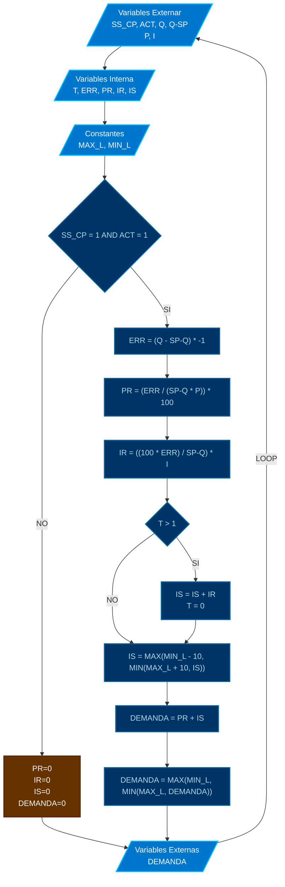

# PROGRAMA

*   **NOMBRE**: MOD: CONTROL PID VAVs 
*   **ID PROGRAMA**: PRG4
*   **DI CONTROLADOR**: 10021
*   **AUTOR**: Carlos Jiménez Hirashi *@cjhirashi*, Adaptación: Asistente de IA
*   **VERSION**: 1.5.0

## DESCRIPCION

Este módulo implementa la lógica de control PID para las VAVs de suministro (Grande, Mediana y Chica) en el plenum activo y VAVs de retorno (Grande y Chica). Calcula la demanda de apertura de cada compuerta VAV en función del error entre el caudal actual y el setpoint de caudal, utilizando un algoritmo PI (Proporcional-Integral).

## VARIABLES DE CONTROL

### VARIABLES INTERNAS

#### CONSTANTES

*   `MAX_L`: Límite máximo para la demanda de la compuerta (100).
*   `MIN_L`: Límite mínimo para la demanda de la compuerta (0).

#### VARIABLES

*   `VG_T`, `VM_T`, `VC_T`: Contadores de tiempo para la integración (usados para evitar la acumulación excesiva del término integral).
*   `VG_ERR`, `VM_ERR`, `VC_ERR`: Error de caudal para cada VAV (Setpoint - Caudal Actual).
*   `VG_PR`, `VM_PR`, `VC_PR`: Componente proporcional del control PID para cada VAV.
*   `VG_IR`, `VM_IR`, `VC_IR`: Componente integral del control PID para cada VAV.
*   `VG_IS`, `VM_IS`, `VC_IS`: Suma integral acumulada para cada VAV.

### VARIABLES EXTERNAS

*   **Entradas:**
    *   `VG_P`, `VM_P`, `VC_P`: Ganancias proporcionales para cada VAV.
    *   `VG_I`, `VM_I`, `VC_I`: Ganancias integrales para cada VAV.
    *   `SS_CP` Señal de activación del sistema.
    *   `VG_ACT` Permiso de operación para la VAV Grande.
    *   `VM_ACT` Permiso de operación para la VAV Mediana.
    *   `VC_ACT` Permiso de operación para la VAV Chica.
    *   `VGR_ACT` Permiso de operación para la VAV Grande de Retorno.
    *   `VCR_ACT` Permiso de operación para la VAV Chica de Retorno.
    *   `VG_Q` Caudal actual de la VAV Grande.
    *   `VM_Q` Caudal actual de la VAV Mediana.
    *   `VC_Q` Caudal actual de la VAV Chica.
    *   `VGR_Q` Caudal actual de la VAV Grande de Retorno.
    *   `VCR_Q` Caudal actual de la VAV Chica de Retorno.
    *   `VG_Q-SP` Setpoint de caudal para la VAV Grande.
    *   `VM_Q-SP` Setpoint de caudal para la VAV Mediana.
    *   `VC_Q-SP` Setpoint de caudal para la VAV Chica.
    *   `VGR_Q-SP` Setpoint de caudal para la VAV Grande de Retorno.
    *   `VCR_Q-SP` Setpoint de caudal para la VAV Chica de Retorno.

*   **Salidas:**
    *   `VG_DEMANDA`, `VM_DEMANDA`, `VC_DEMANDA`: Demanda de apertura de la compuerta para cada VAV activa (%).
    *   `VGR_DEMANDA`, `VCR_DEMANDA`: Demanda de apertura de la compuerta para cada VAV de retorno (%).

## LOGICA DE OPERACION

Este módulo realiza las siguientes acciones para cada VAV de suministro (Grande, Mediana, Chica, Grande Retorno, Chica Retorno):

1.  **Verificación de Permisos:** Verifica si el sistema está activo (`SS_CP = 1`) y si la VAV tiene permiso de operación (`VG_ACT`, `VM_ACT`, `VC_ACT`, `VGR_ACT`, `VCR_ACT`).

2.  **Cálculo del Error:** Calcula el error de caudal como la diferencia entre el setpoint y el caudal actual: 
```basic
ERR = (Q - Q-SP) * -1
```

3.  **Cálculo del Componente Proporcional:** Calcula el componente proporcional del control PID: 
```basic
PR = (ERR / (Q-SP * P)) * 100
```

4.  **Cálculo del Componente Integral:** Calcula el componente integral del control PID:
```basic
IR = ((100 * ERR) / Q-SP) * I
```

*   Si ha pasado más de 1 segundo desde la última actualización (`T > 1`), se acumula el componente integral: 
```basic
IS = IS + IR
```
*   Se limita la suma integral (`IS`) para evitar la acumulación excesiva: 
```basic
IS = MAX(MIN_L - 10, MIN(MAX_L + 10, IS))
```

5.  **Cálculo de la Demanda:** Calcula la demanda total de apertura de la compuerta como la suma de los componentes proporcional e integral: 
```basic
DEMAMDA = PR + IS
```

6.  **Limitación de la Demanda:** Limita la demanda entre los límites mínimo y máximo: `DEMANDA = MAX(MIN_L, MIN(MAX_L, DEMANDA))`.

7.  **Desactivación:** Si el sistema no está activo o la VAV no tiene permiso de operación, se establecen los componentes proporcional, integral y la demanda a 0.

8.  **Escritura de Salidas:** Se escribe el valor de la demanda calculada en la variable de salida correspondiente (`VG_DEMANDA`, `VM_DEMANDA`, `VC_DEMANDA`, `VGR_DEMANDA`, `VCR_DEMANDA`).

**Pseudocódigo (Ejemplo):**

```basic
REM **PI
    IF SS_CP = 1 AND ACT = 1 THEN
        REM **ERROR DEL SISTEMA
            ERR = (Q - SP-Q) * -1

        REM **RESULTANTE PROPORCIONAL
            PR = (ERR / (SP-Q * P)) * 100

        REM **RESULTANTE INTEGRAL
            IR = ((100 * ERR) / SP-Q) * I
            IF T > 1 THEN
                IS = IS + IR
                T = 0
            ENDIF
            IS = MAX(MIN_L - 10, MIN(MAX_L + 10, IS))

        REM **DEMANDA DE SISTEMA
            DEMANDA = PR + IS
            DEMANDA = MAX(MIN_L, MIN(MAX_L, DEMANDA))

    ELSE
        PR = 0
        IR = 0
        IS = 0
        DEMANDA = 0
    ENDIF

    AV[#] = DEMANDA  // Escribir la demanda de la VAV Grande
```

**Diagrama de Flujo:**



