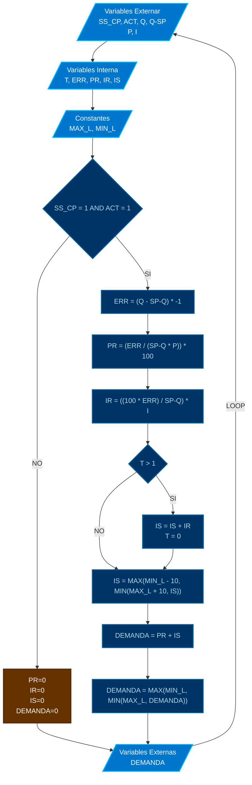

# MOD: CONTROL PID VAVs

* **ID PROGRAMA**: PRG4
* **DI CONTROLADOR**: 10021
* **AUTOR**: Carlos Jiménez Hirashi @cjhirashi, Adaptación: Asistente de IA
* **VERSION**: 1.5.0

## DESCRIPCION

Este módulo de control aplica un algoritmo PI (Proporcional-Integral) para regular la apertura de las compuertas de cinco tipos de Cajas de Volumen Variable (VAV): Grande Suministro (VG), Mediana Suministro (VM), Chica Suministro (VC), Grande Retorno (VGR) y Chica Retorno (VCR). El objetivo es mantener el caudal de aire de cada VAV lo más cercano posible a su respectivo setpoint de caudal (`*_Q_SP`). El cálculo de la demanda (`*_DEMANDA`) se basa en el error entre el setpoint y el caudal actual (`*_Q`), utilizando ganancias Proporcional (`*_P`) e Integral (`*_I`) configurables.

## LOGICA DE OPERACION

El programa ejecuta un bloque de control PI independiente para cada uno de los cinco tipos de VAV (VG, VM, VC, VGR, VCR). La lógica para cada bloque es idéntica, adaptando las variables de entrada (Setpoint, Caudal Actual, Ganancias, Permiso de Activación) y salida (Demanda) correspondientes.

**Bloque de Control PI (Ejemplificado con VAV Grande - VG):**

1.  **Acumulación de Tiempo:**
    *   Se utiliza la función `SCANS` (que devuelve el número de ciclos de ejecución del programa por segundo) para calcular el tiempo transcurrido (`DeltaTime = 1 / SCANS`) en cada ciclo. Este tiempo se suma a un contador específico para cada VAV (`VG_T`, `VM_T`, etc.).
    *   ```basic
        REM *ACUMULACION DE TIEMPO POR SCAN
        IF SCANS > 0 THEN VG_T = VG_T + (1 / SCANS)
        ... (se replica para VM_T, VC_T, VGR_T, VCR_T) ...
        ```

2.  **Verificación de Condiciones de Operación:**
    *   Se comprueba si el sistema general está activo (`SS_CP = 1`) Y si la VAV específica tiene permiso para operar (`VG_ACT = 1`).
    *   ```basic
        IF SS_CP = 1 AND VG_ACT = 1 THEN
           ... (Cálculos PI) ...
        ELSE
           ... (Lógica de Desactivación) ...
        ENDIF
        ```

3.  **Cálculos PI (Si está activo):**
    *   **Error:** Se calcula la diferencia entre el caudal actual y el setpoint, invirtiendo el signo para que un caudal bajo genere un error positivo.
        ```basic
        VG_ERR = (VG_Q - VG_Q_SP) * -1
        ```
    *   **Componente Proporcional (PR):** Se calcula según la fórmula especificada, incluyendo protección contra división por cero si el setpoint (`VG_Q_SP`) o la ganancia (`VG_P`) son cero.
        ```basic
        IF VG_Q_SP <> 0 AND VG_P <> 0 THEN
            VG_PR = (VG_ERR / (VG_Q_SP * VG_P)) * 100
        ELSE
            VG_PR = 0
        ENDIF
        ```
    *   **Componente Integral Instantáneo (IR):** Se calcula según la fórmula especificada, protegiendo contra división por cero si el setpoint (`VG_Q_SP`) es cero.
        ```basic
        IF VG_Q_SP <> 0 THEN
             VG_IR = ((100 * VG_ERR) / VG_Q_SP) * VG_I
        ELSE
             VG_IR = 0
        ENDIF
        ```
    *   **Acumulación Integral (IS) y Anti-Windup:** Si el tiempo acumulado (`VG_T`) supera 1 segundo, se suma el componente integral instantáneo (`VG_IR`) a la suma integral acumulada (`VG_IS`) y se resetea el contador de tiempo (`VG_T`). La suma integral (`VG_IS`) se limita entre -10 y 110 para prevenir el efecto "windup" (acumulación excesiva).
        ```basic
        IF VG_T > 1 THEN
            VG_IS = VG_IS + VG_IR
            VG_T = 0
        ENDIF
        VG_IS = MAX(MIN_L - 10, MIN(MAX_L + 10, VG_IS))
        ```
    *   **Demanda Total:** Se calcula sumando los componentes Proporcional e Integral.
        ```basic
        VG_DEMANDA = VG_PR + VG_IS
        ```
    *   **Limitación de Demanda:** La demanda final se limita entre 0% (`MIN_L`) y 100% (`MAX_L`).
        ```basic
        VG_DEMANDA = MAX(MIN_L, MIN(MAX_L, VG_DEMANDA))
        ```

4.  **Lógica de Desactivación (Si SS_CP=0 o *_ACT=0):**
    *   Si las condiciones de operación no se cumplen, se resetean a cero los componentes Proporcional (`VG_PR`), Integral Instantáneo (`VG_IR`), Suma Integral (`VG_IS`), la Demanda (`VG_DEMANDA`) y el contador de tiempo (`VG_T`).
    *   ```basic
        ELSE
            VG_PR = 0 : VG_IR = 0 : VG_IS = 0 : VG_DEMANDA = 0 : VG_T = 0
        ENDIF
        ```

**Replicación y Adaptación:**

*   Esta lógica completa se replica para las VAVs Mediana (VM), Chica (VC), Grande Retorno (VGR) y Chica Retorno (VCR).
*   Para VGR, se utilizan las ganancias `VG_P` y `VG_I`.
*   Para VCR, se utilizan las ganancias `VC_P` y `VC_I`.
*   Cada VAV utiliza sus propias variables internas (`*_T`, `*_ERR`, `*_PR`, `*_IR`, `*_IS`) y sus correspondientes variables externas de activación, caudal actual, setpoint y demanda.

### Uso de Puntos de Control en UI

*   **Variables que requieren interacción del operador (Configuración):**
    *   `VG_P`, `VM_P`, `VC_P` (AV69, AV71, AV73): Ganancias proporcionales para ajustar la respuesta del control. Requieren sintonización.
    *   `VG_I`, `VM_I`, `VC_I` (AV70, AV72, AV74): Ganancias integrales para eliminar el error en estado estacionario. Requieren sintonización.

*   **Variables de Entrada (Leídas, pueden venir de otros programas o UI):**
    *   `SS_CP` (BV1): Estado general de activación.
    *   `VG_ACT` a `VCR_ACT` (BV9-BV13): Permisos individuales de operación para cada VAV (probablemente controlados por PRG3).
    *   `VG_Q_SP` a `VCR_Q_SP` (AV107-AV111): Setpoints de caudal deseado.
    *   `VG_Q` a `VCR_Q` (AV98-AV100, AV102-AV103): Caudales actuales medidos (probablemente calculados por otros programas).

*   **Variables de Salida (Calculadas, principalmente para Monitoreo y Control):**
    *   `VG_DEMANDA` a `VC_DEMANDA` (AV82-AV84): Demanda de apertura calculada para las VAVs de suministro.
    *   `VGR_DEMANDA`, `VCR_DEMANDA` (AV80-AV81): Demanda de apertura calculada para las VAVs de retorno.
    *   Variables Internas (`*_ERR`, `*_PR`, `*_IR`, `*_IS`, `*_T`): Útiles para diagnóstico y sintonización fina del PID, pero no esenciales para la operación normal.

## DIAGRAMAS DE CONTROL



---
## LISTA DE PUNTOS DEL PROGRAMA

### VARIABLES INTERNAS

#### CONSTANTES

##### LÍMITES DE DEMANDA
1. `MAX_L` **100** *Límite máximo para demanda de compuerta* ( % )
2. `MIN_L` **0** *Límite mínimo para demanda de compuerta* ( % )

#### VARIABLES

##### CONTROL PID VAV GRANDE (VG)
1. `VG_T` *Contador de tiempo para integral VAV Grande* ( sec )
2. `VG_ERR` *Error de caudal VAV Grande (SP - Q)* ( cfm )
3. `VG_PR` *Componente Proporcional VAV Grande* ( % )
4. `VG_IR` *Componente Integral por paso VAV Grande* ( % )
5. `VG_IS` *Suma Integral acumulada VAV Grande* ( % )

##### CONTROL PID VAV MEDIANA (VM)
6. `VM_T` *Contador de tiempo para integral VAV Mediana* ( sec )
7. `VM_ERR` *Error de caudal VAV Mediana (SP - Q)* ( cfm )
8. `VM_PR` *Componente Proporcional VAV Mediana* ( % )
9. `VM_IR` *Componente Integral por paso VAV Mediana* ( % )
10. `VM_IS` *Suma Integral acumulada VAV Mediana* ( % )

##### CONTROL PID VAV CHICA (VC)
11. `VC_T` *Contador de tiempo para integral VAV Chica* ( sec )
12. `VC_ERR` *Error de caudal VAV Chica (SP - Q)* ( cfm )
13. `VC_PR` *Componente Proporcional VAV Chica* ( % )
14. `VC_IR` *Componente Integral por paso VAV Chica* ( % )
15. `VC_IS` *Suma Integral acumulada VAV Chica* ( % )

##### CONTROL PID VAV GRANDE RETORNO (VGR)
16. `VGR_T` *Contador de tiempo para integral VAV Grande Retorno* ( sec )
17. `VGR_ERR` *Error de caudal VAV Grande Retorno (SP - Q)* ( cfm )
18. `VGR_PR` *Componente Proporcional VAV Grande Retorno* ( % )
19. `VGR_IR` *Componente Integral por paso VAV Grande Retorno* ( % )
20. `VGR_IS` *Suma Integral acumulada VAV Grande Retorno* ( % )

##### CONTROL PID VAV CHICA RETORNO (VCR)
21. `VCR_T` *Contador de tiempo para integral VAV Chica Retorno* ( sec )
22. `VCR_ERR` *Error de caudal VAV Chica Retorno (SP - Q)* ( cfm )
23. `VCR_PR` *Componente Proporcional VAV Chica Retorno* ( % )
24. `VCR_IR` *Componente Integral por paso VAV Chica Retorno* ( % )
25. `VCR_IS` *Suma Integral acumulada VAV Chica Retorno* ( % )

### VARIABLES EXTERNAS

#### ESTADO DEL SISTEMA Y PERMISOS VAV
1. `SS_CP` **BV1** *SISTEMA - ACTIVACION* ( ACTIVA/INACTIVA )
    LECTURA - LOCAL - DI-10021
2. `VG_ACT` **BV9** *VAV GRANDE - ACTIVACION* ( ACTIVA/INACTIVA )
    LECTURA - LOCAL - DI-10021
3. `VM_ACT` **BV10** *VAV MEDIANA - ACTIVACION* ( ACTIVA/INACTIVA )
    LECTURA - LOCAL - DI-10021
4. `VC_ACT` **BV11** *VAV CHICA - ACTIVACION* ( ACTIVA/INACTIVA )
    LECTURA - LOCAL - DI-10021
5. `VGR_ACT` **BV12** *VAV GRANDE RETORNO - ACTIVACION* ( ACTIVA/INACTIVA )
    LECTURA - LOCAL - DI-10021
6. `VCR_ACT` **BV13** *VAV CHICA RETORNO - ACTIVACION* ( ACTIVA/INACTIVA )
    LECTURA - LOCAL - DI-10021

#### GANANCIAS PID
7. `VG_P` **AV69** *CAJA GRANDE - VALOR PROPORCIONAL* ( )
    LECTURA - LOCAL - DI-10021
8. `VG_I` **AV70** *CAJA GRANDE - VALOR INTEGRAL* ( )
    LECTURA - LOCAL - DI-10021
9. `VM_P` **AV71** *CAJA MEDIANA - VALOR PROPORCIONAL* ( )
    LECTURA - LOCAL - DI-10021
10. `VM_I` **AV72** *CAJA MEDIANA - VALOR INTEGRAL* ( )
    LECTURA - LOCAL - DI-10021
11. `VC_P` **AV73** *CAJA CHICA - VALOR PROPORCIONAL* ( )
    LECTURA - LOCAL - DI-10021
12. `VC_I` **AV74** *CAJA CHICA - VALOR INTEGRAL* ( )
    LECTURA - LOCAL - DI-10021

#### CAUDALES ACTUALES (Q)
13. `VG_Q` **AV98** *VAV GRANDE ACTIVA - CAUDAL* ( cfm )
    LECTURA - LOCAL - DI-10021
14. `VM_Q` **AV99** *VAV MEDIANA ACTIVA - CAUDAL* ( cfm )
    LECTURA - LOCAL - DI-10021
15. `VC_Q` **AV100** *VAV CHICA ACTIVA - CAUDAL* ( cfm )
    LECTURA - LOCAL - DI-10021
16. `VGR_Q` **AV102** *VAV GRANDE RETORNO - CAUDAL* ( cfm )
    LECTURA - LOCAL - DI-10021
17. `VCR_Q` **AV103** *VAV CHICA RETORNO - CAUDAL* ( cfm )
    LECTURA - LOCAL - DI-10021

#### SETPOINTS DE CAUDAL (Q-SP)
18. `VG_Q_SP` **AV107** *VAV GRANDE ACTIVA - SETPOINT DE CAUDAL* ( cfm )
    LECTURA - LOCAL - DI-10021
19. `VM_Q_SP` **AV108** *VAV MEDIANA ACTIVA - SETPOINT DE CAUDAL* ( cfm )
    LECTURA - LOCAL - DI-10021
20. `VC_Q_SP` **AV109** *VAV CHICA ACTIVA - SETPOINT DE CAUDAL* ( cfm )
    LECTURA - LOCAL - DI-10021
21. `VGR_Q_SP` **AV110** *VAV GRANDE RETORNO - SETPOINT DE CAUDAL* ( cfm )
    LECTURA - LOCAL - DI-10021
22. `VCR_Q_SP` **AV111** *VAV CHICA RETORNO - SETPOINT DE CAUDAL* ( cfm )
    LECTURA - LOCAL - DI-10021

#### DEMANDAS CALCULADAS (SALIDAS)
23. `VGR_DEMANDA` **AV80** *VAV GRANDE RETORNO - DEMANDA* ( % )
    ESCRITURA - LOCAL - DI-10021
24. `VCR_DEMANDA` **AV81** *VAV CHICA RETORNO - DEMANDA* ( % )
    ESCRITURA - LOCAL - DI-10021
25. `VG_DEMANDA` **AV82** *VAV GRANDE - DEMANDA* ( % )
    ESCRITURA - LOCAL - DI-10021
26. `VM_DEMANDA` **AV83** *VAV MEDIANA - DEMANDA* ( % )
    ESCRITURA - LOCAL - DI-10021
27. `VC_DEMANDA` **AV84** *VAV CHICA - DEMANDA* ( % )
    ESCRITURA - LOCAL - DI-10021