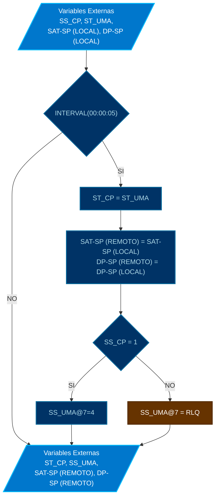

# PROGRAMA

*   **NOMBRE**: MOD: CONTROL DE UMA-01
*   **ID PROGRAMA**: PRG5
*   **DI CONTROLADOR**: 10021
*   **AUTOR**: Carlos Jiménez Hirashi *@cjhirashi*, Adaptación: Asistente de IA
*   **VERSION**: 1.5.0

## DESCRIPCION

Este módulo se encarga de controlar y sincronizar datos con la Unidad de Manejo de Aire (UMA-01) que suministra aire al cuarto de pruebas. Lee el estado de la UMA, envía setpoints de temperatura y presión, y controla el arranque/parada de la UMA con prioridad 7.

## VARIABLES DE CONTROL

### VARIABLES INTERNAS

*   Ninguna.

### VARIABLES EXTERNAS

*   **Entradas:**
    *   `SS_CP` (LOCAL) Señal de activación del sistema del cuarto de pruebas.
    *   `ST_UMA` (REMOTO) Estado remoto de la UMA-01 (proveniente del controlador de la UMA).
    *   `SAT-SP` (LOCAL) Setpoint de Temperatura de Suministro de Aire (calculado o definido en otro módulo). Esta variable local en Cuarto de pruebas se sincroniza con la variable del mismo nombre en el controlador de la UMA-01.
    *   `DP-SP` (LOCAL) Setpoint de Presión Diferencial (calculado o definido en otro módulo). Esta variable local en Cuarto de pruebas se sincroniza con la variable del mismo nombre en el controlador de la UMA-01.

*   **Salidas:**
    *   `ST_CP` (LOCAL) Estado local de la UMA-01 (copia del estado remoto).
    *   `SAT-SP` (REMOTO) Setpoint de Temperatura enviado a la UMA-01.
    *   `DP-SP` (REMOTO) Setpoint de Presión enviado a la UMA-01.
    *   `SS_UMA` (REMOTO) Señal de arranque a UMA-01 (con prioridad 7).
        *   4 = Modo "Cuarto de Pruebas" (Arranque).
        *   RLQ (Release) = Liberar prioridad 7 (Parada o control local).

## LOGICA DE OPERACION

Este módulo se ejecuta cada 5 segundos (`INTERVAL(00:00:05)`) y realiza las siguientes acciones:

1.  **Sincronizar Estado:** Lee el estado remoto de la UMA `ST_UMA` y lo copia en la variable local `ST_CP`.
2.  **Enviar Setpoints:** Envía los setpoints locales de temperatura (`SAT-SP` (LOCAL)) y presión (`DP-SP` (LOCAL)) al controlador de la UMA (`SAT-SP` (REMOTO) y `DP-SP` (REMOTO)).
3.  **Controlar Arranque/Parada (Prioridad 7):**
    *   Si el sistema del cuarto de pruebas está activo (`SS_CP = 1`):
        *   Envía el comando de modo 4 (Arranque/Modo Cuarto de Pruebas) a la UMA variable `SS_UMA` con prioridad 7 (`4`).
    *   Si el sistema del cuarto de pruebas está inactivo (`SS_CP = 0`):
        *   Libera la prioridad 7 en el comando de modo de la UMA variable `SS_UMA` (`RLQ @7`), permitiendo que la UMA sea controlada localmente o se detenga.

**Pseudocódigo:**

```basic
REM **MODULO DE CONTROL DE UMA-01

IF INTERVAL(00:00:05) THEN

    REM **SINCRONIZAR ESTADO
        ST_CP = ST_UMA

    REM **ENVIAR SETPOINTS
        SAT-SP (REMOTO) = SAT-SP (LOCAL)
        DP-SP (REMOTO) = DP-SP (LOCAL)

    REM **CONTROLAR ARRANQUE/PARADA (PRIORIDAD 7)
        IF SS_CP = 1 THEN
            MODO_UMA_REMOTO = 4  // 10003.MSV1@7 = 4
        ELSE
            RLQ MODO_UMA_REMOTO  // RLQ 10003.MSV1@7
        ENDIF

ENDIF
```

**Diagrama de Flujo:**

