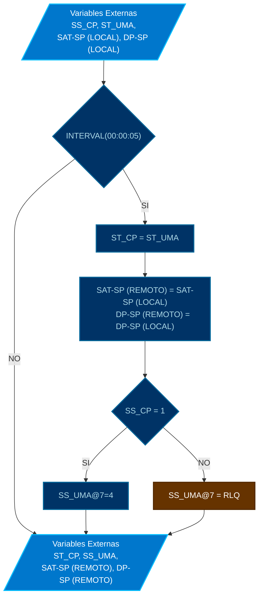

# MOD: CONTROL DE UMA-01

* **ID PROGRAMA**: PRG5
* **DI CONTROLADOR**: 10021
* **AUTOR**: Carlos Jiménez Hirashi @cjhirashi, Adaptación: Asistente de IA
* **VERSION**: 1.5.0

## DESCRIPCION

Este módulo actúa como interfaz entre el sistema de control del cuarto de pruebas (DI=10021) y la Unidad de Manejo de Aire UMA-01 (ubicada en el controlador DI=10003). Se ejecuta periódicamente para sincronizar el estado operativo, enviar los setpoints de temperatura (SAT) y presión diferencial (DP) deseados, y gestionar el modo de operación (arranque/parada) de la UMA-01 con una prioridad específica (7) cuando el cuarto de pruebas está activo.

## LOGICA DE OPERACION

El programa se ejecuta en intervalos de 5 segundos. Dentro de cada intervalo, realiza las siguientes operaciones:

1.  **Sincronización de Estado:**
    *   Lee el estado operativo actual de la UMA-01 remota (objeto `10003.BV3`) y copia su valor en la variable local `BV2` (`ST_CP`), reflejando así el estado de la UMA en el sistema del cuarto de pruebas.
    *   ```basic
        BV2 = 10003.BV3 : REM ST_CP = ST_UMA
        ```

2.  **Envío de Setpoints:**
    *   Lee los setpoints locales de Temperatura de Suministro (`AV118`, `SAT_SP_LOC`) y Presión Diferencial (`AV119`, `DP_SP_LOC`) definidos en el controlador del cuarto de pruebas.
    *   Escribe estos valores en las variables de setpoint correspondientes del controlador remoto de la UMA-01 (`10003.AV4` y `10003.AV8`).
    *   ```basic
        10003.AV4 = AV118 : REM SAT_SP_REM = SAT_SP_LOC
        10003.AV8 = AV119 : REM DP_SP_REM = DP_SP_LOC
        ```

3.  **Control de Arranque/Parada (Prioridad 7):**
    *   Evalúa el estado de activación del sistema del cuarto de pruebas (`BV1`, `SS_CP`).
    *   **Si el sistema está Activo (`BV1 = 1`):** Escribe el valor `4` (indicando modo "Cuarto de Pruebas" o arranque forzado) en la variable multiestado remota `10003.MSV1` (`SS_UMA`) utilizando la **prioridad 7**. Esto asegura que el comando del cuarto de pruebas tenga precedencia sobre comandos de menor prioridad (como el control local de la UMA o el apagado por defecto).
        ```basic
        IF BV1 = 1 THEN  : REM SS_CP = 1
            10003.MSV1@7 = 4
        ```
    *   **Si el sistema está Inactivo (`BV1 = 0`):** Libera (`RLQ`) la prioridad 7 en la variable multiestado remota `10003.MSV1`. Esto permite que la UMA-01 vuelva a su control local, se detenga por falta de comandos, o responda a otros comandos de prioridad inferior o igual a 8.
        ```basic
        ELSE
            RLQ 10003.MSV1@7
        ENDIF
        ```

### Uso de Puntos de Control en UI

*   **Variables de Entrada (Leídas por el programa):**
    *   `BV1` (`SS_CP`): Variable binaria local que indica si el sistema del cuarto de pruebas está activo (1) o inactivo (0). Usualmente controlada por el operador o un horario.
    *   `AV118` (`SAT_SP_LOC`): Variable analógica local donde se define el setpoint de temperatura deseado para la UMA-01. Puede ser ajustada por el operador o calculada por otro programa.
    *   `AV119` (`DP_SP_LOC`): Variable analógica local donde se define el setpoint de presión diferencial deseado para la UMA-01. Puede ser ajustada por el operador o calculada por otro programa.
    *   `10003.BV3` (`ST_UMA`): Estado remoto de la UMA (leído para información).

*   **Variables de Salida (Escritas por el programa):**
    *   `BV2` (`ST_CP`): Variable binaria local que refleja el estado leído de la UMA (`10003.BV3`). Para monitoreo en la UI local.
    *   `10003.AV4` (`SAT_SP_REM`): Setpoint de temperatura enviado a la UMA.
    *   `10003.AV8` (`DP_SP_REM`): Setpoint de presión diferencial enviado a la UMA.
    *   `10003.MSV1` (`SS_UMA`): Comando de modo/arranque enviado a la UMA (con prioridad 7).

## DIAGRAMAS DE CONTROL



---
## LISTA DE PUNTOS DEL PROGRAMA

*(Nota: Se mantiene la lista de puntos detallada para referencia, aunque el código use identificadores directos)*

### VARIABLES INTERNAS
*   (Ninguna)

### VARIABLES EXTERNAS

#### CONTROL LOCAL CUARTO DE PRUEBAS
1.  `SS_CP` **BV1** *SISTEMA - ACTIVACION* ( ACTIVA/INACTIVA )
    LECTURA - LOCAL - DI-10021
2.  `SAT_SP_LOC` **AV118** *TEMPERATURA DE SUMINISTRO - SETPOINT* ( °C )
    LECTURA - LOCAL - DI-10021
3.  `DP_SP_LOC` **AV119** *PRESION DIFERENCIAL - SETPOINT* ( "WC" )
    LECTURA - LOCAL - DI-10021
4.  `ST_CP` **BV2** *SISTEMA - ESTADO* ( ACTIVA/INACTIVA )
    ESCRITURA - LOCAL - DI-10021

#### CONTROL REMOTO UMA-01 (DI=10003)
5.  `ST_UMA` **10003.BV3** *SISTEMA - ESTADO DE OPERACION* ( ACTIVA/INACTIVA )
    LECTURA - REMOTO - DI-10003
6.  `SAT_SP_REM` **10003.AV4** *TEMPERATURA DE SUMINISTRO DE AIRE - SETPOINT* ( °C )
    ESCRITURA - REMOTO - DI-10003
7.  `DP_SP_REM` **10003.AV8** *PRSIÓN DE SUMINISTRO DE AIRE -SETPOINT* ( "WC" )
    ESCRITURA - REMOTO - DI-10003
8.  `SS_UMA` **10003.MSV1** *SISTEMA - ARRANQUE Y PARO* ( 4=CP_MODE/RLQ=OFF )
    ESCRITURA - REMOTO - DI-10003