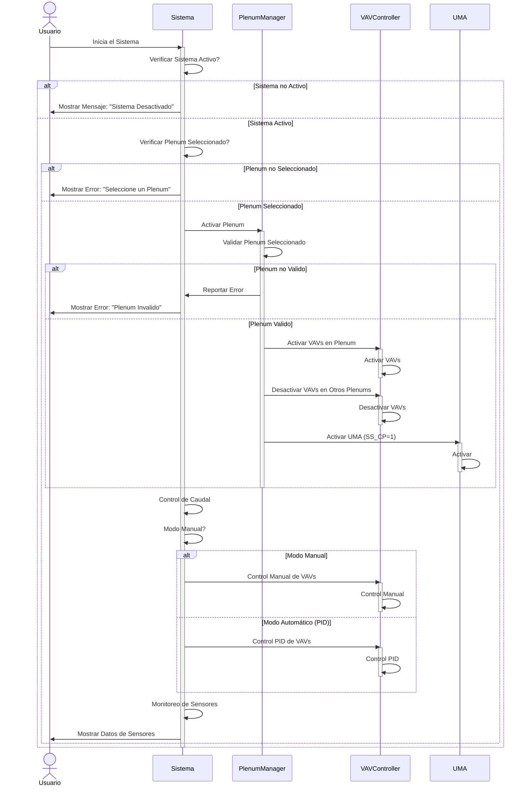

```mermaid
sequenceDiagram
    actor Usuario
    participant Sistema
    participant PlenumManager
    participant VAVController
    participant UMA
    
    Usuario->>Sistema: Inicia el Sistema
    activate Sistema
    Sistema->>Sistema: Verificar Sistema Activo?
    alt Sistema no Activo
        Sistema->>Usuario: Mostrar Mensaje: "Sistema Desactivado"
    else Sistema Activo
        Sistema->>Sistema: Verificar Plenum Seleccionado?
        alt Plenum no Seleccionado
            Sistema->>Usuario: Mostrar Error: "Seleccione un Plenum"
        else Plenum Seleccionado
            Sistema->>PlenumManager: Activar Plenum
            activate PlenumManager
            PlenumManager->>PlenumManager: Validar Plenum Seleccionado
            alt Plenum no Valido
                PlenumManager->>Sistema: Reportar Error
                Sistema->>Usuario: Mostrar Error: "Plenum Invalido"
            else Plenum Valido
                PlenumManager->>VAVController: Activar VAVs en Plenum
                activate VAVController
                VAVController->>VAVController: Activar VAVs
                deactivate VAVController
                PlenumManager->>VAVController: Desactivar VAVs en Otros Plenums
                 activate VAVController
                VAVController->>VAVController: Desactivar VAVs
                deactivate VAVController
                PlenumManager->>UMA: Activar UMA (SS_CP=1)
                activate UMA
                UMA->>UMA: Activar
                deactivate UMA
            end
            deactivate PlenumManager
            Sistema->>Sistema: Control de Caudal
            Sistema->>Sistema: Modo Manual?
            alt Modo Manual
                Sistema->>VAVController: Control Manual de VAVs
                activate VAVController
                VAVController->>VAVController: Control Manual
                deactivate VAVController
            else Modo Automático (PID)
                Sistema->>VAVController: Control PID de VAVs
                activate VAVController
                VAVController->>VAVController: Control PID
                deactivate VAVController
            end
            Sistema->>Sistema: Monitoreo de Sensores
            Sistema->>Usuario: Mostrar Datos de Sensores
        end
    end
    deactivate Sistema
```