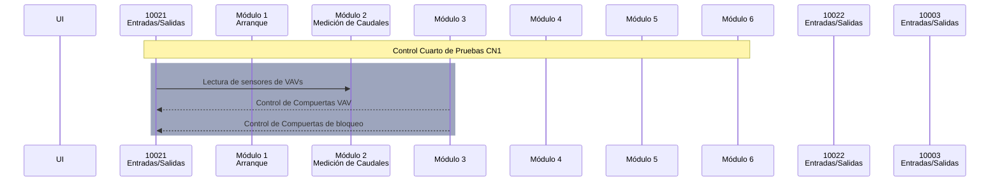

```mermaid
sequenceDiagram
    participant UI as UI
    participant CN1 as 10021<br>Controlador Principal
    participant Plenums as Plenums<br>y VAVs
    participant UMA as UMA-01<br>
    participant CN2 as 10022<br>Controlador Secundario

    Note over CN1: Control Cuarto de Pruebas

    UI->>CN1: Selecciona Plenum y Activa Sistema
    CN1->>Plenums: Desactiva Todos los Plenums
    CN1->>Plenums: Activa Compuertas de Bloqueo (Plenum Seleccionado)
    CN1->>UMA: Arranca UMA (SS_CP = 1 @ Priority 7)

    alt Plenum de Suministro Activo
        loop Control de Caudal (Plenum Activo)
            UI->>CN1: Define Setpoints de Caudal (VAVs)
            CN1->>Plenums: Activa VAVs Proporcionales (Plenum Seleccionado)
            CN1->>Plenums: Ajusta Compuertas VAV (Control PID)
        end
    else Plenum de Retorno Activo
      UI->>CN1: Define Setpoint de Caudal Total (Plenum 7)
      CN1->>Plenums: Distribuye Caudal entre VAVs (Plenum 7)
      CN1->>Plenums: Activa VAVs Proporcionales (Plenum 7)
      CN1->>Plenums: Ajusta Compuertas VAV (Control PID)
    end

    Plenums->>CN1: Envía Lecturas de Sensores (Caudal, Presión)
    CN1->>UI: Muestra Datos y Estado del Sistema
    CN2->>UI: Muestra Datos Sensores Tiro
    UI->>CN2: Muestra Datos de Calibración

    UI->>CN1: Desactiva Sistema
    CN1->>Plenums: Desactiva Todos los Plenums
    CN1->>UMA: Detiene UMA (SS_CP = 0 @ Priority 7)
    ```